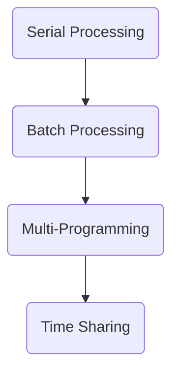

Date: 17th February 2025
Date Modified: 17th February 2025
File Folder: Week 5
#operatingsystems

```ad-abstract
title: Today's Topics
collapse: open

- Topic1
- Topic2
- Topic3

```

# Overview of Operating Systems

## Overview

**Evolution**:
- Multiprogramming
- Time-Sharing

**Major Principles or Concepts**:
- Process
- Memory amnagement
- Protection
- Scheduling

**Features of Modern operating system

**OS for Multiprocessors**

## Main Objectives of Operating Systems

```ad-summary
An **operating system** is a program that controls the execution of application programs. An interface between applicaitons and hardware.
```

Objectives:
- As a convenient interface between suer and hardware
- Managing resources efficiently and securely
- Ability to evolve with the changing environment

![[Pasted image 20250217083927.png]]

## Operating System Services

1. Program development
2. Program execution
3. Access I/O devices
4. Controlled access to files
5. System access
6. Error detection and response
7. Resource Accounting

## Resource Manager

The OS is *strange*. It’s both:
- Managing user process
- A process itself

It has to relinquish control to other process

Hardware has to have special features to give control back to the OS

## Evolution of Operating Systems



### Serial Processing

- No operating systems
- Programmers interact directly with hardware
- Used console, toggle switches, lights
- Users access the computer in “series”

```ad-warning
title: Issues
1. *Scheduling*: Allocated time for suers could be too long or too short. It is MANUAL and on paper
2. Extra setup time is needed for each user
3. A LOT of dead processing time wasted by how long it takes to schedule and write these programs
```

![[Glen_Beck_and_Betty_Snyder_program_the_ENIAC_in_building_328_at_the_Ballistic_Research_Laboratory.jpg]]
### Batch Processing

**Monitor Program:**
- User no longer has direct access to processor
- Job is submitted to *computer operator* who batches them together and places them on an input device for use by the monitor.
- Allows for multiple programs to run in series without the downtime provided by serial processors

**Hardware Features**:
- Memory protection for monitor
- TImer preveents jobs from monopolizing the system
- Privileged instrucitons: can only be executed by teh monitor
- Interrupts
- Monitor has overhead but overall improved utilization

```ad-important
1. Kind of like a first instance of an "operating system" that we had.
2. Introduced the **user/kernel** modelm
```

Most processes → *user mode*
Monitor/OS → *kernel mode*

![[ibm7094console.webp]]

#### Problem with Batch Processing

With batch systems (uniprogramming), processor can be *idle* waiting for I/O.

![[Pasted image 20250219081611.png]]

### Multiprogrammming

- Improvements in memory capacity allowed = load multiple processes into memory
- When one program is waiting for I/O, the monitor switches it out to let another program run on the processor

![[27082011-computer-science102.jpg]]

#### Example: Jobs

We have three jobs to execute:

| —               | Job 1         | Job 2     | Job 3     |
| --------------- | ------------- | --------- | --------- |
| Type of Job     | Heavy compute | Heavy I/O | Heavy I/O |
| Duration        | 5 min         | 15 min    | 10 min    |
| Memory required | 50 M          | 100 M     | 75 M      |
| Need disk?      | No            | No        | Yes       |
| Need terminal?  | No            | Yes       | NO        |
| Need printer?   | No            | NO        | Yes       |

```ad-note
This is where hardware that can do I/O interrupts and DMA comes in handy!
```

**Without multi-programming**

![[Pasted image 20250219082129.png]]

**With multi-programming**

![[Pasted image 20250219082119.png]]

### Time-Sharing Systems

Implements a where we can improve the efficiency of batch processing for *many users*.
- Can help us handle multiple interactive jobs for different users

Multiple users simultaneously access the system through terminals, with the OS interleaving the execution of each user program in a short burst of computation.

#### Time-Sharing vs. Batch Multiprogramming

**Both** batch processing and time sharing use multiprogramming

*Differences*:


| —                                        | Bath Multiprogramming                               | Time Sharing                     |
| ---------------------------------------- | --------------------------------------------------- | -------------------------------- |
| Main Objective                           | Max. processor use                                  | Minimize response time           |
| Source of directives to operating system | Job control language commands provided with the job | Commands entered at the terminal |

#### Case Study

**CTSS**
- one of the first time-sharing operating systems
- Developed at MIT by a group known as Project MAC
- Ran on a computer with 32,000 36-bit words of main memory, with the resident monitor consuming 5,000 of that
- To simplify both the monitor and memory management, a program was always loaded to start at the 5,000th word.

**Time Slicing**:
- System clock generates interrupts at a rate of approximately one every 0.2 seconds
- At each interrupt OS regained control and could assign processor to another user
- At regular time intervals the current user would be preempted and other user loaded it in
- Preempted user programs and data were written out to disk
- Program code and data were restored in main memory when the program was activated 

#### CTSS Operation in Memory


| Job Label | Memory Requirements |
| --------- | ------------------- |
| Job 1     | 10,000              |
| Job 2     | 20,000              |
| Job 3     | 5,000               |
| Job 4     | 10,000              |


| Schedule | Image |
| -------- | ----- |
| Job 1    | a     |
| Job 2    | b     |
| Job 3    | c     |
| Job 4    | d     |
| Job 5    | e     |
| Job 6    | f     |

![[9-16.jpg]]

# Major Achievements of Modern Operating Systems

## Expectations of a Modern OS

Suppose we have computer hardware that handles interrupts and we want to create an OS with the following three key features:
1. **Process batch jobs using multiprogramming**: Job waiting for I/O can be switched out
2. **Share Resoruces with Multiple Users (Time Sharing)**: Time quantum for each user
3. **Process transactions in real-time for an application**: System response time if fast.

### Challenges to Modern OS

![[Pasted image 20250219084725.png]]

**How Do We Overcome These?**:
1. Processes
2. Memory Management
3. Information Protection and Security
4. Scheduling and Resoruce Management

## Process

Fundamental Structure of Operating Systems

```ad-summary
- A program in execution
- An instance of running program
- The entity that can be assigend to, and execute don, a processor
- A unit of activity characterized bya single sequential thread of execution, a current state, and an associated set of system resources
```

### Why Processes?

We are able to juggle several user tasks for:
1. Multiprogramming
2. Time sharing
3. Real-Time Transactions

```ad-note
Remember: creating a new process has *overhead*
```

### Components of a Process

A process contains *three* components
1. An executable program
2. The associated data needed by the program (variables, work space, buffers, etc)
3. The execution context (or “process state”) of the program
	- Internal data structures for OS to continue the process
	- Not necessarily visible to the process
	- Contains:
		- Processor state = register
		- Process priority
		- Process state: running waiting for I/O, sleep setc

#### Process Management Example

Let’s say we have:
- A single processor
- Two processes running

![[Operating Systems - Week 5 Day 1 2025-02-21 08.17.26.excalidraw]]

#### Thread Management

**Threads** are a way of sub-dividing a single process into multiple independent tasks. Switching threads is faster than switching processes.

```ad-important
Very helpful because processes are protected from each other due to multiple users being able to use a CPU. Because of this, it might take awhile to swtich between processes. All the threads in a *process* do not have as much security between each other, which allows different programs to swtich between each other *quickly*
```

![[PXL_20250221_132256570.jpg]]

### Memory Management

One of the main function is to manage **virtual memory**
- Used to meet the requirement of programmers to easily access memory virtuallly

```ad-summary
title: Definition
Virtual memory allow sprograms toa ddress memory froma  lgoical point of view, without regard to the amoutn of main memory physically available.
```

#### Virtual Memory Concepts

```c
int a = 5; //A.0
int b = 6; //A.1
int c = 7; //A.2
int d = 8; //A.3
```

![[Operating Systems - Week 5 Day 1 2025-02-21 08.31.54.excalidraw]]

```ad-important
We can store main memory on secondary memory when not in use
```

Regardless of how the memory is stored, all the program sees is a continuous block.

#### Virtual Memory Addressing

![[Pasted image 20250221083531.png]]

#### Information Protection and security

The nature of the threat that concerns an organization will vary greatly depending on the circumstances

The problem involves controlling access to computer systems and the information stored in them:
- Authenticity: logging in
- Data integrity: who should be able to modify your data
- Confidentiality: user should not be able to modify values that they don’t have access to
- Availability: the service should work promptly

##### Linux File Permissions Demo

![[Operating Systems - Week 5 Day 1 2025-02-21 08.43.16.excalidraw]]

*Permissions* ,Size, Last Modified Time, 

**Permissions breakdown (left to right):**
- Permission of the Owner
- Permissions of the Group
- Permissions of Everyone Else
- 
- What user own the file
- What group owns the file

**Permission Codes**:
- `r`→ Read
- `w` → Write
- `x` → Execute (`chmod +x`)
- `d` → Directory

## Scheduling and Resource Management

Key responsibility of an OS is managing resources

*Must Consider*:
- **Fairness**: All processes should roughly have the same access to resources
- **Differential Responsiveness**: Some processes should have elevated privledges
- **Efficiency**: The OS should be fast and responsive for applications


