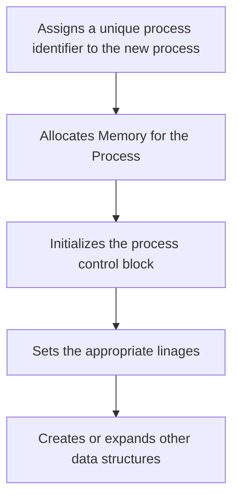

Date: 24th February 2025
Date Modified: 24th February 2025
File Folder: Week 5
#operatingsystems

```ad-abstract
title: Today's Topics
collapse: open

- Topic1
- Topic2
- Topic3

```

# Process Description and Control

## Why Processes?

The concept of a process what created to solve:
- Synchronization between hardware resources and applications
- Mutual exclusion of shared resoruces
- Memory protection
- Deadlocks

*All* modern operating systems today rely on processes to properly execute applications

## Process Control Block

A process consists of:
1. Program code (i.e, instructions) and data
2. Extra set of data elements to uniquely identify the process (process metadata)

**The process control block:**
- Created by the OS
- Contains enough information so that the OS can switch out and restore it

![[Pasted image 20250224082150.png]]

### Trace for a Process or Processor

![[Pasted image 20250224081948.png]]

### Simplified Execution Example

Suppose we have three processes executing: A, B, and C
- All processes are loaded in memory
- No loops or if statements in the processes

`5000`→ Start address of program of process A
`8000` → Start address of program of process B
`12000` → start address of program of process C

![[p1.png]]

![[Pasted image 20250224082340.png]]

```ad-important
From the perspective of the processes, they are unaware of the OS using context swtiching between each of them
```

### Processor Traces Example (Processor Perpective)

Write down the processor trace of execution. Assume that the OS allows a process to execute only for a *maximum of six clock cycles in a row.* Also assume that the **dispatcher** consists of *only six instructions*. We start at line `8000` (Process B) and we switch between processes as B→A→C.

![[Pasted image 20250224083158.png]]


## Two-State Process Model

In the previous example, a process was either running or not running

![[Pasted image 20250224083538.png]]

#### Process Queue

OS must keep track of processes that are not running.

![[Pasted image 20250224083838.png]]

## Process Spawning

### Reasons for Process Creation

1. New job
2. Interactive Login (new user)
3. Created by OS to provide service
4. Spawned by existing process to exploit parallelism or hardware

### What is Process Spawning

Creating a process is called *process spawning*
- Almost all processes are spawned by other processes
- Sometimes, processes are directly caused by the user
- Sometimes, they are also spawned behind the scenes (parent process creates child process)

```ad-example
![[Pasted image 20250224084851.png]]
```

### Process Termination: Reasons

![[Pasted image 20250224084911.png]]

### Problem with Simple Queue

In the two-state model, blocked processes are in the same queue as the ready processes.
- Dispatcher would have to scan all processes in this queue to find the oldest unblocked process to run
- *Not very effective*

## Five-State Model

Split the queue into two different queues:
- Ready
- Blocked

![[Pasted image 20250226081027.png]]

![[Pasted image 20250226081232.png]]

![[Pasted image 20250226081439.png]]

If `B` completes its time quantum, it will go to the *ready queue*

### Process States for the Three Processes Example

```ad-note
Assume a time quantum of *six*
```

![[Pasted image 20250226081810.png]]

### Issue with the Five State Model


```ad-question
What if we have multiple types of I/O with different waiting times?
```

*Each I/O event will have it’s own queue. Very inefficient*

## Process Suspension

What happens if may processes are blocked?
- Blocked processes take up memory, but do not execute
- Why not swap a blocked process to disk to free up memory?
- The OS can now add a newly created process into main memory
- Or bring in another swapped process from the disk onto the memory to give it a chance to make progress
- `Suspend` → Putting the blocked process memory into the *hard disk*

![[Pasted image 20250226082421.png]]

*Problem*: What happens when we get enough memory to swap a process back in?
- The “suspend” queue can have waiting or blocked processes.
- Providing extra states for ready/suspend and blocked/suspend helps the OS manage swapping processes in and out

![[Pasted image 20250226082604.png]]

### other Reasons for Suspension

1. Swapping
2. Other OS Reason
3. Interactive user request
4. Timing
5. Parent process request

# Process Descriptions

## Context

What information does the operating system need to:
1. Control processes
2. Manage resources for these processes

## Where To Find Them

The Operating System ahs several control structures stored in several tables:
- Memory
- Devices 
- File
- Processes

Things like  process state queues will also reference process images

![[Pasted image 20250228080819.png]]

## Control Block

1. **Process Identification**: Basic metadata on process
	- For cross referencing into other tables
	- ID of parent process
	- ID of user owner of the process
2. **Processor State Information**: User registers & Control Registers & Stack Pointers
3. **Process Control Information**: Scheduling information
	- State
	- Priority
	- etc.
	- Memory management
	- Privileges

# Process Control

## Basic Modes of Execution

**User Mode**:
- Less-privleged mode
- User programs typically execute in this mode

**System Mode**
- More privileged mode
- Also referred to as control mode or kernel mode
- Kernel of the operating system
- *NOT* admin mode

```ad-example
- Writing to contorl registers
- Primative I/O instrucstions
- Memory management
```

### Other Powers of Kernel

- Process Switching
- Memory Management
- I/O Management
- Support Functions

![[Pasted image 20250228081507.png]]

### Example: Kernel or User?

| Instruction                                                  | Kernel or User? |
| ------------------------------------------------------------ | --------------- |
| Calculating 4x5                                              | User mode       |
| Interrupting a process to handle an I/O event                | Kernel          |
| Changing the state of a process from running to blocked      | Kernel          |
| Writing the results of 4x5 to a program’s own primary memory | User            |
| Preempting a process to run a time senstive process          | Kernel          |

## Process Creation Steps



![[Pasted image 20250228082924.png]]

## Process Switching

![[Pasted image 20250228083320.png]]

### Mode Switching

A process can switch between user and kernel mode
- Under some operating systems, it allows you to do them without switching processes

Not *all mode switches* are process switches:
- AN interrupt can be quick if it isn’t fully switching
- I/O operations can be quick to get going

![[Pasted image 20250228083546.png]]

#comebacklater 

### Change of Process State

![[Pasted image 20250228083651.png]]

![[Pasted image 20250228084250.png]]

# Executing OS Code

## The Three Models

### Non-Process Kernel

- Traditional approch
- OS kernel doe snot have a PCB
- OS carries out service call
 
![[Pasted image 20250228084427.png]]

### Kernel within User Process

Executes all OS functions within the context of user processes
- User process includes kernel stack to manage service calls
- OS code and data are in shared address space by all user processes
- No context switch needed for service calls. Only switch to kernel mode

![[Pasted image 20250228084520.png]]

### Kernel Process

OS is implemented as a collection of system processes
- Minimal OS code to switch between user and kernel

![[Pasted image 20250228084616.png]]

## Advantages and Disadvantages

![[Pasted image 20250228084655.png]]

