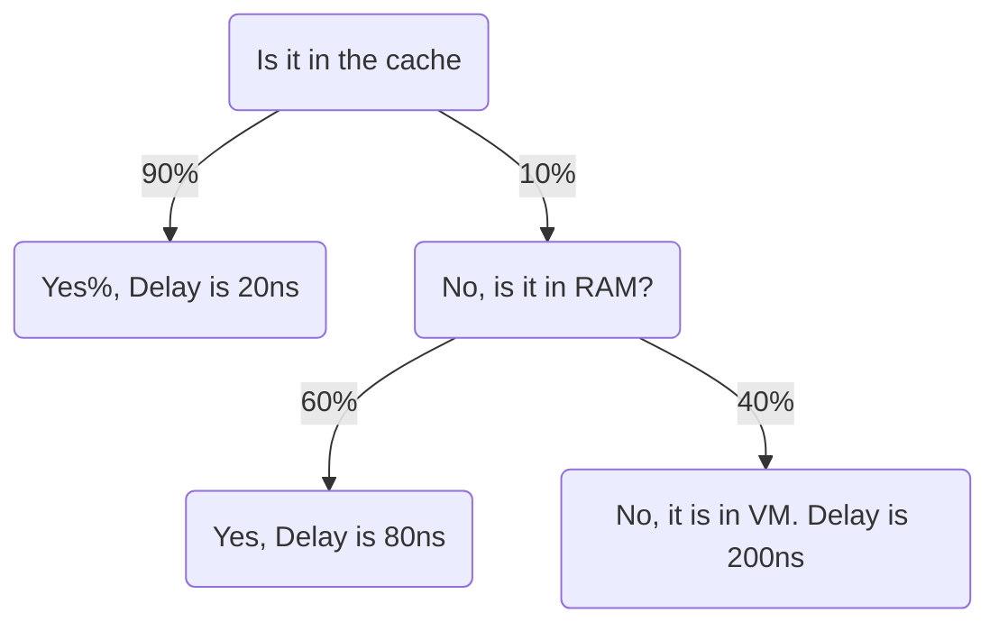

Date: 3rd March 2025
Date Modified: 3rd March 2025
File Folder: Week 7
#operatingsystems

```ad-abstract
title: Today's Topics
collapse: open

- Topic1
- Topic2
- Topic3

```


# ECCS 3661 Midterm

## Overview

### Hardware Background

- Basic components of computer hardware
- How software runs on hardware, inlcuding the fetch-execute cycle
- Basic memory formatting of data and instructions (opcodes & subject)
- Interrupts
	- Why operating systems need interrupts
	- Types of interrupts
	- Interrupt control (how to stop processes and change processes for interrupts)
	- Multiple interrupt handling (priorities)
- Memory hierarchy
	- Why memory hierarchies are necessary
	- Hit ratios
	- Principle of locality
	- **How to calculate average access times**
	- Cache architecture/designs
- I/O techniques
	- Programmed/busy wait (bad bc you have to use pooling)
	- Interrupt driven I/O (good because )
	- **Direct Memory Access (DMA)**

### Bash/Shell

- Linux Architecture (everything is a file)
	- All small commands that have to be put together
	- Windows shell commands are more general purpose
	- Linux uses a bunch of small commands that are put together to create larger commands
- Shell Scripting (HW)
	- Piping (`|`)
	- Redirects (`>`)
	- List (`ls`)
	- `cat`
	- `sed`
	- `echo`
	- `cd`
- *Standard error and standard out*
- **Homework and interview questions are always good study points**
- Explain how a package manager works (no commands such as `apt`)

### OS Overview

- Objectives o operating system
- Hardware and software interfaces of the computer
- Justify the need for (**HISTORY OF OS**)
	- operating systems
	- Kernels/monitors
	- Memory protection
	- Privileged instructions
	- Interrupts
	- Multiprogramming
- Multiprogramming (running multiple programs at once on one or more cores using interrupts) versus multiprocessing (running physically on different cores)
- Demonstrating the benefits of multiprogramming
- Goals of timesharing versus multiprogramming (Minimize response times vs. maximize utilization of CPU)
- Challenges of modern OS
	- Real-Time running
	- Security
	- *Slides for the Rest*
- Processes
	- Why processes are important
	- Components
	- Threads
- Memory Management
	- Why operating systems use virtual memory
	- How virtual memory works
- Information protection and security
- Scheduling and resource management
- Processes are a unit of resource management. Threads are a concept of scheduling and an ownership of materials

### Processes

- Why are processes important to OS design?
- Process control blocks
	-  **Make graphics of them**
- Processor and process traces
- The difference between a program and a process
- Different types of process queues
	- Simple Queue
	- Separate queues for I/O events
	- Separate queues for *each* I/O event
- Process creation/destruction
	- Process creation (by other parent processes)
	- How processes are spawned
	- Why processes are terminated
- State processes models and their strengths/weaknesses
	- Two-state model
	- Five-state model
	- Six-state model/process suspension
	- Seven-state model
		- *Be able to explain the transitions*
- Process Description
	- File table, memory table, I/O table, and process table their roles in the operating systems
	- Process images
	- Control blocks
	- User/kernel mode
	- Process creation
	- Process Switching


## In-Person Questions

```ad-question
What will be the format of the exam?
```

**Short answer, problems from the slides, and very basic shell scripting**
- Any problem with ink is fair game

Each section will be broken up into 80/20 between the actual content and the code section

```ad-question
Would there be any qesutions breaking donw terminal/command line arguments
```

“Yeah possibily”

```ad-question
WIll there be any qeustions about the hisotry of operating systems such as the serial processing and batch processing?
```

Yes, generally possible, but you don’t need to memorize *specifics* (i.e., machine names, specific models, etc.). You should be able to describe the basic narative


```ad-question
What are the processor and process traces example?
```

March through a process one-by-one and then do the fetch execute cycle. From the perspective of the CPU and how it switches between the process traces. 

```ad-question
Examples of Short-Answer Questions
```

“Why do we have operating systems”. Leave the class being able to spend time and money on the exam

```ad-question
Could you please go voer a stack tracing example?
```

Suppose we have three processes executing: A, B, and C
- All processes are loaded in memory
- No loops or if statements in the processes

`5000`→ Start address of program of process A
`8000` → Start address of program of process B
`12000` → start address of program of process C

![[p1.png]]

![[Pasted image 20250224082340.png]]

```ad-important
From the perspective of the processes, they are unaware of the OS using context swtiching between each of them
```

```ad-info
Write down the processor trace of execution. Assume that the OS allows a process to execute only for a *maximum of six clock cycles in a row.* Also assume that the **dispatcher** consists of *only six instructions*. We start at line `8000` (Process B) and we switch between processes as B→A→C.
```

![[Pasted image 20250224083158.png]]

```ad-question
Could you cover a hit ratio example?
```

![[Operating Systems - Week 7 Day 1 2025-03-03 08.45.58.excalidraw]]

$$\mbox{Memory System}= \mbox{Cache} + \mbox{Main Memory} + \mbox{Virtual Memory}$$

Access time for a word reference:
- $20 ns$ if it is in teh cache
- $60 ns$ if not in cahce but in main memory to load it into the cache
- $12ms$ if not in main memory to fetch from disk into main memory

Hit Ratios:
- $0.9$ for cache
- $0.6$ for main memory

```ad-important
$$\mbox{Expected Outcome} = \mbox{Outcome} \times \mbox{probability}, o_2 \times p_2...o_n \times p_n$$
```



$$0.9*20ns + 0.1*[(0.6*80ns)+(0.4*200ns)]$$


