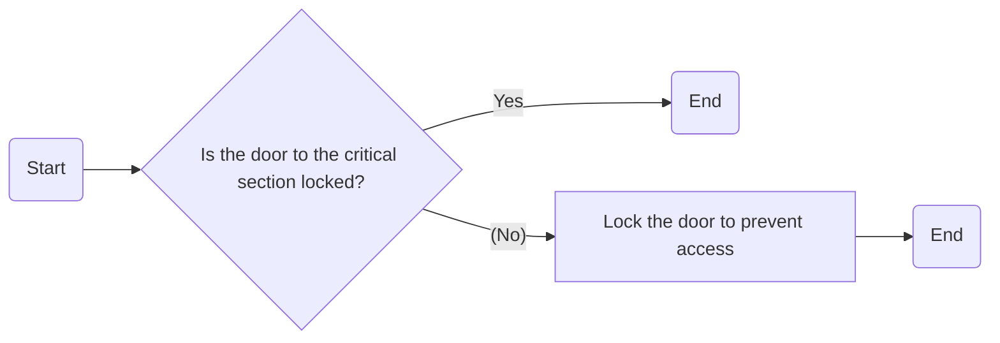

Date: 21st March 2025
Date Modified: 21st March 2025
File Folder: Week 8
#operatingsystems

```ad-abstract
title: Today's Topics
collapse: open

- Topic1
- Topic2
- Topic3

```

# Concurrency

## Objectives

1. Understand race condition
2. Mutual exclusion requirement
3. Solution to concurrency
	- Hardware
	- Semaphores
	- Monitors
	- Message Passing

## Principles of Concurrency

```ad-summary
title: Definition
The concept of multiple things are trying to run on a processor at the same time.
```

### Background Concepts

**Interleaving**: Concurrency on a uniprocessor


![[Operating Systems - Week 8 Day 3 2025-03-21 08.10.44.excalidraw]]

**Overlapping**: Concurrency on a multiprocessor

```ad-note
Both pose similar problems of concurrency
```

*Central Problem*: The relative speed of execution of processes cannot be predicted
- Processes are non-deterministic (not predictable)
- Sharing global resources can lead to race conditions
- Sharing global resources, especially in uniprocessing systems, can lead to *deadlocks*.

```ad-summary
title: Definition

**Race Conditions**: When teh rate of two or more processes (or threads) execution affects he outocme of a procedure.
```

```ad-important
How do we avoid it? **Mutual Exclusion**
```

#### Example: Uniprocessor Concurrency

```ad-question
Assume the following:
- Uniprocessor
- Shared Program Memory
- Two Processes: P1 and P2
- They both run the same code snippet
- They both share the `chin` and `chout` variables
- Start off with P1
```

```c
void echo() {
	chin = getchar();
	chout = chin;
	putchar(chout);
}
```

*CPU Trace*


| Line | Process | What Happened?                                                                                       |
| ---- | ------- | ---------------------------------------------------------------------------------------------------- |
| 1    | P1      | User types in the character `x`, but P1 is preempted (P1 ran out of time) *and is lost* (I II II I_) |
| 1    | P2      | User types the character `y`                                                                         |
| 2    | P2      | Runs as normal                                                                                       |
| 3    | P2      | P2 prints out the character (`y`) and will give back control to P1                                   |
| 2    | P1      | P1 will put the wrong `chin` to `chout`                                                              |
| 3    | P1      | P1 will print out `y` instead of the expected `x`                                                    |


*Memory Over Time*


| Time | `chin` | `chout` |
| ---- | ------ | ------- |
| 0    | `x`    |         |
| 1    | `y`    |         |
| 2    | `y`    | `y`     |
## Responsibility of the OS

To address currency issues, the OS must:
1. *Keep track* of various processes
2. *allocate* and *deallocate* resources
3. *Protect data* from interference formt oehr processes
4. Ensure that outputs are indpenedent of processing speed

```ad-example
Types of conflicts:

```

### Kinds of Concurrency Issues

#comebacklater 

### Potential Control Problems
#### Mutual Exclusion

```ad-note
P1 has access to resource, but P2 does not
```

If P2 wants access to the resource, it will get blocked because of mutual exclusion

![[Operating Systems - Week 8 Day 3 2025-03-21 08.31.56.excalidraw]]

##### Example: Multiple Processes Using Mutual Exclusion

```ad-question
There are $n$ processes with two functions:
1. `entercritical()`
2. `exitcritical()`

Take an arguemn about the shared resource. A process is lbocked if it attempts to enter criticalesection while another process is already in it.
```

**Code**:
```c
void Pn
{
	while (true) {
		/* Preceding Code */
		entercritical(Ra);
		/* Critical Section */
		exitcritical(Ra)
		/* Following Code */
	}
}
```

A process can be blocked if another process is already trying to access it 

#### Deadlock

Happens when two or more processes hold resources that *each other process needs*

```ad-example
When four different cars meet at a four way stop at the same time, there is a chance that they will all go at the same time, blocking up the intersection
```

![[Operating Systems - Week 8 Day 3 2025-03-21 08.38.23.excalidraw]]

#### Starvation

When one process holds onto a resource for way longer than it should and the other process never gets access to it, killing it off

### Requirement for Mutual Exclusion

1. Must be enforced
2. A process that halts must do so without interfering with other processes
3. No *deadlock* or *starvation*
4. A process must be denied access to a critical section when there is no oher process using it
5. No assumptions are made about relative process speeds or number of processes
6. A process remains inside its critical section for a finite time only

## Hardware Support for Mutual Exclusion

### Approach 1: Interrupt Disabling

```ad-note
Assume we are on a uniprocessing system
```

If a process disables interrupt, no other process can interrupt it during critical section

```ad-example
```c
while (true) {
	// Diable interupts
	// Critical Section
	// Enable Interrupts
	// Continue COde
}
```

*Two Main Disadvantages*:
- NO interleaving of processes, even ones that do not require critical section
- Does not work on multiprocessors

### Approach 2: Compare & Swap Instruction

There is a special way to check if:
1. The critical section was being used
2. Gain access to the resource when its free

A compare is made between a memory value and a test value
- This memory value is then used for coordinating concurrency

If they are the same, the memory is swapped



```c
int compare_and_swap (int *word, int testval, int new val) {
	int old val;
	oldval = *word;
	if (oldval == testval) *word = newval; // Compare Followed by the Swap
	return old val;
}
```

- `*word` is the variable used to lock the critical section
- `testval` tests for locked or not locked
- `newval` swap in locked or locked value (SWAP)

```ad-important
The return  value indicates the preexisting state of the lock is free or already locked
```

```ad-note
All computer architectures have compare and swap built into their instruction set
```

**Advantages**:
- Unlimited number of processes
- Simple
- Multiple critical sections for each variable

*Disadvantages*:
- Possible deadlocks
- Possible starvation
- Busy waiting is wasted time for other processes

#### Example: Bolt Lock

```c
const int n = // num of processes
int bolt;
void P(int i) {
	while(true) {
		while(compare_and_swap(&bolt, 0, 1) == 1) {
			// Do nothing
		}
		/* critical section */;
		bolt = 0; //Unlock
		/* remainder */
	}
}

void main() {
	bolt = 0;
	parbegin (P(1), P(2),...,P(n));
}
```

`Parbegin`: Parallel begin spawns multiple parallel threads or processes that share a memory location

