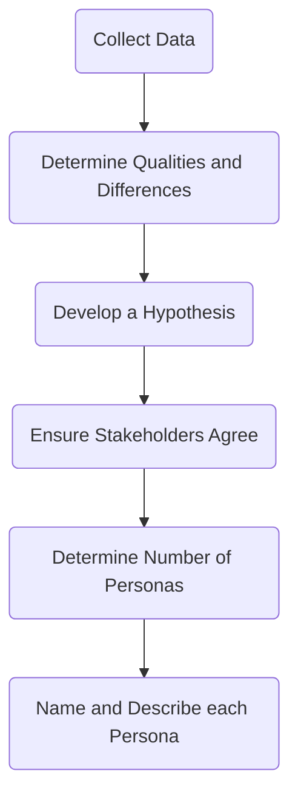

Date: 19th March 2025
Date Modified: 19th March 2025
File Folder: Week 8
#projectdev

# The Initiating Phase: Crafting Problem Statements

```ad-note
title: Remember
**Problem Framing**: Differing perspectives provide an "opportunity recognition"
```

## How to State the Problem

Should include:
- *Where* is this problem happening?
- *Who* is affected?
- *What* is affecting them?
- *Why* does this need to be solved?

### Additional Variations

**Craft a Customer**
- If the people affected by your problem are your customers, have each team member try to find something that might affect them.

```ad-example
Rebecca is a typical inquisitive three-year old and her parents like to travel. The current hotel only ahas one deadbolt lock that can be disengaged by pulling down on the door handle. The parents worry that their child might get up in the middle of the night and run away through the door.
```

## Personas

**Persona**: Fictional character that represents a typical user of an app, website or other product
- Can have multiple personas representing multiple user types
- Distilled essences of real users
- Used to build empathy with target users and focus on *their* world
	- **"You are not your user"**
	- **You are not designing for yourself!**
- Should create from research about real users
- Should *not* invent out of assumptions about your suers
- Should *not* be “stretched” to fit your preferred design

*Persona Development*



### Formats

Often *vary*, but typically include:
1. Name and picture
2. Demographic info
3. Needs, attitudes, desires, limitations, goals and behavior patterns
4. Extra details making the persona more real and relevant, building empathy
5. A written story is *better than* bullet points

### How They Help Designers

They help designers by:
- Determining what a product should do and how it should behave
- Communicate with stakeholders, developers, etc
- Keep the design centered on users at every step in the process.
- Build consensus and commitment to the design by reducing the need for elaborate diagrammatic models
- Measure the design’s effectiveness by “testing” on a persona

### Does and *don’ts*

- Do include summarizing descriptions
- Do *not* include excessive fictional descriptions
- Do include enough detail to cover basic demographics
- Do *not* add levels of detail to your behavior descriptions that you did not observe or research
- Do *not* introduce solutions into the persona narrative
- Do highlight pain points
## Scenarios

**Scenario**: stories which designers create to show how users might act to achieve a goal in a system or environment
- Used to understand users’ motivations, needs, barriers, etc. in the context of how they would interact with a design
- Putting personas to work within stories
- Can create a great scenario without a detailed persona
- Multiple stories provide contrast

*Scenarios Provide Context*:
- Who
- What
- When
- Where
- Why

```ad-important
Focuse son the bigger picture, but keeps to the point. Also needs to be understandable for people without technical background
```

```ad-note
They do not all need to be present. Some can be empathsized over others
```

## Problem Statements Vs. Problem Framing

Problem statements simply state the issue

Problem framing builds on the statement by providing:
- Context
- Boundaries
- Deeper understanding of the problem’s root causes
- Deeper understanding of the problem’s impact
- Empathy

## Tips and Tricks

### Identify the Root Cause

The key to undercovering the problem’s root cause is to ask *why* it is happening, rather than *what*
- Typically, there will be multiple answers to this
- Personas and scenarios can help provide different viewpoints
- What are the “pain points” being experienced?

