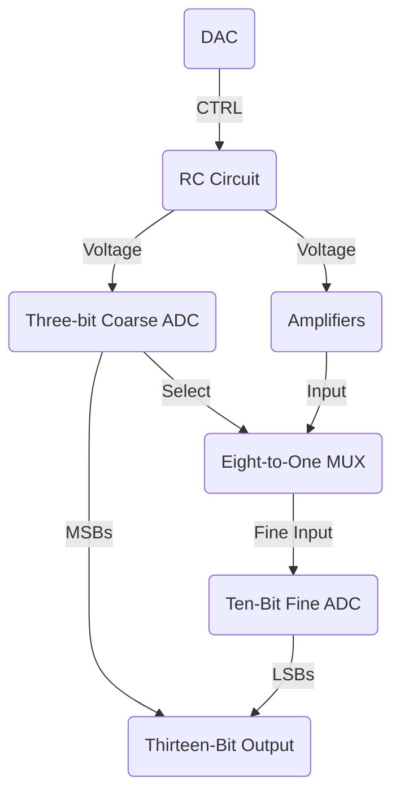

#research

# Glossary
- *Section I*: Overview
- *Section II*: RC Parallel Circuit
	- *Part 1*: Theory
	- *Part 2*: Build
	- *Part 3*: Results
- *Section III*: Differential-OP Amps
- *Section IV*: Three-Bit Flash ADC
	- *Part 1*: Regions
	- *Part 2*: Priority Encoder  
- *Section V*: Eight-to-One MUX
- *Section VI*: Microcontrollers & Code
- *Section VII*: Conclusion & Future Work
- *References*

# Section I: Overview

When it comes to the world of Analog-to-Digital Converts (ADCs), there are many options to choose from. The main type of ADCs are Successive Approximation (SAR), Delta-Sigma ($\Delta \Sigma$), Dual Slope, Pipelined, and Flash [1]. Out of the main types, Flash ADCs peaked the interest of the research team the most. When compared to the other three versions, Flash provides the best sample rate and bit resolution at low bit levels of all the types, which would allow for highly accurate readings and quantization levels without sacrificing time. However, unlike the other variations, Flash ADCs are particularly expensive to produce as they require an exponential amount of comparators per bit ($2^n -1$  comparators where $n$ is the number of bits). We found that, for the Flash ADC to be competitive, a new approach was necessary. 

```ad-important
title: Opportunity Statement 
To improve the current landscape for the use of flash ADCs in the electronics world, the project for Summer 2024 will focus on using a novel approach to measure the resistance of a RC circuit accurately using Flash ADCs, differential amplifiers, and multiplexers.
```

In Section II, the RC circuit is covered. In brief, *a logarithmic staircase control (CTRL)* signal that is powered by a DAC will be placed at the gate of an *NMOS*. This controls the charge and discharge of a resistor and capacitor in parallel to get an accurate reading of the final voltage by allowing the voltage to saturate in certain regions before it discharges. These regions are critical and determine the range the resistor might be in. The relation on the charging was found to be a modified version of the standard discharging equation.

In Section III, the amplification will be handled. Coming off of the capacitor node, it will be wired into *eight different differential op amps* that will scale the voltage thresholds from each region to zero to five volts. This will allow for more accurate readings for the ADCs later on.

In Section IV, the *one coarse three-bit Flash ADC* will be used in combination of another *fine ten-bit ADC* in order to get a thirteen-bit digital output. Controlled by the input of the provided RC circuit, the three bits will be used to both control the Eight-to-One MUX as well as provide the three most significant bits for the output. 

In Section V, the *Eight-to-One Multiplexer* with be used to select which of the amplified regions will be utilized for the fine ADC. The three-bits from the coarse ADC will act as the select bits for this ADC and will determine which region is sent from the amplifiers to the ADC to compute the final bits. The flowchart of this process can be seen below in **Figure 1** and the Block Diagram can be seen in **Figure 2**:


<center> <b>Figure 1</b>: Flow Chart Overview </center>

![[Evan's Fellowship Research Integrated Circuits Report 1 2024-06-19 15.39.32.excalidraw]]
<center> <b>Figure 2</b>: Block Chart Overview </center>

#  Section II: RC Parallel Circuit

For the other parts of the circuit to work, it is critical that there is an input that has a wide range of values to properly assess the viability of this new method of ADC. Therefore, the following circuit will utilize a new version of an *NMOS sensor* that will borrow many of the characteristics of the *MPRS technique* used to achieve high *dynamic range (HDR)* in some active pixel sensor (APS), while also contributing new insight on this technology by experimenting with RC discharging rather than a photodiode in parallel with a capacitor [2].

## Part 1: Theory

### RC Circuits

RC Circuits are critical when using capacitors’ charging and discharging properties in DC. A DC power source charges up a capacitor in series or in parallel with a resistor, which is then disconnected and allows the capacitor to drain over the resistor and into the ground of the circuit [3]. This ideal process can be seen below in **Figure 3** below:

![[Pasted image 20240619163638.png]]
<center> <b>Figure 3</b>: Ideal RC Circuit Charging and Discharging [3] </center>

Importantly, this relationship can be modeled by a few ideal equations, which describes the amount of voltage over the capacitor at anytime $t$ during it charging or discharging [3-4].
$$v(t) = v(\infty) + [v(0^+)-v(\infty)]e^{\frac{t}{\tau}} \space \space \space \space \space  -\enclose{circle}{1}$$
$$V_c(t) = V_s(1-e^\frac{-t}{\tau}) \space \space \space \space \space  -\enclose{circle}{2}$$
$$V_c(t) = V_s(e^\frac{-t}{\tau}) \space \space \space \space \space  -\enclose{circle}{3}$$

Out of the three equations, the most important one is the third equation and will be the primary focus on this research area. It explains that the voltage at anytime over a capacitor after fully charging and discharging is equal to the voltage source times an exponential decay function. This exponential decay function is model as $e^\frac{-t}{\tau}$ where $t$ is the time since the discharge began and $\tau$ is the time constant. This time constant is a function such that $\tau = RC$ and describes the amount of time needed for approximately $63.2 \%$ of the capacitor to discharge [3]. Additionally, another important equation which models the *steady state* can be seen below [4] :

$$e^\frac{-t}{\tau} \tau \approxeq 0 \space \forall t \ge 5\tau \space \space \space \space \space  -\enclose{circle}{4}$$

This equation demonstrates that for any $t$ greater than 5 time constants, the voltage over the capacitor will start to reach equilibrium as it approaches 0. This equation will be important for determining the dynamic range later in this report.


# Section III: Differential OP- Amps

# Section IV: Three-Bit Flash ADC

# Section V: Eight-to-One MUX

# Section VI: Microcontrollers & Code

# Section VII: Conclusion & Future Work

# References

[1] G. Smith, “Types of ADC converters,” Data Acquisition | Test and Measurement Solutions, https://dewesoft.com/blog/types-of-adc-converters
[2] Z. Youssfi and F. Hassan, “Fast restoring of high dynamic range image appearance for multi-partial reset sensor,” _Electronic Imaging_, vol. 31, no. 4, Jan. 2019. doi:10.2352/issn.2470-1173.2019.4.pmii-589
[3] OpenStax, “10.6: RC Circuits,” Physics LibreTexts, https://phys.libretexts.org/Bookshelves/University_Physics/University_Physics_(OpenStax)/Book%3A_University_Physics_II_-_Thermodynamics_Electricity_and_Magnetism_(OpenStax)/10%3A_Direct-Current_Circuits/10.06%3A_RC_Circuits
[4] K. S. Al-Olimat, _Electric Circuits Analysis_, 3rd ed. Ronkonkoma, NY: Linus Learning, 2020.