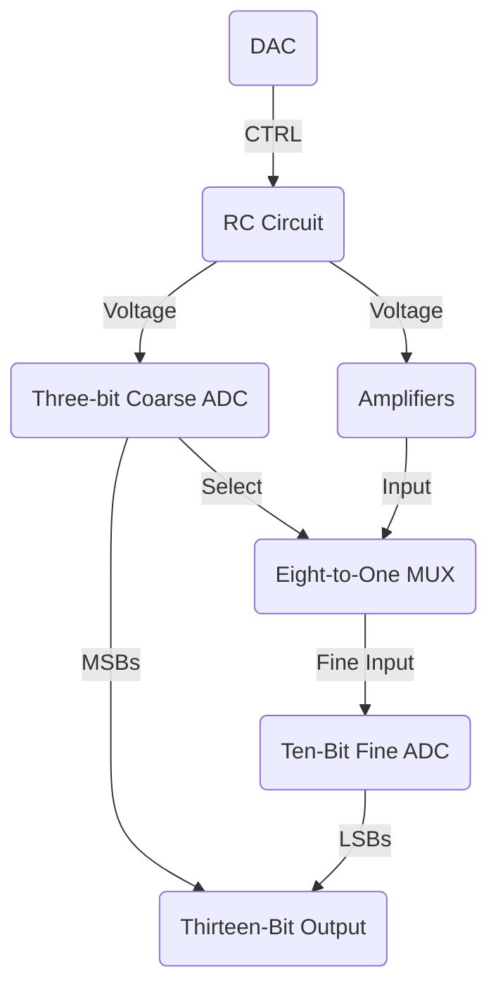

#research 
# Glossary
- *Section I*: Overview
- *Section II*: RC Parallel Circuit
	- *Part 1*: Theory
	- *Part 2*: Simulation
	- *Part 3*: Results
- *Section III*: Differential-OP Amps
	- *Part 1*: Theory
	- *Part 2*: Design
- *Section IV*: Three-Bit Flash ADC
	- *Part 1*: Comparators and the Regions
	- *Part 2*: Priority Encoder
	- *Part 3*: Simulation
- *Section V*: Eight-to-One MUX
	- *Part 1*: Theory
	- *Part 2*: Simulation
- *Section VI*: Conclusion & Future Work
- *References*

# Section I: Overview

When it comes to the world of Analog-to-Digital Converts (ADCs), there are many options to choose from. The main type of ADCs are Successive Approximation (SAR), Delta-Sigma ($\Delta \Sigma$), Dual Slope, Pipelined, and Flash [1]. Out of the main types, Flash ADCs peaked the interest of the research team the most. When compared to the other three versions, Flash provides the best sample rate and bit resolution at low bit levels of all the types, which would allow for highly accurate readings and quantization levels without sacrificing time. However, unlike the other variations, Flash ADCs are particularly expensive to produce as they require an exponential amount of comparators per bit ($2^n -1$  comparators where $n$ is the number of bits). We found that, for the Flash ADC to be competitive, a new approach was necessary. 

```ad-important
title: Opportunity Statement 
To improve the current landscape for the use of flash ADCs in the electronics world, the project for Summer 2024 will focus on using a novel approach to measure the resistance of a RC circuit accurately using Flash ADCs, differential amplifiers, and multiplexers.
```

In Section II, the RC circuit is covered. In brief, *a logarithmic staircase control (CTRL)* signal that is powered by a DAC will be placed at the gate of an *NMOS*. This controls the charge and discharge of a resistor and capacitor in parallel to get an accurate reading of the final voltage by allowing the voltage to saturate in certain regions before it discharges. These regions are critical and determine the range the resistor might be in. The relation on the charging was found to be a modified version of the standard discharging equation.

In Section III, the amplification will be handled. Coming off of the capacitor node, it will be wired into *eight different differential op amps* that will scale the voltage thresholds from each region to zero to five volts. This will allow for more accurate readings for the ADCs later on.

In Section IV, the *one coarse three-bit Flash ADC* will be used in combination of another *fine ten-bit ADC* in order to get a thirteen-bit digital output. Controlled by the input of the provided RC circuit, the three bits will be used to both control the Eight-to-One MUX as well as provide the three most significant bits for the output. 

In Section V, the *Eight-to-One Multiplexer* with be used to select which of the amplified regions will be utilized for the fine ADC. The three-bits from the coarse ADC will act as the select bits for this ADC and will determine which region is sent from the amplifiers to the ADC to compute the final bits. The flowchart of this process can be seen below in **Figure 1** and the Block Diagram can be seen in **Figure 2**:


<center> <b>Figure 1</b>: Flow Chart Overview </center>

![[Evan's Fellowship Research Integrated Circuits Report 1 2024-06-19 15.39.32.excalidraw]]
<center> <b>Figure 2</b>: Block Chart Overview </center>

#  Section II: RC Parallel Circuit

For the other parts of the circuit to work, it is critical that there is an input that has a wide range of values to properly assess the viability of this new method of ADC. Therefore, the following circuit will utilize a new version of an *NMOS sensor* that will borrow many of the characteristics of the *MPRS technique* used to achieve high *dynamic range (HDR)* in some active pixel sensor (APS), while also contributing new insight on this technology by experimenting with RC discharging rather than a photodiode in parallel with a capacitor [2].

```ad-note
title: Author's Note
This section is relatively long as this is one of the more important parts of the circuit and took the longest to accomplish compared to the different sections. Sit back and grab a snack as I detail everything.
```

## Part 1: Theory

### RC Circuits

RC Circuits are critical when using capacitors’ charging and discharging properties in DC. A DC power source charges up a capacitor in series or in parallel with a resistor, which is then disconnected and allows the capacitor to drain over the resistor and into the ground of the circuit [3]. This ideal process can be seen below in **Figure 3** below:

![[Pasted image 20240619163638.png]]
<center> <b>Figure 3</b>: Ideal RC Circuit Charging and Discharging [3] </center>

Importantly, this relationship can be modeled by a few ideal equations, which describes the amount of voltage over the capacitor at anytime $t$ during it charging or discharging [3-4].
$$v(t) = v(\infty) + [v(0^+)-v(\infty)]e^{\frac{t}{\tau}} \space \space \space \space \space  -\enclose{circle}{1}$$
$$V_c(t) = V_s(1-e^\frac{-t}{\tau}) \space \space \space \space \space  -\enclose{circle}{2}$$
$$V_c(t) = V_s(e^\frac{-t}{\tau}) \space \space \space \space \space  -\enclose{circle}{3}$$

Out of the three equations, the most important one is the third equation and will be the primary focus on this research area. It explains that the voltage at anytime over a capacitor after fully charging and discharging is equal to the voltage source times an exponential decay function. This exponential decay function is model as $e^\frac{-t}{\tau}$ where $t$ is the time since the discharge began and $\tau$ is the time constant. This time constant is a function such that $\tau = RC$ and describes the amount of time needed for approximately $63.2 \%$ of the capacitor to discharge [3]. Additionally, another important equation which models the *steady state* can be seen below [4] :

$$e^\frac{-t}{\tau} \tau \approxeq 0 \space \forall t \ge 5\tau \space \space \space \space \space  -\enclose{circle}{4}$$

This equation demonstrates that for any $t$ greater than 5 time constants, the voltage over the capacitor will start to reach equilibrium as it approaches 0. This equation will be important for determining the dynamic range later in this report. 

By using a combination of these techniques, a constant period of discharge and call it $T$ and a set capacitor $C$ is set with a voltage value $V_{cc}$ that is used to charge and discharge the capacitor and resistor ($R$) that are in parallel to find the difference in the amount of discharge depending on the selected resistor. This works since the rate of discharge is directly connected to resistance through the time constant relation. However, according to plenty of literature, a parallel RC circuit is typically not ideal when measuring the amount of voltage and is instead better at monitoring the change of current. This is due to the typical setup having the input node being connected to the output node, which makes a current divider as shown in **Figure 4**: [5]

![[Pasted image 20240620100546.png]]
<center> <b>Figure 4</b>: Standard Parallel RC Circuit [5] </center>

To overcome the limitations, a device that acts like a switch must be utilized to connect the $V_{cc}$ node to the capacitor node during charge and disconnect them during discharge, allowing the capacitor to create current through the resistor. Therefore, much like the ADS’s of the past, a transistor will be used [2]. Specifically an NFET MOSFET, which is also known as a NMOS, is critical in the switching the occurs.

### NMOS Transistors

NMOS transistors are a silicon device that is critical for many applications in the electronics today. Specifically, they allow the flow of current from one end to another only when a sufficient amount of voltage is applied to the gate of the transistor [6]. A diagram of the internals of a typical NMOS can be seen below in **Figure 5**:

![[Electronics - Week 9 Day 2 2024-03-27 13.06.50.excalidraw]]
<center> <b>Figure 5</b>: Internals of a NMOS Transistor</center>

Importantly, the NMOS acts in *three regions* that determine the current flow from the source to the drain. These regions are known as **cutoff**, **triode**, and **saturation**. A table of each of these regions and their dictating equations and characteristics can be seen below in **Table 1:**

<center> <b>Table 1</b>: NMOS Transistor Characteristics </center>

| Region        | Characteristics                                                                                                                                                                                                                    | Boundary                | Equation                                                                     |
| ------------- | ---------------------------------------------------------------------------------------------------------------------------------------------------------------------------------------------------------------------------------- | ----------------------- | ---------------------------------------------------------------------------- |
| Cutoff        | There is not enough voltage connected to the gate voltage. The source and drain are not connected by the depletion region.                                                                                                         | $V_{GS} < V_t$          | $I_D = 0$                                                                    |
| Active/Triode | There is enough voltage at the gate and the source that the depletion area connects both the source and drain together. As more voltage is added, there is a linear increase in the amount of current as it approaches saturation. | $V_{DS} < V_{GS} - V_t$ | $I_D = K_N^\prime \frac{W}{L}[(V_{GS}-V_t)V_{DS}V_{DS}- \frac{V_{DS}^2}{2}]$ |
| Saturation    | The voltage has increased to a point where the channel created between the source and the drain is completely pinched off. It leads to a constant $I_D$ that does not increase past this point.                                    | $V_{DS} > V_{GS} - V_t$ | $I_D = \frac{K_N^\prime}{2} \frac{W}{L}(V_{GS} - V_t)^2$                     |
Due to the transistors property to act much like a switch with its cutoff and saturation regions, it is critical in controlling the charge and discharge of the parallel RC circuit and measuring its voltage at the end of this discharge period. To do so, a constant voltage source $V_{cc}$ will be applied to the source branch of the transistor and the parallel RC circuit will be connected to the drain. Then, another variable voltage source, called *CTRL*, is connected to the gate of the transistor to control the current.

#### CTRL Signal

Typically, the CTRL signal would pulse on and off every time period $T$ to charge the circuit and discharge the circuit on the clock. However, as described by Dr. Youssfi and Hassan, there is a chance that a provided value of resistance can cause full saturation, which can ruin the dynamic range [2]. Therefore, Dr. Hassan proposed an alternative CTRL signal that could prevent the oversaturation problem faced with this design [7]. This control signal is designed to drop a constant amount of voltage, which we call the threshold voltage ($V_{th}$), by a logarithmic time difference on the power of two. This means that it will drop in an exponentially shorter amount of time until it hits its eighth drop. At this point, the voltage will be dropped for a 128th of the period $T$ right before the gate opens back up to 5 volts and is charged again. **Table 2** illustrates this in detail, while **Figure 6** shows an example given that $V_{cc} =5V \space \& \space V_{th}=0.3V$:

<center> <b>Table 2</b>: CTRL Signal </center>

| Voltage ($V$)     | Time Range                                    | Duration        |
| ----------------- | --------------------------------------------- | --------------- |
| $V_{cc}-V_{th}$   | $0 \Rightarrow \frac{T}{2}$                   | $\frac{T}{2}$   |
| $V_{cc}-2V_{th}$  | $\frac{T}{2} \Rightarrow \frac{3T}{4}$        | $\frac{T}{4}$   |
| $V_{cc} -3V_{th}$ | $\frac{3T}{4} \Rightarrow \frac{7T}{8}$       | $\frac{T}{8}$   |
| $V_{cc} -4V_{th}$ | $\frac{7T}{8} \Rightarrow \frac{15T}{16}$     | $\frac{T}{16}$  |
| $V_{cc} -5V_{th}$ | $\frac{15T}{16} \Rightarrow \frac{31T}{32}$   | $\frac{T}{32}$  |
| $V_{cc} -6V_{th}$ | $\frac{31T}{32} \Rightarrow \frac{63T}{64}$   | $\frac{T}{64}$  |
| $V_{cc} -7V_{th}$ | $\frac{63T}{64} \Rightarrow \frac{127T}{128}$ | $\frac{T}{128}$ |
| $0$               | $\frac{127T}{128} \Rightarrow 2T$             | $\frac{T}{256}$ |
![[Pasted image 20240620114522.png]]
<center> <b>Figure 6</b>: Example CTRL Signal </center>

As described earlier, this gradual decrease in voltage as a logarithmic step signal will prevent early desaturation in the case of lower resistances bottoming out before they reach the proper value. It is also important as it will allow the dynamic range to have different *regions*. The regions are labeled from 1 to 8 and represent where the the voltage does not saturate at. More information can be found under the next subheading when it comes to saturation and regions. The circuit diagram for the circuit can be seen below in **Figure 7:** 

![[circuit(6).png]]
<center> <b>Figure 7</b>: Circuit Diagram for NMOS Sensor</center>

### Regions

Depending on the different parameters set between the period of discharge and the chosen capacitor and NMOS, the resistor may saturate in one region and not saturate in another. To determine which region the resistor is in for a given setup, it is critical to look at a simulated version of the circuit to see where the resistor may fall under. For instance, a resistor my never saturate under one scenario, but might saturate earlier given another parameter. The resistances that fall between two regions are called threshold resistors ($R_{th}$) and are important as they determine which amplified $V_c$ is used in the fine ADC.

```ad-warning
The equation to find these threshold resistors is still a work in progress. As for now, only trial and error has been attempted through the step command in LTSpice.
```

In **Tables 3** below, the approximate threshold resistors are given for three combinations of capacitors and periods:

<center> <b>Table 3</b>: Resistor Threshold for Three Different Capacitor and Period Combinations </center>

| $C=1\micro F$ | $T=5ms$                  | \|  | $C=10nF$ | $T=5 \micro s$           | \|  | $C=100nF$ | $5 \micro s$             |
| ------------- | ------------------------ | --- | -------- | ------------------------ | --- | --------- | ------------------------ |
| Region        | $R_{th} \space (\Omega)$ | \|  | Region   | $R_{th} \space (\Omega)$ | \|  | Region    | $R_{th} \space (\Omega)$ |
| 8             | 10                       | \|  | 8        | 1                        | \|  | 8         | 0.1                      |
| 7             | 370                      | \|  | 7        | 45                       | \|  | 7         | 5                        |
| 6             | 835                      | \|  | 6        | 90                       | \|  | 6         | 10                       |
| 5             | 1770                     | \|  | 5        | 200                      | \|  | 5         | 25                       |
| 4             | 3575                     | \|  | 4        | 430                      | \|  | 4         | 45                       |
| 3             | n/a                      | \|  | 3        | 960                      | \|  | 3         | 100                      |
| 2             | n/a                      | \|  | 2        | 2305                     | \|  | 2         | 200                      |
| 1             | n/a                      | \|  | 1        | 3370                     | \|  | 1         | 430                      |

```ad-summary
The dynamic range is changed greatly by the choice of the period of discharge and the capacitor that is discharged during that period.
```

### Derived Equations

Given the parameters specified above, a few different equations can be derived from the given information. Firstly, the third equation as describe in the RC Circuits subpart, does a great job at modeling the discharge of the capacitor when the circuit never saturates (aka. it is in the first region). However, it does not account for any drops to saturation in any of the other regions. It is important to understand that these regions determine where the voltage waveform will saturate on a level and when it will not saturate and decay exponentially as according to the time constant $\tau$. Therefore, the last region it saturated in would be where the decay begins. This means that the decay begins at some amount of $V_{th}$ less than the input voltage $V_{cc}$ and can be modeled as shown in **Table 2** earlier. However, even if we assume that there are different voltage drops at each region, it is critical to also note the changes in time. For example, if it saturates in the first region, it would already be half-way done with the period and the time of discharge would also be half. By taking both of these premises into account, the set of equations in **Table 4** models these changes in behavior based on the region they are found in:

<center> <b>Table 4</b>: Region and Discharge Relation Equations </center>

| Region | Initial Condition  | End Point          | Final Range                                   | Period            | Final Equation                                            |
| ------ | ------------------ | ------------------ | --------------------------------------------- | ----------------- | --------------------------------------------------------- |
| 1      | $$V_{cc}$$         | $$V_{cc}-V_{th}$$  | $$V_{cc} \rightarrow V_{cc}-2V_{th}$$         | $$T$$             | $$V_f = V_{cc}(e^\frac{-T}{\tau})$$                       |
| 2      | $$V_{cc}-V_{th}$$  | $$V_{cc}-2V_{th}$$ | $$V_{cc}-2V_{th} \rightarrow V_{cc}-3V_{th}$$ | $$\frac{T}{2}$$   | $$V_f = (V_{cc}-V_{th})(e^\frac{\frac{-T}{2}}{\tau})$$    |
| 3      | $$V_{cc}-2V_{th}$$ | $$V_{cc}-3V_{th}$$ | $$V_{cc}-3V_{th} \rightarrow V_{cc}-4V_{th}$$ | $$\frac{T}{4}$$   | $$V_f = (V_{cc}-2V_{th})(e^\frac{\frac{-T}{4}}{\tau})$$   |
| 4      | $$V_{cc}-3V_{th}$$ | $$V_{cc}-4V_{th}$$ | $$V_{cc}-4V_{th} \rightarrow V_{cc}-5V_{th}$$ | $$\frac{T}{8}$$   | $$V_f = (V_{cc}-3V_{th})(e^\frac{\frac{-T}{8}}{\tau})$$   |
| 5      | $$V_{cc}-4V_{th}$$ | $$V_{cc}-5V_{th}$$ | $$V_{cc}-5V_{th} \rightarrow V_{cc}-6V_{th}$$ | $$\frac{T}{16}$$  | $$V_f = (V_{cc}-4V_{th})(e^\frac{\frac{-T}{16}}{\tau})$$  |
| 6      | $$V_{cc}-5V_{th}$$ | $$V_{cc}-6V_{th}$$ | $$V_{cc}-6V_{th} \rightarrow V_{cc}-7V_{th}$$ | $$\frac{T}{32}$$  | $$V_f = (V_{cc}-5V_{th})(e^\frac{\frac{-T}{32}}{\tau})$$  |
| 7      | $$V_{cc}-6V_{th}$$ | $$V_{cc}-7V_{th}$$ | $$V_{cc}-7V_{th} \rightarrow V_{cc}-8V_{th}$$ | $$\frac{T}{64}$$  | $$V_f = (V_{cc}-6V_{th})(e^\frac{\frac{-T}{64}}{\tau})$$  |
| 8      | $$V_{cc}-7V_{th}$$ | $$0$$              | $$V_{cc}-8V_{th} \rightarrow 0$$              | $$\frac{T}{128}$$ | $$V_f = (V_{cc}-7V_{th})(e^\frac{\frac{-T}{128}}{\tau})$$ |
By examining the equations for each region, the region has an effect on both the change in the $V_{th}$ and the fraction of the period that is taken, with the former being linear and the latter being exponential. Therefore, they both can be replaced by their own equations in terms of $r$, where $r$ is equal to the region the voltage does not saturate in minus one. The generalized equation is below:

$$V_{f}=(V_{cc}-r7V_{th})e^\frac{\frac{-T}{2^r}}{RC} \space \space \space \space \space -\enclose{circle}{\bigstar}$$
#### Inverse Relation

As stated earlier, understanding how to get the value of the resistance back after doing all the processing is critical for getting an accurate reading from this circuit. Therefore, by moving the variables around in *Equation Star* above, the inverse equation is created as shown below:

$$R = \frac{-T}{2^rC \ln(\frac{V_f}{V_{cc}-rV_{th}})} \space \space \space \space \space -\enclose{circle}{\diamondsuit}$$
#### Setting Lower Boundary

Knowing that a capacitor would fully desaturate at around $5 \tau$, choosing both a capacitor value and a time period must be taken in *caution*. Therefore, to prevent inaccuracies at lower bounds of resistances, the period and capacitor must follow the equation below:

$$\frac{T}{128} = 4R_{min}C \space \space \space \space \space -\enclose{circle}{\heartsuit}$$

The left side of the equation is provided by the fact that it is the shortest time the capacitor can discharge (in Region 8). The right-hand side converts the time constant back into its product and acknowledges that this would be the minimum resistance value that could be measured given these parameter. The constant is to make sure that it will never go too low and is just one less than the expected $5 \tau$. 

```ad-example
**Applications for Equation Heart**
- Given a capacitor and time period, find the minimum resistor that can be detected
- Given a minimum resistor, choose a time period or capacitor to find the other.
- Combining it with *Equation Star* to find the minimum voltage.
```

## Part 2: Simulation

To simulate the circuit described, the program LTSpice was utilized. LTSpice is a free SPICE simulator that allows for the simulation of analog circuits and is able to capture the behaviors of many electrical components [8]. Importantly, LTSpice allows simulations during a specific time period through the transient simulation mode. Each part of the circuit will be explained throughout this part. The overview of the circuit can be seen below in **Figure 8**:

![[Untitled 3.png]]
<center> <b>Figure 8</b>: Circuit Diagram for NMOS Sensor</center>

### CTRL Signal

Natively, LTSpice supports various types of functions for its voltage sources for both AC and DC capabilities. The one that is most crucial for creating a control signal; however, is the *Piecewise-Linear function (PWL)*. It allows for multiple time-voltage combinations to be chosen such that it increases linearly to the next voltage amount. However, since a step signal is needed rather than a linear one, a little trick is employed. By setting two times a fraction of a nanosecond apart and dropping the voltage only afterwards. it makes it such that there is a sudden drop. By placing a timestamp of the same voltage beforehand, a step signal can be replicated. **Table 5** below shows the PWL table for two periods (charge and discharge) and **Figure 9** shows an example of the table in LTSpice given $V_{cc}=5V, V_{th}= 0.3 V, T=5ms$:

<center> <b>Table 5</b>: Piecewise-Linear Function for Step Function </center>

| Time ($s$)                  | Value ($V$)      |
| --------------------------- | ---------------- |
| $0$                         | $V_{cc}+V_t$     |
| $T$                         | $V_{cc}+V_{t}$   |
| $T+10^{-11}$                | $V_{cc}-V_{th}$  |
| $\frac{3T}{2}$              | $V_{cc}-V_{th}$  |
| $\frac{3T}{2}+10^{-11}$     | $V_{cc}-2V_{th}$ |
| $\frac{7T}{4}$              | $V_{cc}-2V_{th}$ |
| $\frac{7T}{4}+10^{-11}$     | $V_{cc}-3V_{th}$ |
| $\frac{15T}{8}$             | $V_{cc}-3V_{th}$ |
| $\frac{15T}{8}+10^{-11}$    | $V_{cc}-4V_{th}$ |
| $\frac{31T}{16}$            | $V_{cc}-4V_{th}$ |
| $\frac{31T}{16}+10^{-11}$   | $V_{cc}-5V_{th}$ |
| $\frac{63T}{32}$            | $V_{cc}-5V_{th}$ |
| $\frac{63T}{32}+10^{-11}$   | $V_{cc}-6V_{th}$ |
| $\frac{127T}{64}$           | $V_{cc}-6V_{th}$ |
| $\frac{127T}{64}+10^{-11}$  | $V_{cc}-7V_{th}$ |
| $\frac{255T}{128}$          | $V_{cc}-7V_{th}$ |
| $\frac{255T}{128}+10^{-11}$ | $0$              |
| $2T-10^{-11}$               | $0$              |
| $2T$                        | $V_{cc}+V_t$     |

![[Pasted image 20240621115851.png]]
<center> <b>Figure 9</b>: PWL Table in LTSpice Example</center>

```ad-note
title: Reminder
$V_{t}$ is the threshold value for the transistor chosen. This is crucial as the capacitor will not fully charge if the CTRL signal during the charge period is not $V_{cc}+V_t$
```

### NMOS Customization

For the sake of testing the ideal equations, a nearly perfect NMOS should be used. However, the default NMOS’s in LTSpice do not have a good $K^\prime_N$ value that will allow the right amount of current to flow through, which greatly hinders the circuit during charging and discharging. Therefore, a custom definition for the NMOS was used that follows the SPICE directive below:

```
.model POWERMOSFET NMOS vto=0 kp=1000
```

This prevented any unwanted voltage drops or current fluctuations that can be seen with a real NMOS.

### Resistor and Capacitor Parameters

To test the dynamic range of a particular combination, the capacitor is to be kept constant and the resistor is to be stepped linearly through a range of resistors so the equation’s accuracies can be measured. An example of a SPICE directives can be seen below:

```
.step param X 5 4k 5
.param Y 1u
```

### Measurements

To accurately measure the final voltage at the end of a period, using the graph alone was not accurate enough. Therefore, the measure directive was used to find the minimum value during the discharge cycle. The directive is described below:

```
.meas TRAN Vcmin MIN V(VC) FROM Ti TO Tf
```
- TRAN - Measuring a transient value
- Vcmin - The name of the measured variable
- MIN - Looking for the minimum value
- FROM Ti TO Tf - Only over the discharge period

## Part 3: Results

To discover the dynamic range of resistors and accuracy of the equations, three different combinations of capacitors and time periods were swept with resistors ranging from 0.01 Ohms to 4k Ohms in steps of 5. By doing so, the behavior of the circuit can be put on full display. The embed to the Excel document can be seen below: [9]

[Resistor and Voltage Relation.xlsx]
```embed
title: "Resistor and Voltage Relation.xlsx"
image: "https://res-1.cdn.office.net/officeonline/x/s/h63BD80475830AA69__layouts/resources/FavIcon_Excel.ico"
description: ""
url: "https://onu0-my.sharepoint.com/:x:/g/personal/e-berei_onu_edu/EfO_lukxUuxNkC5Za-ohGUIBx1x0umVvIYBsmBBEIx1Zrg?e=aFZt11"
```

### Dynamic Range

After looking at the dynamic ranges of the different combinations, the amount of resistors that could be measured was much less than expected. The researchers felt that it should be able to measure very small resistors up to around the $100k \Omega$ range. However, it was found that it works from around $0.01\sim 1k$ at the low end and $10 \sim 5k$ at the high end before it was clearly not keeping up with the equations. Further studying into the reason why the dynamic range is limited and *Equation Heart* should help elevate these values.

### Accuracy

Much like the dynamic range, the team was curious about the accuracy discrepancies. At low resistance values, the readings were nearly perfect with a percent error of no more than 1% for the resistors and voltage. However, as the resistors increased, the percent error sky-rocketed when it was not near a region. For example, at $5k \Omega$ when $T = 5ms \space \& \space C = 1\micro F$, the inverse equation predicted a resistor value of about $4.2k$ and a percent error of $15\%$. However, it is important to note that the percent error for the voltages increased by only $1\%$ and held constant while the resistor’s percent error increased linearly. This strange variation in the percent error of the voltage and resistances should be looked into further as it could solve the  alarming accuracy falter at higher resistances. This could also allow the dynamic range of to be pushed further for both resistances and final voltages.

# Section III: Differential OP- Amps

After getting the final voltage at the end of discharge, its is time to send part of the signal to both the small ADC and the set of differential op amps as seen in **Figures 1 & 2**. Even though this part of the process is one of the most simple, it is critical in making the fine ADC work,  each region larger, and allowing a large amount of quantization levels.

## Part 1: Theory

Much like other operational amplifier configurations, the differential op-amp is useful at scaling voltages to the correct value. Being a staple for more than 40 years, it still has many uses today [10]. However, unlike more standard configurations like the inverting and non-inverting op-amp, it is also able to subtract from positive voltage and add to negative voltage. The difference amplifier schematic can be seen below in **Figure 10**:

![[deeper-look-into-difference-amplifiers-FIG01.jpg]]
<center> <b>Figure 10</b>: Differential Operational Amplifier [10]</center>

Importantly, this configuration excels at filtering and tolerance sensing applications, while also allowing higher amounts of gain. The behavior of the differential op-amp can be seen below in *Equation 4* (the general equation) and *Equation 5* (when $R_1=R_3$ and $R_2=R_4$)

$$V_{out} = \frac{R_3(R_2+R_4)}{R_1(R_2+R_3)}V_2 - \frac{R_2}{R_1}V_1 \space \space \space \space \space -\enclose{circle}{4}$$
$$V_{out} = (\frac{R_2}{R_1})(V_2-V_1) \space \space \space \space \space -\enclose{circle}{5}$$

## Part 2: Design

As shown in **Table 4** earlier, each of the eight regions have their own range of values between a higher and a lower value. To make it so the fine ADC does not need to be as complicated, scaling each region back to between $0$ and $V_{cc}$ would be ideal. To accomplish this goal, there needs to be a single differential op-amp for every region. The op-amps will zero out the lowest voltage of the region, make the highest voltage in the region scale to $V_{cc}$, and every value in-between would be scaled accordingly between those two extremes. According to the original documentation, the best way to condition these signals would be as follows in **Table 6**:

<center> <b>Table 6</b>: Signal Conditioning of the Different Regions [7]</center>

| Region | Signal Conditioning |
| ------ | ------------------- |
| 1      | $8x$                |
| 2      | $16(x-0.6)$         |
| 3      | $16(x-0.9)$         |
| 4      | $16(x-1.2)$         |
| 5      | $16(x-1.5)$         |
| 6      | $16(x-1.8)$         |
| 7      | $16(x-2.4)$         |
| 8      | $1.875(x-2.4)$      |

```ad-warning
title: Mistake
I incorrectly assumed that the values above were for voltages, but they are for the *slopes*. Signal conditioning for voltage would have different equations, but I wanted a good example of what the equations may look like.
```

By using *Equation Four* above and the basic non-inverting equation, I was able to convert this equations into the correct combination of resistors. Given that the voltage offset $V_{off} = 0.1V$, the following op-amps were created as shown in **Figure 11:**

![[Untitled 4.png]]
<center> <b>Figure 11</b>: Op-Amps for Signal Conditioning Every Region [10]</center>

```ad-important
To create the correct equations, the different threshold regions will be taken into account and scaled accordingly to the 0 to $V_{cc}$ boundaries. Then, new op-amps can be created to account for this change.
```

# Section IV: Three-Bit Flash ADC

Much like the signal conditioning op-amps, the three-bit flash ADC reads right off of the parallel RC circuit. However, instead of amplifying the signals, its main job is vastly different. Its job is to determine which region the final voltage belongs to which does two important concepts. It provides the most significant bits of the un-inverted output and the switching bits for the multiplexer. The 3-bit ADC is right in the sweet-spot for Flash ADCs and will have a higher accuracy and will hopefully provide much use in determining the proper regions [1]. The Flash ADC can be broken down into two parts: the comparators and the priority encoder. An image of the typical Flash ADC can be seen below in **Figure 12:**

![[three-bit-flash-ADC-circuit_2.webp]]
<center> <b>Figure 12</b>: Three-Bit Flash ADC Block Diagram [11]</center>

## Part 1: Comparators and the Regions

To detect each region and send the proper signals over to the priority encoder, it is critical that the $V_{ref}$ and the resistors are chosen wisely based on the chosen time period and capacitance of the RC circuit. To determine the proper bounds for the negative input to each comparator, the voltage divider formula is utilized. To get each of these reference voltages, it is equivalent to the total reference voltage minus the voltage drop over each resistor above it. The voltage at each node is equal to the following equation below as well as a written-out version of the equations in **Table 7** [12] :
$$V(x) =V_{ref}-(V_{ref}\frac{\sum_1^x R_x}{R_T}) \space \space \space \space \space -\enclose{circle}{6}$$


<center> <b>Table 7</b>: Voltage Reference Values </center>

| Region | Reference Voltage                                          |
| ------ | ---------------------------------------------------------- |
| 1      | $V_{ref}-(V_{ref}\frac{R_1}{V_T})$                         |
| 2      | $V_{ref}-(V_{ref}\frac{R_1+R_2}{V_T})$                     |
| 3      | $V_{ref}-(V_{ref}\frac{R_1+R_2+R_3}{V_T})$                 |
| 4      | $V_{ref}-(V_{ref}\frac{R_1+R_2+R_3+R_4}{V_T})$             |
| 5      | $V_{ref}-(V_{ref}\frac{R_1+R_2+R_3+R_4+R_5}{V_T})$         |
| 6      | $V_{ref}-(V_{ref}\frac{R_1+R_2+R_3+R_4+R_5+R_6}{V_T})$     |
| 7      | $V_{ref}-(V_{ref}\frac{R_1+R_2+R_3+R_4+R_5+R_6+R_7}{V_T})$ |
| 8      | 0                                                          |
```ad-warning
It is critical to find the resistance and voltage threshold values for a specific combination of components and time period before computing the reference voltages for the comparators
```

From there, the input voltage is taken into the positive terminal of each op-amp to compare the reference voltage that is going into the negative terminal. If the input voltage is higher than the reference voltage, the comparator will output high. Otherwise, it will output low. This means that the highest comparator that is on will determine the which region the incoming voltage is in. For example, if the voltage is in region 5, the bottom three comparators will be outputting high. Additionally, since it is assumed that the 8th region is always on as shown in **Figure 12**, it allows us to use one less comparator and assume the first comparator is for the 7th region.

```ad-note
The voltage references will be one of the next steps on the progress charts and hopefully an equation in terms of the capacitance, period, and other variables will be made once the reference voltages and resistances can be found consistently
```

## Part 2: Priority Encoder 

### Theory

To turn the readings from the comparators into binary, it is critical that an eight-to-three priority encoder is placed right afterwards. The priority encoder’s goal is to take the discrete signals from the comparators and turn it into 3 bits that represents the region with `000` representing region 8 (always saturates) and `111` representing region 1 (never saturates). These three bits are critical as they both control the multiplexer and are the most significant bits before the inverse circuits. **Table 8 and 9** below illustrates the typical truth table for a priority encoder and the resulting equations [13] :

<center> <b>Table 8</b>:  Typical Priority Encoder Truth Table and Equations </center>

| Inputs          |                 |                 |                 |                 |                 |                 | \|  | Outputs         |                 |                 |
| --------------- | --------------- | --------------- | --------------- | --------------- | --------------- | --------------- | --- | --------------- | --------------- | --------------- |
| *D<sub>7</sub>* | *D<sub>6</sub>* | *D<sub>5</sub>* | *D<sub>4</sub>* | *D<sub>3</sub>* | *D<sub>2</sub>* | *D<sub>1</sub>* | \|  | *Q<sub>2</sub>* | *Q<sub>1</sub>* | *Q<sub>0</sub>* |
| 0               | 0               | 0               | 0               | 0               | 0               | 0               | \|  | 0               | 0               | 0               |
| 0               | 0               | 0               | 0               | 0               | 0               | 1               | \|  | 0               | 0               | 1               |
| 0               | 0               | 0               | 0               | 0               | 1               | x               | \|  | 0               | 1               | 0               |
| 0               | 0               | 0               | 0               | 1               | x               | x               | \|  | 0               | 1               | 1               |
| 0               | 0               | 0               | 1               | x               | x               | x               | \|  | 1               | 0               | 0               |
| 0               | 0               | 1               | x               | x               | x               | x               | \|  | 1               | 0               | 1               |
| 0               | 1               | x               | x               | x               | x               | x               | \|  | 1               | 1               | 0               |
| 1               | x               | x               | x               | x               | x               | x               | \|  | 1               | 1               | 1               |
<center> <b>Table 9</b>: Resultant Equations</center>

| Output          | Equation                                                |
| --------------- | ------------------------------------------------------- |
| *Q<sub>2</sub>* | $D_4+D_5+D_6+D_7$                                       |
| *Q<sub>1</sub>* | $\bar{D_5} \bar{D_4}(D_2+D_3)+D_6+D_7$                  |
| *Q<sub>0</sub>* | $\bar{D_6}(\bar{D_4}\bar{D_2}D_1+\bar{D_4}D_3+D_5)+D_7$ |
According to the documentation, the author claims that due to the great amount of not-care inputs that are present, the zero inputs would be ignored [13]. When considering these do not cares, the encoder should be broken down into multiple OR gates as shown below in **Figure 13**:

![[Pasted image 20240624115236.png]]
<center> <b>Figure 12</b>: Priority Encoder Logic Diagram [13]</center>

```ad-warning
However, when this gate configuration was put into practice, it failed to replicate the proper behavior as the author assumes that there is only one digital pin on at a time. Since the op-amps cascade, the above logic does not work in our situation.
```

### Improved Encoder

To combat the problems faced above, it is critical to replace most of the do-not cares with high inputs. By doing so, the resultant equations can be taken in and simplified down into a form that can handle the op-amp cascade. For example, a redundancies are removed in the middle bit output. $D_4$ reading low will also mean that $D_5$ is reading low, $D_2$ is independent of $D_3$ being on, and $D_6$ being on will also mean that $D_7$ could be on with no change to the bit. These reduced equations and their logic gate representation can be seen below in **Figures 13-15**:

$$S_2 = D_4$$
$$S_1=D_6 + \bar{D_4}D_2$$
$$S_2=D_7 + \bar{D_6}(D_5+\bar{D_4}D_3+\bar{D_2}D_1)$$

![[Untitled 7.png]]
<center> <b>Figure 13</b>: Select Bit Two Logic Diagram</center>

![[Untitled 6.png]]
<center> <b>Figure 14</b>: Select Bit One Logic Diagram</center>

![[Untitled 5.png]]
<center> <b>Figure 15</b>: Select Bit Zero Logic Diagram</center>
### Implementation
Now that the logic equations are created, there are three main ways of implementing them in a real-life circuit. Firstly, a microcontroller that has 10 digital pins or more can be used to do the logic processing using an on-board program. The program would read the 7 comparator signals and then output on three digital pins for the select bits. If power is more of a concern, an FPGA can be programmed to simulate these logic gates using its look-up tables. This will be more power efficient and will result in a similar signal integrity. The final option is to convert the combination of logic gates into various transistor gates, making it the most low-level and difficult to implement with the upside of being the cheapest computationally.

```ad-note
For the sake of this project, we will most likely start off with using an microcontroller then switching over to an FPGA towards the tail-end.
```
## Part 3: Simulation Results

To test the validity of the logic equations and logic diagrams above, they were recreated in LTSpice. To do so, the built in logic modules were used in conjunction with ideal op-amps and resistors to simulate the behavior of the Flash ADC. The comparators were tested using the direct output from the RC circuit while the encoder used pulsing voltage sources.

### Comparator Results

By using an parallel RC circuit with $T = 5ms, R = 370 \Omega, C = 1\micro F, V_{th}=0.3V$, the comparators are fed with a $V_{ref}$ of $5V$ and every resistor was set to $100 \Omega$ for testing purposes. **Figure 16** shows the comparator circuit, **Figure 17** shows the waveform diagram for the reference voltages, and **Figure 18** shows the comparator outputs:

![[Untitled 9.png]]
<center> <b>Figure 16</b>: Comparator Circuit</center>

![[reference voltages-1.png]]
<center> <b>Figure 17</b>: Reference Voltages Waveform</center>

![[comparator output-1.png]]
<center> <b>Figure 18</b>: Comparator Output Waveform</center>

As shown above, the comparators are nearly working as intended. The flash values are matching the fact that the input voltage is less than the 5th reference, but is just barely greater than the 4th reference. As expected, the resistor values are not close to what they need to be, but that was expected and will be fixed when the voltage and resistor threshold equations are found. The only concerning result is how the reference voltages are dropping in a similar manner to the input voltage. This could possibly be caused by some input bias currents with the OP07 model in LTspice [6]. Further solutions need to be tested and see if the results are reflected in real-life tests.

### Encoder Results

To ensure every region was working as expected, an increasing input voltage was simulated using 7 different voltage sources controlled by the PWL step method as described during the CTRL signal section. Each second of simulation time, the next voltage source is turned on to simulate the input voltage surpassing a reference voltage. The LTSpice schematic for this can be seen below in **Figure 19**:

![[Untitled 10.png]]
<center> <b>Figure 19</b>: PWL Encoder Testing Signals</center>

From there, the inputs from each of the voltage signals is transferred into the logic gates as shown before in **Figures 13-15**. The resultant waveforms for each select bit is indicated below in **Figure 20:**

![[select bits-1.png]]
<center> <b>Figure 20</b>: Resultant Select Bits</center>

```ad-note
The waveform follows exactly what we are looking for, which means the encoder is working exactly as expected.
```

# Section V: Eight-to-One MUX

## Part 1: Theory

As previously articulated, the signal coming from the RC circuit will be conditioned by 8 differential op-amps to 

## Part 2: Simulation

# Section VI: Conclusion & Future Work

# References

[1] G. Smith, “Types of ADC converters,” Data Acquisition | Test and Measurement Solutions, https://dewesoft.com/blog/types-of-adc-converters
[2] Z. Youssfi and F. Hassan, “Fast restoring of high dynamic range image appearance for multi-partial reset sensor,” _Electronic Imaging_, vol. 31, no. 4, Jan. 2019. doi:10.2352/issn.2470-1173.2019.4.pmii-589
[3] OpenStax, “10.6: RC Circuits,” Physics LibreTexts, https://phys.libretexts.org/Bookshelves/University_Physics/University_Physics_(OpenStax)/Book%3A_University_Physics_II_-_Thermodynamics_Electricity_and_Magnetism_(OpenStax)/10%3A_Direct-Current_Circuits/10.06%3A_RC_Circuits
[4] K. S. Al-Olimat, _Electric Circuits Analysis_, 3rd ed. Ronkonkoma, NY: Linus Learning, 2020.
[5] Electrical4U, “RC Circuit Analysis: Series, Parallel, Equations & Transfer Function,” Electrical4U, https://www.electrical4u.com/rc-circuit-analysis/
[6] A. S. Sedra, K. C. Smith, T. C. Carusone, and V. Gaudet, _Microelectronic Circuits_. Oxford, England: OXFORD UNIV Press US, 2019.
[7] F. Hassan, “Draft Idea,” unpublished, https://drive.google.com/file/d/1SL6p3nZAVlVUhMEyUxYd5MuWDnLYOq69/view
[8] Analog Devices, “LTspice,” LTspice Information Center, https://www.analog.com/en/resources/design-tools-and-calculators/ltspice-simulator.html
[9] E. Berei, “Resistor and Voltage Relation,” unpublished, https://onu0-my.sharepoint.com/:x:/g/personal/e-berei_onu_edu/EfO_lukxUuxNkC5Za-ohGUIBx1x0umVvIYBsmBBEIx1Zrg?e=aFZt11
[10] H. Holt, “A Deeper Look into Difference Amplifiers,” Analog Devices, https://www.analog.com/en/resources/analog-dialogue/articles/deeper-look-into-difference-amplifiers.html
[11] All About Circuits, “Flash ADC: Digital-Analog Conversion,” Digital Circuits, https://www.allaboutcircuits.com/textbook/digital/chpt-13/flash-adc/
[12] A. Gabriel, “DIY 3bit flash ADC,” Electronoobs, https://electronoobs.com/eng_circuitos_tut15_2.php
[13] W. Storr, “Priority Encoder and Digital Encoder Tutorial,” Electronics Tutorials, https://www.electronics-tutorials.ws/combination/comb_4.html
[14] S. Jaiswal, “Multiplexer in Digital Electronics,” Javatpoint, https://www.javatpoint.com/multiplexer-digital-electronics