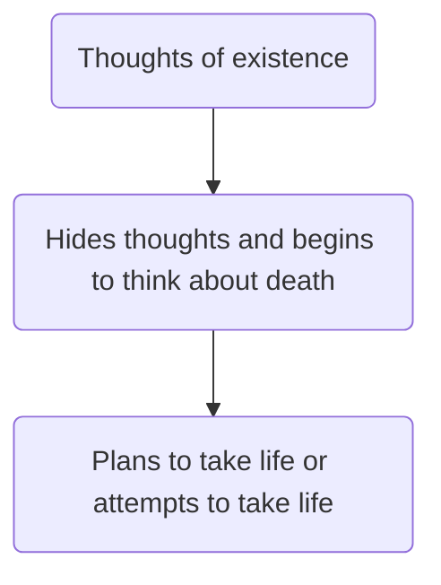

#aflv2025 #_2025 #ThetaChi 

```ad-note
Sponsored by Kappa Kappa Gamma and the Jed Foundation
```

# Speaker

**Name**: Dr. Ross Szabo

**Bio**: 
- Wellness Director, Geffen Academy at UCLA
- Doctor at UCLA that has made strides in the mental health space. 

# Introduction

Mental health has a lot of confusion around it. Is it:
- Self-care?
- Like Physical Health?

```ad-summary
title: Definiton

*Mental health* isn't having a problem**. It's how you address challenges in your life.** It's not about being perfectl. It's knowing what skills to use and when.
```

# Background Story

- Born in Bethlehem, and raised in Nazareth PA 
	- Super small town
- Looks like a normal family but:
	- Dad was raised by a raging alcoholic and was hurt physically and mentally
	- Mom was raised by two alcoholic and gained mental health issues later in life alongside diagnosed anxiety
- Tried to do everything to everything to make their lives better but:
	- Didn’t know how to talk through emotions
- At age 11, his oldest brother went to college when he was 16
- His oldest brother was diagnosed with bipolar disorder and had a 10 day manic episode
- A lot of tragic events happened:
	- Grandpa and Grandma passed away
	- Best friend got killed in a car accident
- At age 12, he started getting addicted to substance abuse (alcohol)
- Age 16:
	- Clear symptoms of bipolar disorder
	- Didn’t know how to deal with the problem
	- Would drink to pass out so his brain could stop
	- Got a diagnosis officially
- Senior year
	- Went into a deep depression
	- Kept drinking regardless of what the psychiatrist said
	- Was hoping that things would magically get better
	- Hospitalized for attempting to take his own life
		- Wanted to live, but didn’t want to feel the pain
	- Group Therapy
		- Full of traumatic experiences
		- Realized that he was pushing forward the perfect external life, but in reality, his internal life was tragic 
- After the hospital
	- Everyone called him a psycho and lost many of his friends
	- Psychiatrist came in and everyone laughed
	- However, when he shared his story, no one else laughed
- American University
	- Went in and out due to bipolar relapses
	- At age 22: binge-drank so much that he passed out for 22 hours
	- **Finally accepted that he had mental health issues**
- 21 Years Old:
	- Went to a family dinner
	- Both parents started crying, was very confused
	- Dad said that we didn’t think you would live until 21

```ad-important
- The number 1 predictor of mental health is from your family biology.
- External and internal life should be in balance
- The most dangerous people are people who hate themselves
```

# Fixing the Language

## Barriers

Some things that stop you getting help include:
- Denial
- Being Looked Down on
- Don’t want to be a burden on others
- Trauma-Comparing: (“At least I do not have it as bad as him”)
- Financial barriers
- Rumor-Spreading
- Not trusting others

## Mental Health Literacy

```ad-summary
title: Definition

Knowledge about metnal health disorders are associated with methods of help and prevention
```

## Influences

1. **Everyday**
- Stress
- Sleep
- Self-Esteem
2. **Your Environment**
- Friends
- Family
- Class
3. **Significant Events**
- Death of a loved one
- Life-changing events
4. **Mental Health Disorders**
- Bipolar
- Major Depressive Disorders
5. **Developmental Disabilities**
- ADHD
- Austim-Spectrum


## Spectrum

```mermaid
flowchart LR
A(Don't have stressors)-->B(Difficult to Balance)
B-->
```

## Emotions vs. *Disorders*

```ad-example
1. Nervous <-> Anxiety Disorder
2. Sad <-> Depression
3. Problems with Academics <-> Development Disorder
4. Hates messes <-> 
```

### Anxiety Spectrum

```ad-abstract
Anxiety disorders are an intense or disproportionate emotinal reponse.
```

```ad-important
The opposite of anxiety disorder is being able to see the reality.
```

### Depression Spectrum

Depression is *not* getting happier, it is gaining the physical changes like appetite, sleep, and more to gain vitality


### Suicidal Thought Spectrum



## Competition of Stress

### Good Stress vs. Bad Stress


| Good Stress     | Bad Stress                  |
| --------------- | --------------------------- |
| Keeps you going | Stops you from doing things |
|                 |                             |

```ad-important
How you **frame** stress matters. Those who don't have any stress tend to die earlier!
```

## The Brain
### Limbic System vs. Neocortex

Technology activates our Limbic System more often, which means we have become more impulsive than the past.

### Growing the Brain

Men’s brains are fully aged between 25-28, while women’s brains are fully developed by around 22

```ad-important
Procrastinators can only 
```

## How to Support Mental Health

1. Help a friend feel more comfortable with their situation
2. Ask open-ended questions to allow them to explain what is happening.
3. Listening can be enough. They don’t need to have answers.
4. Ask for help from an adult if it gets worse
5. Take care of their mental health during the process.
6. understand that they can’t be a therapist or psychologist.
7. Tell someone if a friend is suicidal

## A.S.K 

1. **Acknowledge**: Crate a supportive space by letting know you’re here for them
2. **Support**: Validate their feelings and ask what they need
3. **Keep-In-Touch**: Check back in regularly

## Coping

```ad-important
All coping mechanisms come from the mechanisms that we use in our brain.
```

All coping mechanisms go back to the synapses in our brain
- The more often you use it, the more often it becomes nature

The longer you use a coping mechanism:
- The more automatic it becomes
- The deeper the neural pathways get

**Between the ages of 12-25, that’s where you prepare them**

### Changing Ineffective Coping

1. You have to want o change ineffective coping
2. Identify the coping mechanism
3. Replace the ineffective coping mechanism
4. Spend plenty of time and effort to do so
5. It becomes automatic

## How to Lead Mental Health Conversations

1. Choose a story to share (your own or someone else’s WITH CONSENT)
2. Use a story you have emotionally processed
3. Make sure the story has a relevant point for a lesson
4. Center the learning objective and not yourself (the story isn’t personal validation)
5. Ensure the learning objective is *universal*

# Conclusion

We go through a checklist everyday until we end up in a place of *comfort*

```ad-important
Next time you are in your comfort zone, think about how you can express your internal life more.
```

## Resources

Text **ROSS** to `66866`
