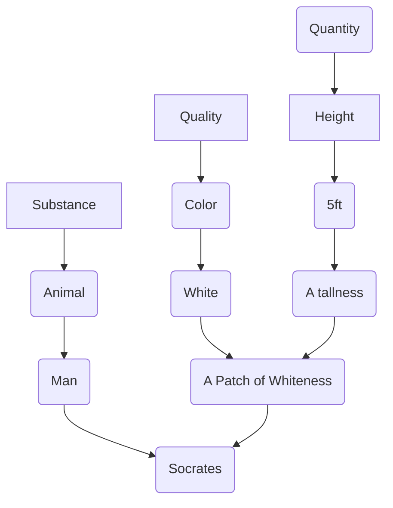

Date: 28th October 2025
Date Modified: 28th October 2025
File Folder: Week 10
#ancient_philosophy

```ad-abstract
title: Today's Topics
collapse: open

- Topic1
- Topic2
- Topic3

```

# Aristotle: Categories

## Brief Introduction

```ad-warning
Aristotle uses a lot of technical terms and are much more difficult to read than Plato's. It is also his lecture notes instead of published works.
```

Aristotle was a star student of Plato for 20 years. He was called “the mind of the school”. The school here means Plato’s Academy
- Was one of the first universities to exist
- Aristotle went to Plato’s Academy when he was just 17 years old
- He stayed there until Plato passed away

```ad-question
To what extent is Aristotle a Platonist and to what extent Aristotle differs fundamentally from Plato?
```

The school of Athens, a painting by Raphael, is a good example of this dichotomy
- *Interpretation*: Plato looks towards the heavens (Forms), while Aristotle finds a more grounded solution in the natural world

![[Pasted image 20251028093716.png]]

## Chapter 4: The List of Categories

```ad-note
Aristotle's works is broken up using Bekker's pagination: (ex. *Categoreies* 4, 1b25-2a4)
```

Aristotle divides or classifiers “being” or “reality” into 10 different categories.”
- **Substance** (A man and a horse)
- **Quantity** (2 inches long and a line 3 inches long)
- **Quality** (White and grammatical)
- **Relative** (A double, a half and the greater)
- **Place** (In the Lyceum and in the Agora)
- **Time** (Yesterday and last year)
- **Position** (Lies and sits)
- **Possessing** (Is shod and is armed)
- **Acting** (Cuts and burns)
- **Being Acted Upon** (is cut and is burned)

### Questions About his Categories

1. Where did Aristotle get this list?
	- He does not tell us; he is notorious for simply listing things without providing any rationale.
2. Must there be 10 categories?
	- Sometimes list 8 or even 4. 10 might not be the maximum either
3. What are they?
	- Categories are the highest classifications of being or they are the highest genera; categories themselves are not subject o classification
	- “Being”, therefore, is not a category or genus

## Chapter 2: “Said of Subject” and “Present In A Subject”

```ad-quote
collapse: closed
Of things, (1) some are said of a subject but are not present in any subject. 20 For example, man is said of an individual man, which is the subject, but is not present in any subject. (2) Others are present in a subject but are not said of any subject (a thing is said to be present in a subject if, not belonging as a part to that subject, it is incapable of existing apart from the subject in 25 which it is). For example, a particular point of grammar is present in the soul , which is the subject, but is not said of any subject, and a particular whiteness is present in a body (for every color is in a body), which is the subject, but is not said of any subject. (3) Other things, again, are said of a subject and are also present in a subject. For example, knowledge is present in the soul, which is the subject, and is said of a subject, e.g., of grammar. Finally, (4) there are things which are neither present in a subject nor said of a subject, such as an individual man and an individual horse; for, of things such as these, no one is either present in a subject or said of a subject. And without qualification, that which is an individual and numerically one is not said of any subject, but nothing prevents some of them from being present in a subject; for a particular point of grammar is present in a subject but is not said of any subject.
```

**Said of a subject** (S) and **Present in a Subject** (P) - a thing is present in a subject when it does not belong to a subject as a part and when it is incapable of existing apart from a subject.

Four possible combinations:
1. *S and not P:* Man is said of (and not present in) an individual man.
2. *Not-S and P*: A particular whiteness is in (and not predicated of) the body or a particular grammar is in (and not predicated of) the soul.
3. *S AND P*: Knowledge is in the soul and said of grammatical knowledge.
4. *not-S and not-P*: An individual man or an individual horse, which is a primary substance (*OUSIA*).

```ad-important
(S) is a subject-predicate relationship; and (P) is a relationshiop what exists dependently and independently.
```

### Primary Ousia (Substance)




**Each arrow represents a subject-predicate nature**

```ad-example
- Dog $\to$ 1 (General Substance)
- A Particular Shade of Brown $\to$ 2 (Specific Characteristic)
- 30 LBs $\to$ 2 (Specific Characteristic)
- Red $\to$ 3 (General Characteristic)
- My Dog Fido $\to$ 4 (Specific Substance)
- Sleeping $\to$ 3 (General Characteristic)
```

### Noteworthy Points

Primary substances (what are onto-logically prior) are identified negatively. What is independent is paradoxically picked out from reality negatively (the word itself is desired by the negative prefix). Compare that with Plato’s discussion of the Form of the Good and Parmenides’s account of “what-is”

Categories are usually considered to be one of the very early works of Aristotle written when he was in the Academy. Aristotle’s view is *a direct challenge* to Plato’s view that what is real and onto-logically prior are the Forms, like Justice, Beauty, and Good.

## Chapter 5: Substance

An individual man (a subject) is a **primary substance**. Man (species) and Animal (Genus) are **secondary substances**.
- A species is more of a substance than Genus because Species is more informative than Genus and it is more appropriate to call an individual in terms of Species than Genus.

### Questions

1. If primary substances are the individuals that exist, where do secondary substances exist?
2. Aristotle does not address this question in the *Categories*
3. In the *Metaphysics*, he grapples with this issue: He calls them the Universals. Where do they exist? In our mind? In the physical world? In the non-physical world? Or do they exist at all?
4. In other words, where do “forms” exist?

### *Tode Ti*

“Said of a subject” criterion itself *cannot* draw a distinction between any ontological difference between primary and secondary substances
- Ex. Aristotle (subject) is a Man (predicate) vs. Man (subject) is an Animal (predicate)
- See 3b10-25

```ad-quote
title: 3b10-25
collapse: closed
Every substance is thought to indicate a this. Now in the case of primary substances there is no dispute, and it is true that a primary substance indicates a this: for what is exhibited is something individual and numerically one. But in the case of a secondary substance, though the manner of naming it appears to signify in a similar way a this, as when one uses ‘a man’ or ‘an animal’, this is not true, for [such a name] signifies rather a sort of quality; for the subject is not just one [in an unqualified way], as in the case of a primary substance, but man or animal is said of many things. Nevertheless, such a [name] does not signify simply a quality, as ‘white’ does; for ‘white’ signifies a quality and nothing more, whereas a species or a genus [of a primary substance] determines the quality of a substance, for it signifies a substance which is qualified in some way. But the determination in the case of a genus is wider in application than that in the case of a species, for he who uses the name ‘animal’ includes more things than he who uses the name ‘man’.
```

A primary substance is a this (*Tode ti*); and a secondary substance is “a sort of quality” or a such.

### A Number of Features of Primary Substances

1. Has no contrary (in contrast to Hot and Cold or Small and Big)
2. Does not admit of degree (an individual man is not more or less of a man; in contrast white or beautiful or hot can be more or less)
3. Admits of contraries while remains numerically one and the same
	- *This feature is considered the most proper mark of a substance*
	- A man becomes light and dark or becomes virtuous and vicious
	- This is *not* possible for color (ex. black does not become white or virtue does not become vice)

### Aristotle; Pre-Socratics; and Plato


| Aristotle                                                                               | Pre-Socratics                                                                                                                                          | Plato                                                                                                                                       |
| --------------------------------------------------------------------------------------- | ------------------------------------------------------------------------------------------------------------------------------------------------------ | ------------------------------------------------------------------------------------------------------------------------------------------- |
| Opposites depends their existance on Primary Substances (which are ontologically prior) | Did not draw any categorical distinction about the Hot and Cold; the Wet and the Dry; that is, they speak of them as if they could exist on their own. | Opposites (Forms) are Onto-logically prior Beings that exists transcendentally. Physical things are in a state of flux (they are Becomings) |
### A Counter Example

A statement admits of contraries while remaining numerically one and the same (ex. Socrates is setting will become true and false) [See 4a23-33]

*Response*: The manner in which a statement admits of contraries is different. The reason it admits of contraries is that something else undergoes change, in this case it is Socrates; that is, a statement itself does not undergo changes but the substance itself (S).

### End Lecture Notes

- Plato introduced Forms because he thinks that knowledge is very difficult to obtain by discovering, so he thinks that there must be an intuitive knowledge within it
- Aristotle has to explain that we can push passed this and that we can learn about the objects in the cave and not their shadows by the physical world instead of transcendentally.
- Aristotle will put Forms into the physical world in his later arguments