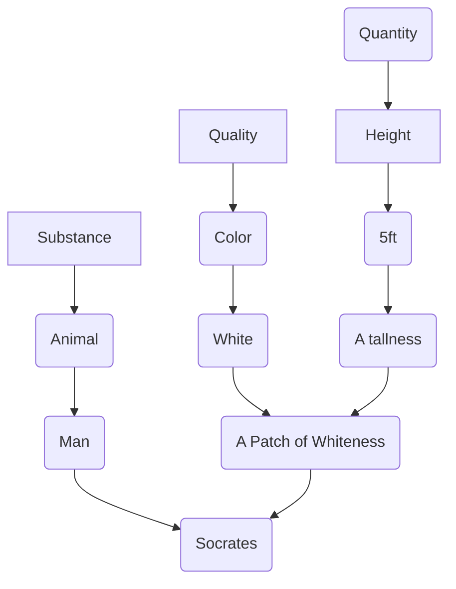

Date: 28th October 2025
Date Modified: 28th October 2025
File Folder: Week 10
#ancient_philosophy

```ad-abstract
title: Today's Topics
collapse: open

- Topic1
- Topic2
- Topic3

```

# Aristotle: Categories

## Brief Introduction

```ad-warning
Aristotle uses a lot of technical terms and are much more difficult to read than Plato's. It is also his lecture notes instead of published works.
```

Aristotle was a star student of Plato for 20 years. He was called “the mind of the school”. The school here means Plato’s Academy
- Was one of the first universities to exist
- Aristotle went to Plato’s Academy when he was just 17 years old
- He stayed there until Plato passed away

```ad-question
To what extent is Aristotle a Platonist and to what extent Aristotle differs fundamentally from Plato?
```

The school of Athens, a painting by Raphael, is a good example of this dichotomy
- *Interpretation*: Plato looks towards the heavens (Forms), while Aristotle finds a more grounded solution in the natural world

![[Pasted image 20251028093716.png]]

## Chapter 4: The List of Categories

```ad-note
Aristotle's works is broken up using Bekker's pagination: (ex. *Categoreies* 4, 1b25-2a4)
```

Aristotle divides or classifiers “being” or “reality” into 10 different categories.”
- **Substance** (A man and a horse)
- **Quantity** (2 inches long and a line 3 inches long)
- **Quality** (White and grammatical)
- **Relative** (A double, a half and the greater)
- **Place** (In the Lyceum and in the Agora)
- **Time** (Yesterday and last year)
- **Position** (Lies and sits)
- **Possessing** (Is shod and is armed)
- **Acting** (Cuts and burns)
- **Being Acted Upon** (is cut and is burned)

### Questions About his Categories

1. Where did Aristotle get this list?
	- He does not tell us; he is notorious for simply listing things without providing any rationale.
2. Must there be 10 categories?
	- Sometimes list 8 or even 4. 10 might not be the maximum either
3. What are they?
	- Categories are the highest classifications of being or they are the highest genera; categories themselves are not subject o classification
	- “Being”, therefore, is not a category or genus

## Chapter 2: “Said of Subject” and “Present In A Subject”

```ad-quote
collapse: closed
Of things, (1) some are said of a subject but are not present in any subject. 20 For example, man is said of an individual man, which is the subject, but is not present in any subject. (2) Others are present in a subject but are not said of any subject (a thing is said to be present in a subject if, not belonging as a part to that subject, it is incapable of existing apart from the subject in 25 which it is). For example, a particular point of grammar is present in the soul , which is the subject, but is not said of any subject, and a particular whiteness is present in a body (for every color is in a body), which is the subject, but is not said of any subject. (3) Other things, again, are said of a subject and are also present in a subject. For example, knowledge is present in the soul, which is the subject, and is said of a subject, e.g., of grammar. Finally, (4) there are things which are neither present in a subject nor said of a subject, such as an individual man and an individual horse; for, of things such as these, no one is either present in a subject or said of a subject. And without qualification, that which is an individual and numerically one is not said of any subject, but nothing prevents some of them from being present in a subject; for a particular point of grammar is present in a subject but is not said of any subject.
```

**Said of a subject** (S) and **Present in a Subject** (P) - a thing is present in a subject when it does not belong to a subject as a part and when it is incapable of existing apart from a subject.

Four possible combinations:
1. *S and not P:* Man is said of (and not present in) an individual man.
2. *Not-S and P*: A particular whiteness is in (and not predicated of) the body or a particular grammar is in (and not predicated of) the soul.
3. *S AND P*: Knowledge is in the soul and said of grammatical knowledge.
4. *not-S and not-P*: An individual man or an individual horse, which is a primary substance (*OUSIA*).

```ad-important
(S) is a subject-predicate relationship; and (P) is a relationshiop what exists dependently and independently.
```

### Primary Ousia (Substance)




**Each arrow represents a subject-predicate nature**

```ad-example
- Dog $\to$ 1 (General Substance)
- A Particular Shade of Brown $\to$ 2 (Specific Characteristic)
- 30 LBs $\to$ 2 (Specific Characteristic)
- Red $\to$ 3 (General Characteristic)
- My Dog Fido $\to$ 4 (Specific Substance)
- Sleeping $\to$ 3 (General Characteristic)
```

### Noteworthy Points

Primary substances (what are onto-logically prior) are identified negatively. What is independent is paradoxically picked out from reality negatively (the word itself is desired by the negative prefix). Compare that with Plato’s discussion of the Form of the Good and Parmenides’s account of “what-is”

Categories are usually considered to be one of the very early works of Aristotle written when he was in the Academy. Aristotle’s view is *a direct challenge* to Plato’s view that what is real and onto-logically prior are the Forms, like Justice, Beauty, and Good.

## Chapter 5: Substance

An individual man (a subject) is a **primary substance**. Man (species) and Animal (Genus) are **secondary substances**.
- A species is more of a substance than Genus because Species is more informative than Genus and it is more appropriate to call an individual in terms of Species than Genus.

### Questions

1. If primary substances are the individuals that exist, where do secondary substances exist?
2. Aristotle does not address this question in the *Categories*
3. In the *Metaphysics*, he grapples with this issue: He calls them the Universals. Where do they exist? In our mind? In the physical world? In the non-physical world? Or do they exist at all?
4. In other words, where do “forms” exist?

### *Tode Ti*

“Said of a subject” criterion itself *cannot* draw a distinction between any ontological difference between primary and secondary substances
- Ex. Aristotle (subject) is a Man (predicate) vs. Man (subject) is an Animal (predicate)
- See 3b10-25

```ad-quote
title: 3b10-25
collapse: closed
Every substance is thought to indicate a this. Now in the case of primary substances there is no dispute, and it is true that a primary substance indicates a this: for what is exhibited is something individual and numerically one. But in the case of a secondary substance, though the manner of naming it appears to signify in a similar way a this, as when one uses ‘a man’ or ‘an animal’, this is not true, for [such a name] signifies rather a sort of quality; for the subject is not just one [in an unqualified way], as in the case of a primary substance, but man or animal is said of many things. Nevertheless, such a [name] does not signify simply a quality, as ‘white’ does; for ‘white’ signifies a quality and nothing more, whereas a species or a genus [of a primary substance] determines the quality of a substance, for it signifies a substance which is qualified in some way. But the determination in the case of a genus is wider in application than that in the case of a species, for he who uses the name ‘animal’ includes more things than he who uses the name ‘man’.
```

A primary substance is a this (*Tode ti*); and a secondary substance is “a sort of quality” or a such.

### A Number of Features of Primary Substances

1. Has no contrary (in contrast to Hot and Cold or Small and Big)
2. Does not admit of degree (an individual man is not more or less of a man; in contrast white or beautiful or hot can be more or less)
3. Admits of contraries while remains numerically one and the same
	- *This feature is considered the most proper mark of a substance*
	- A man becomes light and dark or becomes virtuous and vicious
	- This is *not* possible for color (ex. black does not become white or virtue does not become vice)

### Aristotle; Pre-Socratics; and Plato


| Aristotle                                                                               | Pre-Socratics                                                                                                                                          | Plato                                                                                                                                       |
| --------------------------------------------------------------------------------------- | ------------------------------------------------------------------------------------------------------------------------------------------------------ | ------------------------------------------------------------------------------------------------------------------------------------------- |
| Opposites depends their existance on Primary Substances (which are ontologically prior) | Did not draw any categorical distinction about the Hot and Cold; the Wet and the Dry; that is, they speak of them as if they could exist on their own. | Opposites (Forms) are Onto-logically prior Beings that exists transcendentally. Physical things are in a state of flux (they are Becomings) |
### A Counter Example

A statement admits of contraries while remaining numerically one and the same (ex. Socrates is setting will become true and false) [See 4a23-33]

*Response*: The manner in which a statement admits of contraries is different. The reason it admits of contraries is that something else undergoes change, in this case it is Socrates; that is, a statement itself does not undergo changes but the substance itself (S).

### End Lecture Notes

- Plato introduced Forms because he thinks that knowledge is very difficult to obtain by discovering, so he thinks that there must be an intuitive knowledge within it
- Aristotle has to explain that we can push passed this and that we can learn about the objects in the cave and not their shadows by the physical world instead of transcendentally.
- Aristotle will put Forms into the physical world in his later arguments

# Aristotle’s Physics

## Book I

### First Principle

### Containers and the Principles of Chambers

### The Third Principle

Two principles are not sufficient to account for changes because one conrary does no act on another contrary

### Accidental & Substantial Changes

Using three changes, it can account for:
1. **Qualitative Change**: Change respect to quality Ex. Pale Socrates to Dark Socrates
2. **Quantitative Change**: Change with respect to quantity Ex. 4-ft Oak Tree to 6-ft Oak Tree
3. **Locomotion**: Change with respect to place. Ex. a Stone falling with up and bottom being contraries
4. **Substantial Change**: Change with respect to substance Ex. a chunk of a bronze becomes a statue

### Analogy

The third principle is an **underlying subject**:

```ad-quote
title: 19a8-15
As for the underlying nature, it is knowable by analogy. Thus, as bronze is to the statue or the wood is to the bed or the matter or the formless object prior to receiving a form is to that which has a form, so is this [underlying nature] to a substance or to a this or to being. This then is one of the principles, though it is not one nor a being in the manner of a this; another [principle] is the formula; then there is the contrary of the latter, and this is the privation.
```

- $\text{Bronze} \to \text{Statue}$
- $\text{Wood} \to \text{a bed, matter}$
- The formless object prior to receives a form → that which ahs a form


The three principles of coming-to-be are:
1. **Form**: The actual current state of the object
2. **Privation**: That which that thing does not have, but could have
3. **Underlying Subject**: The one that receives the form in privation

### Aristotle’s Reponse to Parmenides

**Argument of Parmenides**
```ad-quote
title: 19a24-34
In seeking the truth and the nature of things from the philosophical point of view, the first thinkers, as if led astray by inexperience, were misled into another way of thinking by maintaining the following: No thing can be generated or be destroyed because a thing must be generated either from being or from nonbeing; but both of these are impossible, for being cannot become something since it already exists, and a thing generated cannot come to be from nonbeing since there must be some underlying subject [from which it is to be generated]. And exaggerating the consequences in this manner, they concluded by saying that there is no plurality of things, but that only Being itself exists. This is the doctrine they adopted, then, and for the reasons stated.
```

**Aristotle’s Response**: Non-being is said to be in two different senses (one in terms of matter and the other in terms of privation)

```ad-quote
title: 191b13-15
It is the failure to make this distinction that led those thinkers astray, and through their ignorance of this they added so much more as to think that nothing else is generated or exists [besides Being], thus doing away with every [kind of] generation. Now we too maintain, as they do, that nothing is generated from unqualified nonbeing, yet we do maintain that generation from nonbeing in a qualified sense exists, namely, with respect to an attribute; for from the privation, which in itself is a not-being, something which did not exist is generated.
```

Matter is non-being in the sense of potentiality

```ad-quote
title: 191b27-30
This then is one way [of solving the difficulty]; but there is another, in view of the fact that we may speak of things with respect to their potentiality as well as with respect to their actuality, and we have settled this elsewhere with greater accuracy.
```

![[Ancient Philosophy - Week 10 Day 1 2025-10-30 09.53.08.excalidraw | center]]

```ad-note
title: Remember: Parmenides
![[Ancient Philosophy - Week 2 Day 1 2025-09-02 10.29.34.excalidraw | center]]
```

```ad-important
**Aristotle’s Point-of-View**: He views what is and **what is possible** (Actuality vs Potentiality)
- He extends *noein* to both "what is" AND "what is possible" and does not exclude it like Parmenides

![[Ancient Philosophy - Week 10 Day 1 2025-10-30 09.57.22.excalidraw | center]]
```

Implications of this:
- We can only come to know what is based on Parmenides
- Aristotle believes that there is something in between and that it is possible to eventually know that is possible.

# Book II: Nature and Art

Some things exist by **Nature**
- Such as animals, parts of animals, plants, and elements (earth, fire, air, and water).
- They are substance (*Ousiai*)
- In these things, a principle of motion and standstill belong primarily in virtue of itself

Exist by **Art**:
- Such as a bed or a garment
- They do not have a principle of motion and stnadstill
- *Except* when it is by accident; that is, in so far as they are made up of stone or earth

```ad-example
Aristotle's Example of "by accident": The same person is both a doctor and a patient (he becomes healthy not in virtue of being a patient but in virtue of being a doctor).
```

### Matter as the Nature

Some, like Antiphon, believes that nature is the underlying matter, such as wood or bronze.
- If Antiphon is correct, then all matter would be a principle in such a way. That is why it is not surprising that elements (such as air, water, fire, and earth) were posited to be the ultimate principles by some thinkers.

```ad-example
If one were to plant a bed, and if it is possible to growth, what would result would not be a bed, but wood.
```

### Form as the Nature

However, Aristotle identifies *form as the nature*:
- Because we identify what the thing is in virtue of its form (something that is only potentially flesh or bone does not yet have its nature until it acquires the form).
- It is a man, who has the full form, who is responsible for generating another man (bed is not generated from a bed.)
- Form (which is an actuality) is more of a nature than matter (which is a potentiality), such that form is a final end towards which a thing aims at.

Nature is spoken of in 2 senses: *Form* and *Matter*. But form is prior to matter because form is what exists in virtue of which we identify what it is and it is both an **efficient cause** (for a thing with the complete form that generates, such as a man generates a man) and a **final cause** (for a change is directed towards it, such as an acorn aims to become an oak).

![[Ancient Philosophy - Week 10 Day 1 2025-10-30 10.18.06.excalidraw | center]]

```ad-note
The form of an object kind of puts a limit on "what-is-possible".
```

### Three Theoretical Sciences

**Mathematics**: Separates in thought from he physical bodies; they are separable from motion
- For example: oddness, straightness, curvature, a number, a line, and a figure
- Geometry studies physical lines but not *qua* physical

**Physics**: Studies both form and matter
- Example: A snub nose (a curvature in a body)
- Optics studies mathematical line not qua mathematical but *qua* physical

**Metaphysics**: Studies a separate form (ex. a God)

### Four Causes

```ad-note
We understand a thing when we could account the *why* of it; that is, to give its causes (or explanations)
```

The Four Causes:
1. **Formal** (shape or formula)
2. **Material** (The bronze of a statue)
3. **Efficient** (A father)
4. **Final** (Walking is for the *sake* of health)

```ad-important
Human soul is the formal cause of humans as they are vs a perfect statue of them.
```

### 4-6: Chance and Luck

The difference between them is that luck involves choice: hence, it is a result of an action. Nothing, therefore, happens by luck to inanimate objects, brutes, and children (only by chance).

```ad-summary
title: Definition
**Cause**: What is necessary, or eternal, or for the most part; hence, knowledge of it is possible
```

A chance/luck, in contrast, is neither necessary, nor eternal, nor for the most part
- It occurs only by accident
- Example: A cause of a house ocming into being is the art of building not pale and not musical even if the buiilder happens to have these properties (they are accidental).
- Example 2: A person goes to a marketplace and happens to bump into a person who owes you money.

*Characteristics*:
1. Indefinite
2. A cuase in a qualifed sense
3. Contrary to reason because reason is of what is always or for the most part.
4. Cannot be a part of science

### 8: Teleology

Do tings in nature happen only by necessity or are they also for the sake of something or for what is better?

```ad-example
Rain occurs because what goes up must be cooled resulting in coming down fo cold water. If the growth of corn happens because of the rain, the rain did not occur for the sake of corn, but by coincidence.
```

Is everything in nature expalined in the same way?
- *ex*: Front teeth are sharp for tearing food and the molars are broad for grinding food - is this a coincidence or a final cause?

```ad-important
All things by nautre, however, come to be either always or for the most part; hence, their causes are not coincidence. There *must* be a final cause (or for the sake of something)
```

#### For the Sake of Something

Different stages in natural develop:
- Earlier stages are for the sake of latter stages
- Ex. Embryo is for the sake of child which is for the sake of adult
- Art: Foundation is for the sake of the walls, which is for the sake of the house
- *Analogy*: If art is for the sake of something, so is the nature 

```ad-quote
title: Book II, Chapter 8 199b
Moreover, in that which has an end, a prior stage and the stages that follow are done for the sake of that end. Accordingly, these are done in the manner in which the nature of the thing disposes them to be done; and the nature of the thing disposes them to be done in the manner in which they are done at each stage, if nothing obstructs. But they are done for the sake of something; so they are by nature disposed to be done for the sake of something. For example, if a house were a thing generated by nature, it would have been generated in a way similar to that in which it is now generated by art. So if things by nature were to be generated not only by nature but also by art, they would have been generated just as they are by nature disposed to be generated. So one stage is for the sake of the next. In general, in some cases art completes what nature cannot carry out to an end, in others, it imitates nature. Thus, if things done according to art are for the sake of something, clearly also those according to nature are done for the sake of something; for the later stages are similarly related to the earlier stages in those according to art and those according to nature.
```

```ad-note
He also considers inadimate objects in his tedeology
```

#### The Form and the Final Cause

The final cause is found in the form and not in the matter
- What is necessary exists in the matter
- What is necessary is subordinated to the final cause.

```ad-example
In order for a saw to exist, it must be made of certian material (or for a thing to perform its funciton it must be made of certain materials).
```

```ad-warning
We reject Aristotle's tedeology because inanimate objects only move due to being acted on external animate objects (Newton's Laws)
```

## Book III

### 1: Change/Motion

**Substantial change**; A change with respect to a substance (ex. *this* change from the form to the privation of that form)

**Accidental Change**:
1. Qualitative Change
2. Quantitative Change 
3. Locomotion

### Definition of Motion

One stage has actuality and the other has potentiality,,

```ad-summary
title: Definition
The actuality of hte poentiallity exsitng *qua* existing poentiality.
```

```ad-example
What is buildable is that which can be built. It exists in acutality when it is in the process of being built.
```

**Qua**: “In so far as” or “in aspect”
- Ex. One athlete is *qua* basketball, but not *qua* baseball.


### Incomplete Actuality

- Motion is difficult to define
- Not definite
- Neither potentiality or actuality
- Motion is an incomplete actuality

### Actuality in the Moved

```ad-question
Where is the actuality? The mover or in the moved?
```

*NOT* in the mover
- If it was so, then the motion occurs in the mover
- Neither are there 2 different acutalites because there will be 2 actualities

Therefore, actuality must occur in the moved!

### Implications

The actuality of the mover and the moved are one in the same.

**The Four Implications**
1. Cause and effect occur simultaneously
2. The definition of motion, in terms of actuality and potentiality, implies teleology. Motion/change requires an end goal
3. It is always what is actual that is responsible for what is potential to come into being; hence, the priority of actuality over potentiality.
4. No such things as self-motion, even in the case of animals.

