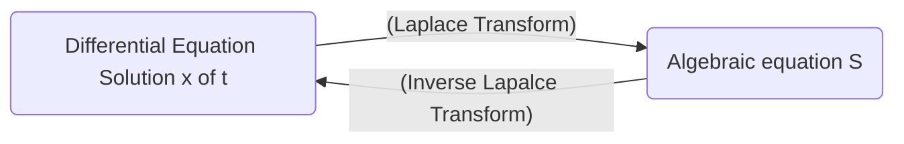

Date: 14th November 2025
Date Modified: 14th November 2025
File Folder: Module 5
#diffeq

# Introduction to Laplace Transforms

## Basis of Laplace Transforms

```ad-important
The Laplace transform turns a differential equaiton into an algebraic equation, solve then algebraic equation, and then apply the inverse laplace transform to get it back.

```



## Formal Definition

Let $f$ be defined for $t \ge 0$ and let $s$ be a real number. Then, the **Laplace Transform** of $f$ is the function $F$ defined by:

$$
F(s)= \laplace \{ f(t)\} =\int_{0}^\infty e^{-st}f(t)dt \newcommand{\laplace}{\mathscr{L}}
$$
for those values of $s$ for which the improper integral converges

### Elementary Function Examples

#### Constants
$$
\laplace\{1\} = \int_{0}^{\infty} e^{-st}*1dt = \int_{0}^\infty e^{-st}dt
$$
$$
= \lim_{ b \to \infty } \int_{0}^b e^{-st}dt
$$
$$
= \eval{\lim_{ b \to \infty } \frac{1}{-s}e^{-st}}{0}{b}=\lim_{ b \to \infty } \left [  e^{-sb}+\frac{1}{s}e^{-s(0)} \right ] = \frac{1}{s} \newcommand{\eval}[3]{\left. #1 \right\rvert_{#2}^{#3}}
$$
#### Single Variable

$$
\laplace \{ t \} = \int_{0}^\infty e^{st}t dt
$$
$$
= \lim_{ b \to \infty } \int_{0}^b t e^{-st}dt
$$
$$
\int te^{-st}dt
$$
$$
u = t \quad du = dt
$$
$$
dv = e^{-st}dt \quad v = \frac{1}{-s}e^{-st}
$$
$$
(t)\left( -\frac{1}{s}e^{-st} \right)- \int -\frac{1}{s}e^{-st}dt
$$
$$
= \frac{1}{s}te^{-st} + \frac{1}{s} \int e^{-st} dt
$$
$$
= -\frac{1}{s}te^{-st}+\frac{1}{s}-\frac{1}{s}e^{-st}
$$

$$
= \eval{\lim_{ b \to \infty } \left[ -\frac{1}{s}te^{-st} - \frac{1}{s^2}e^{-st} \right]}{0}{b}
$$
$$
\lim_{ b \to \infty } \left \{ \left [-\frac{1}{s}b e^{-sb}-\frac{1}{s^2}e^{-sb}\right ] - \left  [ -\frac{1}{s}(0)e^{-s(0)}=\frac{1}{s^2}e^{-s(0)} \right]\right \}
$$
$$
\lim_{ b \to \infty } be^{-sb}
$$
$$
\lim_{ b \to \infty } \frac{b}{e^{sb}}
$$
$$
\lim_{ b \to \infty } \frac{1}{se^{sb}}
$$
$$
\to 0
$$
$$
\boxed{\laplace\{ t\} = \frac{1}{s^2}} 
$$
#### Other Function

$$
\laplace\{f(t)\}=\int_{0}^\infty e^{-st} dt
$$

| $f(t)$ | $\laplace\{ f(t) \}$ |
| ------ | -------------------- |
| 1      | $\frac{1}{s}$        |
| $k$    | $\frac{k}{s}$        |
| $t$    | $\frac{1}{s^2}$      |
## Gamma Function

The Laplace transform $\laplace \{ t^a \}$ of a power function is most conveniently expressed in terms of the **gamma function** $\Gamma(x)$, which is defined as:

$$
\Gamma(x)= \int_{0}^{\infty}e^{-t}t^{x-1}dt \quad \forall x > 0
$$
```ad-summary
title: Properties
1. $\Gamma(1)=1$
2. $\Gamma(x+1)=x\Gamma(x)$ for $x > 0$
3. $\Gamma(\frac{1}{2})= \sqrt{\pi}$
```

### Gamma Function and the Factorial

It then follows that if $n$ is a positive integer, then:

$$
\Gamma(n+1)=n \Gamma(n)
$$
$$
=n \times (n-1) \Gamma(n-1)
$$
$$
n \times (n-1) \times (n-2) \Gamma(n-2)
$$
$$
\vdots
$$
$$
=n(n-1)(n-2)\dots {2} \times \Gamma(2)
$$
$$
n(n-1)(n-2)\dots 2 \times 1 \times \Gamma(1)
$$
$$
\therefore \Gamma(n+1) =n!
$$
### Example

Suppose we have a function $f(t)=t^a$ where $a$ is a real and $a > -1$. Then,

$$
\laplace(t^a)= \int_{0}^\infty e^{-st}t^adt
$$
If we substitute $u = st$, $t = \frac{u}{s}$, and $dt=\frac{du}{s}$ in this integral, we get:

$$
\frac{1}{s^{a+1}} \int_{0}^\infty e^{-u}u^adu = \frac{\Gamma(a+1)}{s^{a+1}}
$$
$$
\boxed{\laplace \{ t^a \}= \frac{n!}{s^{n+1}} \quad \forall s> 0}
$$
*For Instance*
$$
\laplace\{t\} = \frac{1}{s^2}, \laplace \{ t^2 \} = \frac{2}{s^3}, \laplace \{ t^3\} = \frac{6}{s^4}
$$
$$
\laplace \{ t^{5/2} \} = \frac{\Gamma\left( \frac{5}{2}+1 \right)}{s^{5/2+1}}
$$
$$
\Gamma\left( \frac{5}{2}+1 \right) = \frac{5}{2}\Gamma\left( \frac{5}{2} \right)
$$
$$
= \frac{5}{2} \times \frac{3}{2} \times \frac{1}{2} \times \Gamma\left( \frac{1}{2} \right)
$$
$$
\laplace\{ t^{5/2} \} = \frac{15}{8} \frac{\sqrt{ \pi }}{s^{7/2}}
$$
## Theorem 1: Linearity of the Laplace Transform

If $a$ and $b$ are constants, then:

$$
\laplace\{ af(t)+bg(t) \}= a \laplace \{ f(t) \} + b \laplace\{ g(t) \} \quad \forall s
$$

if the functions $f$ and $g$ have Laplace transforms

```ad-example

$$
\laplace\{ 2t+1 \}
$$
$$
2 \laplace\{t\} + \laplace\{1\}
$$
$$
= 2 \times \frac{1}{s^2}+\frac{1}{s}
$$
$$
\frac{2}{s^2}+\frac{1}{s}
$$
```

### Example 1

```ad-question
Find the laplace transform:
$$\laplace\{ 3t^2+4t^{3/2} \}$$
```

$$
= 3 \times \frac{2!}{s^3}+ 4 \frac{\Gamma\left( \frac{5}{2} \right)}{\frac{s^5}{2}}
$$
$$
= \frac{6}{s^3}+ 3 \sqrt{ \frac{\pi}{s^5} }
$$
### Example 2

$$
\laplace \{ 3t^2 -4t + 3 \}
$$
$$
3 \laplace \{ t^2 \}-4 \laplace \{ t \} + 3 \laplace \{ 1 \}
$$
$$
=3 \times \frac{2!}{s^{2+1}}-4 \frac{1}{s^2}+3\left( \frac{1}{s} \right)
$$
$$
=\frac{6}{s^3}-\frac{4}{s^2}+\frac{3}{s}
$$
## Trig Functions and Hyperbolic

#### Hyperbolic Cosine

Recall that $\cosh kt = (e^{kt}+e^{-kt})/2$

If $k >0$, then use both Theorems together to get:

$$
\laplace\{ \cosh kt \} \frac{1}{2} \laplace\{ e^{kt} \} + \frac{1}{2} \laplace\{ e^{-kt} \} = \frac{1}{2} \left( \frac{1}{s-k}+\frac{1}{s+k} \right)
$$
Such that

$$
\laplace  \{ \cosh kt \} = \frac{s}{s^2-k^2} \quad \forall s > k > 0
$$
### Hyperbolic Sine

$$
\laplace \{ \sinh kt \} = \frac{k}{s^2-k^2}
$$
### Cosine

$$
\cos kt = (e^{ikt}+e^{-ikt})/2
$$
$$
\laplace\{\cos kt\} = \frac{1}{2} \left( \frac{1}{s-ik} + \frac{1}{s+ik} \right) = \frac{1}{2} \frac{2s}{s^2-(ik)^2}
$$
$$
\laplace \{ \cos kt \} = \frac{s}{s^2+k^2} \quad \forall s>0
$$

### Sine

$$
\laplace\{ \sin kt\} = \frac{k}{s^2+k^2}
$$

### Examples

$$
\laplace\{\sin 2t\} = \frac{2}{s^2+4}
$$
$$
\laplace \{ \cos 3\pi t \} = \frac{s}{s^2+9 \pi^2}
$$
$$
\laplace \{ \cosh 2t \} = \frac{s}{s^2-4}
$$
$$
\laplace\{ \sinh 7t \} = \frac{7}{s^2-49}
$$
## Table of Transform $\star$


| $f(t)$                | $F(s)$                                    | \|  | $f(t)$     | $F(s)$                                |
| --------------------- | ----------------------------------------- | --- | ---------- | ------------------------------------- |
| $1$                   | $\frac{1}{2} \quad (s>0)$                 | \|  | $\cos kt$  | $\frac{s}{s^2+k^2} \quad (s>0)$       |
| $t$                   | $\frac{1}{s^2} \quad (s> 0)$              | \|  | $\sin kt$  | $\frac{k}{s^2+k^2} \quad (s>0)$       |
| $t^n \quad (n \ge 0)$ | $\frac{n!}{s^{n+1}} \quad (s>0)$          | \|  | $\cosh kt$ | $\frac{s}{s^2-k^2} \quad (s > \|k\|)$ |
| $t^a (a>-1)$          | $\frac{\Gamma(a+1)}{s^{a+1}} \quad (s>0)$ | \|  | $\sinh kt$ | $\frac{k}{s^2-k^2} \quad (s> \|k\|)$  |
| $e^{at}$              | $\frac{1}{s-a} \quad (s>a)$               | \|  | $u(t-a)$   | $\frac{e^{-as}}{s} \quad (s > 0)$     |

## Homework Examples

### Example 1

```ad-question
Find the laplace transform of the funciton $f(t) =3, t>0$ using the definition
```

$$
F(s)= \int_{0}^\infty 3e^{-st}dt
$$
#### Constants
$$
\laplace\{3\} = 3\int_{0}^{\infty} e^{-st}*1dt = 3\int_{0}^\infty e^{-st}dt
$$
$$
= \lim_{ b \to \infty } 3\int_{0}^b e^{-st}dt
$$
$$
= 3 \times \eval{\lim_{ b \to \infty } \frac{1}{-s}e^{-st}}{0}{b}= 3 \times \lim_{ b \to \infty } \left [  e^{-sb}+\frac{1}{s}e^{-s(0)} \right ] = \frac{3}{s} \newcommand{\eval}[3]{\left. #1 \right\rvert_{#2}^{#3}}
$$
### Example 2

```ad-question
Find the laplace transform for the function $f(t) = e^{0.4t}$
```

$$
\laplace\{e^{at}\}=\frac{1}{s-a}
$$
$$
= \frac{1}{s-0.4}
$$
## Class Examples

### Example 1

$$
\laplace \{ \sqrt{ t } +3t \}
$$
$$
= \frac{\Gamma\left( \frac{1}{2}+1 \right)}{s^{1/2+1}} +\frac{3}{s^2}
$$
$$
= \frac{\sqrt{ \pi }}{2s^{3/2}}+\frac{3}{s^2}
$$

### Example 2

$$
\laplace \{ t -2e^{3t}\}
$$
$$
= \frac{1}{s^2}-\frac{2}{s-3}
$$

### Example 3

$$
\laplace\{ \sin 2t + \cos 2t\}
$$
$$
=\frac{2}{s^2+4}+ \frac{s}{s^2+4}
$$
### Example 4

$$
\laplace \{ 1+ \cosh 5t \}
$$
$$
\frac{1}{s}+\frac{s}{s^2-25}
$$

### Example 5

$$
\laplace \{ \cos^2 2t\}
$$
$$
\cos 2 \theta= \cos^2 \theta \times \sin^2 \theta
$$
$$
\cos^2 \theta = \frac{1}{2}(1+\cos2\theta)
$$
$$
\laplace \left\{  \frac{1}{2} [1+\cos 4t]  \right\}
$$
$$
\frac{1}{2s} + \frac{s}{s^2+16}
$$

### Example 6

$$
\laplace \{ \sin 3t \cos 3t \}
$$
$$
\sin 2 \theta = 2 \sin \theta \cos \theta
$$
$$
\sin \theta \cos \theta = \frac{1}{2} \sin \theta
$$
$$
\laplace \{ \}
$$


# Inverse Laplace Transforms

## Basic Examples

$$
\laplace^{-1} \left \{ \frac{4}{s^2+16} \right \} = \sin 4t
$$
$$
\laplace^{-1} \left \{ \frac{49}{s^2-4} \right \}= \laplace^{-1} \{ \frac{49}{2} \times \frac{2}{s^2-4} \}
$$
$$
= \frac{49}{2}\sin 2t
$$


