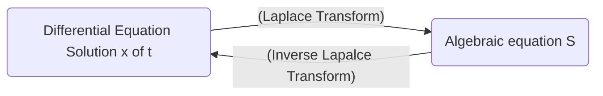

Date: 14th November 2025
Date Modified: 14th November 2025
File Folder: Module 5
#diffeq

# Introduction to Laplace Transforms

## Basis of Laplace Transforms

```ad-important
The Laplace transform turns a differential equaiton into an algebraic equation, solve then algebraic equation, and then apply the inverse laplace transform to get it back.

```



## Formal Definition

Let $f$ be defined for $t \ge 0$ and let $s$ be a real number. Then, the **Laplace Transform** of $f$ is the function $F$ defined by:

$$
F(s)= \laplace \{ f(t)\} =\int_{0}^\infty e^{-st}f(t)dt \newcommand{\laplace}{\mathscr{L}}

$$
for those values of $s$ for which the improper integral converges

### Elementary Function Examples

$$
\laplace\{1\} = \int_{0}^{\infty} e^{-st}*1dt = \int_{0}^\infty e^{-st}dt
$$
$$
= \lim_{ b \to \infty } \int_{0}^b e^{-st}dt
$$
$$
= \lim_{ b \to \infty } \frac{1}{-s}e^{-st} 
$$
$$
\newcommand{\defeval }}[3]{\left. #1\right\rvert_{#2}^{#3}}
$$

| $f(t)$ | $\laplace\{ f(t) \}$ |
| ------ | -------------------- |
| 1      | $\frac{1}{s}$        |
| $k$    | $\frac{k}{s}$        |


