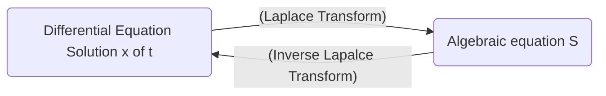

Date: 14th November 2025
Date Modified: 14th November 2025
File Folder: Module 5
#diffeq

# Introduction to Laplace Transforms

## Basis of Laplace Transforms

```ad-important
The Laplace transform turns a differential equaiton into an algebraic equation, solve then algebraic equation, and then apply the inverse laplace transform to get it back.

```



## Formal Definition

Let $f$ be defined for $t \ge 0$ and let $s$ be a real number. Then, the **Laplace Transform** of $f$ is the function $F$ defined by:

$$
F(s)= \laplace \{ f(t)\} =\int_{0}^\infty e^{-st}f(t)dt \newcommand{\laplace}{\mathscr{L}}
$$
for those values of $s$ for which the improper integral converges

### Elementary Function Examples

#### Constants
$$
\laplace\{1\} = \int_{0}^{\infty} e^{-st}*1dt = \int_{0}^\infty e^{-st}dt
$$
$$
= \lim_{ b \to \infty } \int_{0}^b e^{-st}dt
$$
$$
= \eval{\lim_{ b \to \infty } \frac{1}{-s}e^{-st}}{0}{b}=\lim_{ b \to \infty } \left [  e^{-sb}+\frac{1}{s}e^{-s(0)} \right ] = \frac{1}{s} \newcommand{\eval}[3]{\left. #1 \right\rvert_{#2}^{#3}}
$$
#### Single Variable

$$
\laplace \{ t \} = \int_{0}^\infty e^{st}t dt
$$
$$
= \lim_{ b \to \infty } \int_{0}^b t e^{-st}dt
$$
$$
\int te^{-st}dt
$$
$$
u = t \quad du = dt
$$
$$
dv = e^{-st}dt \quad v = \frac{1}{-s}e^{-st}
$$
$$
(t)\left( -\frac{1}{s}e^{-st} \right)- \int -\frac{1}{s}e^{-st}dt
$$
$$
= \frac{1}{s}te^{-st} + \frac{1}{s} \int e^{-st} dt
$$
$$
= -\frac{1}{s}te^{-st}+\frac{1}{s}-\frac{1}{s}e^{-st}
$$

$$
= \eval{\lim_{ b \to \infty } \left[ -\frac{1}{s}te^{-st} - \frac{1}{s^2}e^{-st} \right]}{0}{b}
$$
$$
\lim_{ b \to \infty } \left \{ \left [-\frac{1}{s}b e^{-sb}-\frac{1}{s^2}e^{-sb}\right ] - \left  [ -\frac{1}{s}(0)e^{-s(0)}=\frac{1}{s^2}e^{-s(0)} \right]\right \}
$$
$$
\lim_{ b \to \infty } be^{-sb}
$$
$$
\lim_{ b \to \infty } \frac{b}{e^{sb}}
$$
$$
\lim_{ b \to \infty } \frac{1}{se^{sb}}
$$
$$
\to 0
$$
$$
\boxed{\laplace\{ t\} = \frac{1}{s^2}} 
$$
#### Other Function

$$
\laplace\{f(t)\}=\int_{0}^\infty e^{-st}
$$

| $f(t)$ | $\laplace\{ f(t) \}$ |
| ------ | -------------------- |
| 1      | $\frac{1}{s}$        |
| $k$    | $\frac{k}{s}$        |
| $t$    | $\frac{1}{s^2}$      |
## Gamma Function

The Laplace transform $\laplace \{ t^a \}$ of a power function is most conveniently expressed in terms of the **gamma function** $\Gamma(x)$, which is defined as:

$$
\Gamma(x)= \int_{0}^{\infty}e^{-t}t^{x-1}dt
$$
#comebacklater 
