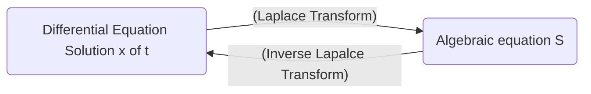

Date: 14th November 2025
Date Modified: 14th November 2025
File Folder: Module 5
#diffeq

# Introduction to Laplace Transforms

## Basis of Laplace Transforms

```ad-important
The Laplace transform turns a differential equaiton into an algebraic equation, solve then algebraic equation, and then apply the inverse laplace transform to get it back.

```



## Formal Definition

Let $f$ be defined for $t \ge 0$ and let $s$ be a real number. Then, the **Laplace Transform** of $f$ is the function $F$ defined by:

$$
F(s)= \laplace \{ f(t)\} =\int_{0}^\infty e^{-st}f(t)dt \newcommand{\laplace}{\mathscr{L}}
$$
for those values of $s$ for which the improper integral converges

### Elementary Function Examples

#### Constants
$$
\laplace\{1\} = \int_{0}^{\infty} e^{-st}*1dt = \int_{0}^\infty e^{-st}dt
$$
$$
= \lim_{ b \to \infty } \int_{0}^b e^{-st}dt
$$
$$
= \eval{\lim_{ b \to \infty } \frac{1}{-s}e^{-st}}{0}{b}=\lim_{ b \to \infty } \left [  e^{-sb}+\frac{1}{s}e^{-s(0)} \right ] = \frac{1}{s} \newcommand{\eval}[3]{\left. #1 \right\rvert_{#2}^{#3}}
$$
#### Single Variable

$$
\laplace \{ t \} = \int_{0}^\infty e^{st}t dt
$$
$$
= \lim_{ b \to \infty } \int_{0}^b t e^{-st}dt
$$
$$
\int te^{-st}dt
$$
$$
u = t \quad du = dt
$$
$$
dv = e^{-st}dt \quad v = \frac{1}{-s}e^{-st}
$$
$$
(t)\left( -\frac{1}{s}e^{-st} \right)- \int -\frac{1}{s}e^{-st}dt
$$
$$
= \frac{1}{s}te^{-st} + \frac{1}{s} \int e^{-st} dt
$$
$$
= -\frac{1}{s}te^{-st}+\frac{1}{s}-\frac{1}{s}e^{-st}
$$

$$
= \eval{\lim_{ b \to \infty } \left[ -\frac{1}{s}te^{-st} - \frac{1}{s^2}e^{-st} \right]}{0}{b}
$$
$$
\lim_{ b \to \infty } \left \{ \left [-\frac{1}{s}b e^{-sb}-\frac{1}{s^2}e^{-sb}\right ] - \left  [ -\frac{1}{s}(0)e^{-s(0)}=\frac{1}{s^2}e^{-s(0)} \right]\right \}
$$
$$
\lim_{ b \to \infty } be^{-sb}
$$
$$
\lim_{ b \to \infty } \frac{b}{e^{sb}}
$$
$$
\lim_{ b \to \infty } \frac{1}{se^{sb}}
$$
$$
\to 0
$$
$$
\boxed{\laplace\{ t\} = \frac{1}{s^2}} 
$$
#### Other Function

$$
\laplace\{f(t)\}=\int_{0}^\infty e^{-st} dt
$$

| $f(t)$ | $\laplace\{ f(t) \}$ |
| ------ | -------------------- |
| 1      | $\frac{1}{s}$        |
| $k$    | $\frac{k}{s}$        |
| $t$    | $\frac{1}{s^2}$      |
## Gamma Function

The Laplace transform $\laplace \{ t^a \}$ of a power function is most conveniently expressed in terms of the **gamma function** $\Gamma(x)$, which is defined as:

$$
\Gamma(x)= \int_{0}^{\infty}e^{-t}t^{x-1}dt \quad \forall x > 0
$$
```ad-summary
title: Properties
1. $\Gamma(1)=1$
2. $\Gamma(x+1)=x\Gamma(x)$ for $x > 0$
3. $\Gamma(\frac{1}{2})= \sqrt{\pi}$
```

### Gamma Function and the Factorial

It then follows that if $n$ is a positive integer, then:

$$
\Gamma(n+1)=n \Gamma(n)
$$
$$
=n \times (n-1) \Gamma(n-1)
$$
$$
n \times (n-1) \times (n-2) \Gamma(n-2)
$$
$$
\vdots
$$
$$
=n(n-1)(n-2)\dots {2} \times \Gamma(2)
$$
$$
n(n-1)(n-2)\dots 2 \times 1 \times \Gamma(1)
$$
$$
\therefore \Gamma(n+1) =n!
$$
### Example

Suppose we have a function $f(t)=t^a$ where $a$ is a real and $a > -1$. Then,

$$
\laplace(t^a)= \int_{0}^\infty e^{-st}t^adt
$$
If we substitute $u = st$, $t = \frac{u}{s}$, and $dt=\frac{du}{s}$ in this integral, we get:

$$
\frac{1}{s^{a+1}} \int_{0}^\infty e^{-u}u^adu = \frac{\Gamma(a+1)}{s^{a+1}}
$$
$$
\boxed{\laplace \{ t^a \}= \frac{n!}{s^{n+1}} \quad \forall s> 0}
$$
*For Instance*
$$
\laplace\{t\} = \frac{1}{s^2}, \laplace \{ t^2 \} = \frac{2}{s^3}, \laplace \{ t^3\} = \frac{6}{s^4}
$$
$$
\laplace \{ t^{5/2} \} = \frac{\Gamma\left( \frac{5}{2}+1 \right)}{s^{5/2+1}}
$$
$$
\Gamma\left( \frac{5}{2}+1 \right) = \frac{5}{2}\Gamma\left( \frac{5}{2} \right)
$$
$$
= \frac{5}{2} \times \frac{3}{2} \times \frac{1}{2} \times \Gamma\left( \frac{1}{2} \right)
$$
$$
\laplace\{ t^{5/2} \} = \frac{15}{8} \frac{\sqrt{ \pi }}{s^{7/2}}
$$
## Theorem 1: Linearity of the Laplace Transform

If $a$ and $b$ are constants, then:

$$
\laplace\{ af(t)+bg(t) \}= a \laplace \{ f(t) \} + b \laplace\{ g(t) \} \quad \forall s
$$

if the functions $f$ and $g$ have Laplace transforms

```ad-example

$$
\laplace\{ 2t+1 \}
$$
$$
2 \laplace\{t\} + \laplace\{1\}
$$
$$
= 2 \times \frac{1}{s^2}+\frac{1}{s}
$$
$$
\frac{2}{s^2}+\frac{1}{s}
$$
```

### Example 1

```ad-question
Find the laplace transform:
$$\laplace\{ 3t^2+4t^{3/2} \}$$
```

$$
= 3 \times \frac{2!}{s^3}+ 4 \frac{\Gamma\left( \frac{5}{2} \right)}{\frac{s^5}{2}}
$$
$$
= \frac{6}{s^3}+ 3 \sqrt{ \frac{\pi}{s^5} }
$$
### Example 2

$$
\laplace \{ 3t^2 -4t + 3 \}
$$
$$
3 \laplace \{ t^2 \}-4 \laplace \{ t \} + 3 \laplace \{ 1 \}
$$
$$
=3 \times \frac{2!}{s^{2+1}}-4 \frac{1}{s^2}+3\left( \frac{1}{s} \right)
$$
$$
=\frac{6}{s^3}-\frac{4}{s^2}+\frac{3}{s}
$$
## Trig Functions and Hyperbolic

#### Hyperbolic Cosine

Recall that $\cosh kt = (e^{kt}+e^{-kt})/2$

If $k >0$, then use both Theorems together to get:

$$
\laplace\{ \cosh kt \} \frac{1}{2} \laplace\{ e^{kt} \} + \frac{1}{2} \laplace\{ e^{-kt} \} = \frac{1}{2} \left( \frac{1}{s-k}+\frac{1}{s+k} \right)
$$
Such that

$$
\laplace  \{ \cosh kt \} = \frac{s}{s^2-k^2} \quad \forall s > k > 0
$$
### Hyperbolic Sine

$$
\laplace \{ \sinh kt \} = \frac{k}{s^2-k^2}
$$
### Cosine

$$
\cos kt = (e^{ikt}+e^{-ikt})/2
$$
$$
\laplace\{\cos kt\} = \frac{1}{2} \left( \frac{1}{s-ik} + \frac{1}{s+ik} \right) = \frac{1}{2} \frac{2s}{s^2-(ik)^2}
$$
$$
\laplace \{ \cos kt \} = \frac{s}{s^2+k^2} \quad \forall s>0
$$

### Sine

$$
\laplace\{ \sin kt\} = \frac{k}{s^2+k^2}
$$

### Examples

$$
\laplace\{\sin 2t\} = \frac{2}{s^2+4}
$$
$$
\laplace \{ \cos 3\pi t \} = \frac{s}{s^2+9 \pi^2}
$$
$$
\laplace \{ \cosh 2t \} = \frac{s}{s^2-4}
$$
$$
\laplace\{ \sinh 7t \} = \frac{7}{s^2-49}
$$
## Table of Transform $\star$


| $f(t)$                | $F(s)$                                    | \|  | $f(t)$     | $F(s)$                                |
| --------------------- | ----------------------------------------- | --- | ---------- | ------------------------------------- |
| $1$                   | $\frac{1}{2} \quad (s>0)$                 | \|  | $\cos kt$  | $\frac{s}{s^2+k^2} \quad (s>0)$       |
| $t$                   | $\frac{1}{s^2} \quad (s> 0)$              | \|  | $\sin kt$  | $\frac{k}{s^2+k^2} \quad (s>0)$       |
| $t^n \quad (n \ge 0)$ | $\frac{n!}{s^{n+1}} \quad (s>0)$          | \|  | $\cosh kt$ | $\frac{s}{s^2-k^2} \quad (s > \|k\|)$ |
| $t^a (a>-1)$          | $\frac{\Gamma(a+1)}{s^{a+1}} \quad (s>0)$ | \|  | $\sinh kt$ | $\frac{k}{s^2-k^2} \quad (s> \|k\|)$  |
| $e^{at}$              | $\frac{1}{s-a} \quad (s>a)$               | \|  | $u(t-a)$   | $\frac{e^{-as}}{s} \quad (s > 0)$     |

## Homework Examples

### Example 1

```ad-question
Find the laplace transform of the funciton $f(t) =3, t>0$ using the definition
```

$$
F(s)= \int_{0}^\infty 3e^{-st}dt
$$
#### Constants
$$
\laplace\{3\} = 3\int_{0}^{\infty} e^{-st}*1dt = 3\int_{0}^\infty e^{-st}dt
$$
$$
= \lim_{ b \to \infty } 3\int_{0}^b e^{-st}dt
$$
$$
= 3 \times \eval{\lim_{ b \to \infty } \frac{1}{-s}e^{-st}}{0}{b}= 3 \times \lim_{ b \to \infty } \left [  e^{-sb}+\frac{1}{s}e^{-s(0)} \right ] = \frac{3}{s} \newcommand{\eval}[3]{\left. #1 \right\rvert_{#2}^{#3}}
$$
### Example 2

```ad-question
Find the laplace transform for the function $f(t) = e^{0.4t}$
```

$$
\laplace\{e^{at}\}=\frac{1}{s-a}
$$
$$
= \frac{1}{s-0.4}
$$
## Class Examples

### Example 1

$$
\laplace \{ \sqrt{ t } +3t \}
$$
$$
= \frac{\Gamma\left( \frac{1}{2}+1 \right)}{s^{1/2+1}} +\frac{3}{s^2}
$$
$$
= \frac{\sqrt{ \pi }}{2s^{3/2}}+\frac{3}{s^2}
$$

### Example 2

$$
\laplace \{ t -2e^{3t}\}
$$
$$
= \frac{1}{s^2}-\frac{2}{s-3}
$$

### Example 3

$$
\laplace\{ \sin 2t + \cos 2t\}
$$
$$
=\frac{2}{s^2+4}+ \frac{s}{s^2+4}
$$
### Example 4

$$
\laplace \{ 1+ \cosh 5t \}
$$
$$
\frac{1}{s}+\frac{s}{s^2-25}
$$

### Example 5

$$
\laplace \{ \cos^2 2t\}
$$
$$
\cos 2 \theta= \cos^2 \theta \times \sin^2 \theta
$$
$$
\cos^2 \theta = \frac{1}{2}(1+\cos2\theta)
$$
$$
\laplace \left\{  \frac{1}{2} [1+\cos 4t]  \right\}
$$
$$
\frac{1}{2s} + \frac{s}{s^2+16}
$$

### Example 6

$$
\laplace \{ \sin 3t \cos 3t \}
$$
$$
\sin 2 \theta = 2 \sin \theta \cos \theta
$$
$$
\sin \theta \cos \theta = \frac{1}{2} \sin 2\theta
$$
$$
\laplace \{ \}
$$


# Inverse Laplace Transforms

## Basic Examples

$$
\laplace^{-1} \left \{ \frac{4}{s^2+16} \right \} = \sin 4t
$$
$$
\laplace^{-1} \left \{ \frac{49}{s^2-4} \right \}= \laplace^{-1} \{ \frac{49}{2} \times \frac{2}{s^2-4} \}
$$
$$
= \frac{49}{2}\sin 2t
$$
## In-Class Practice

```ad-question
Find the inverse Laplace transforms of the functions
```

### Problem 1

$$
F(s)=\frac{3}{s^4}
$$
$$
\laplace^{-1} \left\{  \frac{3!}{s^{3+1}}  \right\} = t^3
$$
$$
F(s)=\frac{1}{2}\left( \frac{6}{s^{4}} \right)
$$
$$
f(t) = \frac{1}{2} \laplace^{-1}\left\{  \frac{6}{s^4}  \right\}
$$
$$
f(t)=\frac{t^3}{2}
$$
### Problem 2

$$
F(s) = \frac{1}{s+5}
$$
$$
f(t)=e^{-5t}
$$
### Problem 3

$$
F(s) = s^{-3/2}
$$
$$
F(s) = \frac{1}{s^{3/2}}
$$
$$
F(s) = \frac{1}{\Gamma\left( \frac{3}{2} \right)}\frac{\Gamma\left( \frac{3}{2} \right)}{s^{3/2}}
$$
$$
f(t) = \frac{1}{\Gamma\left( \frac{3}{2} \right)}(t^{1/2})
$$
$$
f(t) = \frac{2}{\sqrt{ \pi }}t^{1/2}
$$
$$
f(t) = 2 \sqrt{ \frac{t}{\pi} }
$$
### Problem 4

$$
F(s) = \frac{1}{s} - \frac{2}{s^{5/2}}
$$
$$
F(s) = \frac{1}{s}-\frac{2}{\Gamma\left( \frac{5}{2} \right)}\times \frac{\Gamma\left( \frac{5}{2} \right)}{s^{5/2}}
$$
$$
f(t) = 1-\frac{2}{\Gamma\left( \frac{5}{2} \right)}t^{3/2}
$$
$$
f(t) = 1- \frac{8}{3 \sqrt{ \pi }}t^{3/2}
$$
#### Problem 5

$$
F(s)=\frac{3}{s-4}
$$
$$
3 \laplace^{-1}\{ \frac{1}{s-4}\}
$$
$$
f(t) = 3e^{4t}
$$
### Problem 6

$$
F(s)=\frac{5-3s}{s^2+9}
$$
$$
f(t) = \laplace^{-1}\{ F(s) \}
$$
$$
= \laplace^{-1} \left\{  \frac{5}{s^2+9}- \frac{3s}{s^2+9}  \right\}
$$
$$
= \laplace^{-1}\left\{  \frac{5}{s^2+9}  \right\} - \laplace^{-1} \left\{  \frac{3s}{s^2+9}  \right\}
$$
$$
f(t)=\frac{5}{3} \sin(3t)-3\cos(3t)
$$
### Problem 7

$$
F(s) = \frac{9+s}{4-s^2}
$$
$$
f(t)= \laplace^{-1}\left\{  \frac{9}{4-s^2}  \right\} + \laplace^{-1} \left\{  \frac{s}{4-s^2}  \right\}
$$
$$
= -\frac{9}{2}\laplace^{-1}\left\{  \frac{2}{s^2-4}  \right\} - \laplace^{-1} \left\{  \frac{s}{s^2-4}  \right\}
$$
$$
f(t) = -\frac{9}{2}\sinh(2t)-\cosh (2t)
$$
### Problem 8

$$
F(s) = \frac{10s-3}{25-s^2}
$$
$$
f(t) = \laplace^{-1}\left\{  \frac{10s}{25-s^2}  \right\} - \laplace^{-1} \left\{  \frac{3}{25-s^2}  \right\}
$$
$$
f(t) = -10 \laplace^{-1} \left\{  \frac{s}{s^2-25}  \right\}+ \frac{3}{5} \laplace^{-1} \left\{  \frac{5}{s^2-25}  \right\}
$$
$$
f(t) = -10 \cosh 5t+\frac{3}{5} \sinh 5t
$$
# Translation on the $s$-Axis

**Theorem**: If $F(s) = \laplace\{ f(t) \}$ exists for $s > c$, then $\laplace\{e^{at}f(t)\}$ exists for $s > a+c$, and:

$$
\laplace \{e^{at}f(t)\}=F(s-a)
$$
and
$$
\laplace^{-1}\{F(s-a)\} = e^{at}f(t)
$$

Thus the translation of $s \to s-a$ in the transform corresponds to the multiplication of the original function of $t$ by $e^{at}$


| $f(t)$    | $F(s)$              |
| --------- | ------------------- |
| 1         | $\frac{1}{s}$       |
| $e^{at}$  | $\frac{1}{s-a}$     |
| $t$       | $\frac{1}{s^2}$     |
| $te^{at}$ | $\frac{1}{(s-a)^2}$ |
## Examples

### Example 1

$$
\laplace \{ t^3 e^{2t} \}
$$
$$
\laplace\{ t^3\} = \frac{3!}{s^4}
$$
$$
\laplace \{ t^3 e^{2t} \} = \frac{6}{(s-2)^4}
$$
### Example 2

$$
f(t) = -3t^2e^{-8t}
$$
$$
F(s) = -3\laplace\{ t^2e^{-8t} \}
$$
$$
\laplace\{ t^2 \} = \frac{2}{s^3}
$$
$$
F(s) = -\frac{6}{(s+8)^3}
$$
### Example 3

$$
f(t) = e^{-7t}\sinh(-2t)
$$
$$
k = -2
$$
$$
F(s) = \frac{-2}{(s+7)^2-4}
$$
### Example 4

$$
f(t) = \laplace^{-1}\left\{ \frac{3}{2s-4}  \right\}
$$
$$
f(t) = \frac{3}{2}\laplace^{-1}\left\{  \frac{1}{s-2} \right\}
$$
$$
f(t) = \frac{3}{2}e^{2t}
$$
### Example 5

$$
f(t) = \laplace^{-1}\left\{  \frac{1}{s^2+4s+4}  \right\}
$$
$$
= \laplace^{-1}\left\{  \frac{1}{(s+2)^2}  \right\}
$$
$$
\laplace^{-1}\left\{  \frac{1}{s^2}  \right\}=t
$$
$$
f(t)= te^{-2t}
$$
### Example 6

$$
F(s) = \frac{1}{s^2+5s+4}
$$
$$
F(s) = \frac{1}{(s+1)(s+4)}
$$

### Example 7

$$
F(s) = \frac{2}{(s+6)^2} + \frac{-3s+2}{s^2+36}
$$
$$
f(t) = 2\laplace^{-1}\left \{ \frac{1}{(s+6)^2} \right \} - 3 \laplace^{-1}\left \{ \frac{s}{s^2+36} \right \}+ \frac{2}{6} \laplace^{-1} \left \{ \frac{6}{s^2+36} \right \}
$$
$$
f(t) = 2te^{-6t}-3\cos 6t + \frac{1}{3}\sin 6t
$$

### Example 8

$$
F(s)= \frac{{7s-11}}{s^2-25-15}
$$
$$
F(s) = \frac{7s-11}{(s-5)(s+3)}
$$
$$
= \frac{A}{s-5}+\frac{B}{s+3}
$$
$$
7s-11 =A(s+3)+B(s-5)
$$
$$
\text{At } s =-3
$$
$$
7(-3)-11=A(0)+B(-3-5)
$$
$$
-32 = -8B
$$
$$
B = 4
$$
$$
\text{At } s =5
$$
$$
24 = 8A
$$
$$
A = 3
$$
$$
F(s) = \frac{3}{s-5}+\frac{4}{s+3}
$$
$$
f(t) = 3\laplace^{-1}\left\{  \frac{1}{s-5}  \right\} + 4 \laplace^{-1}\left\{  \frac{1}{s+3}  \right\}
$$
$$
f(t) = 3e^\text{5t}+4e^{-3t}
$$
### Example 9

$$
F(s) = \frac{s}{(s-9)(s+7)(s+8)}
$$
$$
= \frac{A}{s-9}+\frac{B}{s+7}+\frac{C}{s+8}
$$
$$
s = A(s+7)(s+8)+B(s-9)(s+8)+C(s-9)(s+7)
$$
$$
\text{At } s = 9
$$
$$
9 = A(9+7)(9+8)
$$
$$
9 = 272A
$$
$$
A = \frac{9}{272}
$$
$$
\text{At } s=-7
$$
$$
-7 = B(-7-9)(-7+8)
$$
$$
-7 = -16B
$$
$$
B = \frac{7}{16}
$$
$$
\text{At } s=-8
$$
$$
-8 = C(-8-9)(-8+7)
$$
$$
-8=17C
$$
$$
-\frac{8}{17}=C
$$
$$
f(t) = \frac{9}{272} \laplace^{-1}\left \{ \frac{1}{s-9} \right \} + \frac{7}{16} \laplace^{-1} \left \{ \frac{1}{s+7} \right \}-\frac{8}{17} \laplace^{-1} \left \{ \frac{1}{s+8} \right \}
$$
$$
f(t) = \frac{9}{272}e^{-9t}+\frac{7}{16}e^{-7t}-\frac{8}{17}e^{-8t}
$$
### Example 10

$$
F(s) = \frac{-s^2+3s-6}{(s-3)^3}
$$
$$
= \frac{A}{s-3}+\frac{B}{(s-3)^2}+\frac{C}{(s-3)^3}
$$
$$
-s^2+3s-6 = A(s-3)^2+B(s-3)+C
$$
$$
\text{At } s = 3
$$
$$
-(3)^2+3(3)-6 = C
$$
$$
C = -6
$$
$$
-s^2+3s-6 = As^2-6sA+9A+Bs-3B+C
$$
$$
= As^2+ (B-6A)s+(9A-3B+C)
$$
$$
A = -1
$$
$$
3 = (B-6(-1))
$$
$$
B = -3
$$
$$
f(t) = - \laplace^{-1} \left \{ \frac{1}{s-3}  \right \}-3 \laplace^{-1} \left \{ \frac{1}{(s-3)^2} \right \} -\frac{6}{2} \laplace^{-1} \left \{ \frac{2}{(s-3)^3} \right \}
$$
$$
f(t) = -e^{3t}-3te^{3t}-3t^2e^{3t}
$$

### Example 11

$$
F(s)= \frac{s-6}{(s^2-1)(s^2+4)}
$$
$$
= \frac{s-6}{(s-1)(s+1)(s^2+4)} = \frac{A}{s-1}+\frac{B}{s+1}+\frac{Cs+D}{s^2+4}
$$
```ad-warning
This is an irreducable quadratic factor
```

$$
s-6 = A(s+1)(s^2+4)+B(s-1)(s^2+4)+(Cs+D)(s+1)(s-1)
$$
$$
\text{At } s = -1
$$
$$
(-1)-6 = 0 + B(-1-1)(-1^2+4)+0
$$
$$
-7 = -10B
$$
$$
B = \frac{7}{10}
$$
$$
\text{At } s = 1
$$
$$
-5 = A(2)(5) + 0+0
$$
$$
-5 = 10A
$$
$$
A = -\frac{1}{2}
$$
$$
\text{At } s =0
$$
$$
-6 = 4A -4B -D
$$
$$
-6 = 4\left( -\frac{1}{2} \right)-4\left( \frac{7}{10} \right)-D
$$
$$
-\frac{6}{5}=-D
$$
$$
D = \frac{6}{5}
$$
$$
\text{At } s = 2
$$
$$
-4 = 24A +8B + 3(2C+D)
$$
$$
-4 = 24\left( -\frac{1}{2} \right)+8\left( \frac{7}{10} \right)+6C+3\left( \frac{6}{5} \right)
$$
$$
C = -\frac{1}{5}
$$
$$
f(t) = -\frac{1}{2}\times \frac{1}{s-1} + \frac{7}{10}\times \frac{1}{s+1}-\frac{1}{5} \frac{s}{s^2+4}+\frac{6}{5} \frac{1}{s^2+4}
$$
### Example 12

$$
F(s) = \frac{4s-12}{s^2-8s+20}
$$
$$
F(s) = \frac{4s-12}{(s-4)^2+(2)^2}
$$
```ad-note

$$
\laplace \{ e^{at}\cos kt \} = \frac{s-a}{(s-a)^2+k^2}
$$
$$
\laplace \{ e^{at}\sin kt \} = \frac{k}{(s-a)^2+k^2}
$$
```

$$
4s-12= 4(s-4)+4
$$
$$
= \frac{4(s-4)+4}{(s-4)^2+2^2}
$$
$$
= \frac{4(s-4)}{(s-4)^2+(2)^2}+\frac{4}{(s-4)^2+2^2}
$$
$$
f(t) = 4e^{4t}\cos 2t + e^{4t}\sin 2t
$$
### Example 13

$$
F(s) = \frac{6s+5}{(s-2)(s^2+2s+5)}
$$
$$
= \frac{A}{s-2}+\frac{Bs+C}{s^2+2s+5}
$$
$$
6s+5 = A(s^2+2s+5)+(Bs+C)(s-2)
$$
$$
\text{At } s=2
$$
$$
6(2)+5=A((2)^2+2(2)+5)+0
$$
$$
17 = 13A
$$
$$
A = \frac{17}{13}
$$
$$
\text{At }s=0
$$
$$
5 = 5A -2C
$$
$$
5 = 5\left( \frac{17}{13} \right)-2C
$$
$$
-2C = \frac{-20}{13}
$$
$$
C = \frac{10}{13}
$$
$$
\text{At }s=1
$$
$$
11 = 8A-B-C
$$
$$
11 = 8\left( \frac{17}{13} \right)-B-\left( \frac{10}{13} \right)
$$
$$
-B = \frac{17}{13}
$$
$$
B = -\frac{17}{13}
$$
$$
= \frac{17}{13}\times \frac{1}{s-2}-\frac{17}{13} \times \frac{s}{s^2+2s+5}+\frac{10}{13}\times \frac{1}{s^2+2s+5}
$$
$$
= \frac{17}{13} \times \frac{1}{s-2}-\frac{17}{13} \left [\frac{s+1}{(s+1)^2+2^2}+\frac{1}{2}\times \frac{2}{(s+1)^2+2^2}\right]+\frac{5}{13} \times \frac{2}{(s+1)^2+2^2}
$$
$$
f(t) = \frac{17}{13}e^{2t}-\frac{17}{13}e^{-t}\cos 2t - \frac{17}{26}e^{-t}\sin 2t + \frac{5}{13}e^{-t}\sin 2t
$$
$$
f(t) = \frac{17}{13}e^{2t}-\frac{17}{13}e^{-t}\cos 2t -\frac{7}{26}e^{-t}\sin 2t
$$
### Example 14

$$
F(s) = \frac{5}{s(s^2+36)}
$$
```ad-important

```

$$
\laplace \left \{ \int_{0}^t f(\tau)d\tau\right \}=\frac{1}{s} F(s)
$$
$$
F(s) = 5 \times \frac{1}{s} \times \frac{1}{s^2+36}
$$
$$
F(s) = \frac{1}{s^2+36}; \quad
f(t) = \frac{1}{6}\sin 6t
$$
$$
f(t) = 5 \int_{0}^t \frac{1}{6} \sin {6 \tau} d \tau
$$
$$
f(t) = \frac{5}{6} \left [\eval{-\frac{1}{6} \cos 6 \tau}{0}{t} \right ]
$$
$$
= -\frac{5}{36}[\cos 6t - \cos (0)]
$$
$$
f(t) = -\frac{5}{36}(\cos6t-1)
$$


