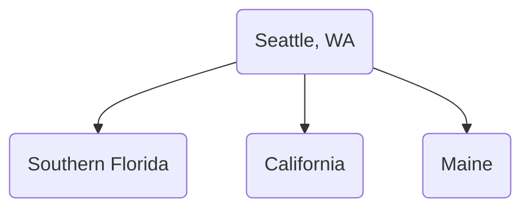

Date: 31st October 2025
Date Modified: 31st October 2025
File Folder: Week 10
#environmental

```ad-abstract
title: Today's Topics
collapse: open

- Topic1
- Topic2
- Topic3

```

# Module 5.3 Managing Solid Waste

## Where Does Trash Go?

1. **Open Dumps**: 
	- Hazardous and nonhazardous materials
	- *Leachate*: Toxic run off that can run into nearby waterways
2. **Sanitary Landfills**
	- The trash is covered by soil
	- The bottom has a lining that prevents trash from leaching out
	- ![[Pasted image 20251031100806.png]]
	- The trash is *compacted* to remove air in the landfill to save space
	- HOWEVER, this causes anaerobic conditions, which leads to slow decomposition
	- Therefore, 
3. **Incinerators**
	- Reduces the volume of trash significantly
	- However, it does create more air pollution
4. **Trash Transfers**
	- Often happens with e-waste
	- Where trash is produced is often where it does not stay
	- Ex. New York City moves trash out of the city since they cannot hold it all there
	- Are often even sent to other countries for them to break it down for useful materials

### Hazardous Waste

There are hazardous materials that cannot be thrown away in normal trash.
- Drain Openers
- Oven Cleaners
- Engine oil and fuel additives
- Grease and rust removers
- Glue
- Pesticides and insecticides
- Mold and mildew removers
- Paint thinners, strippers, and removers
- Batteries
- Florescent lights

### How Far Can Trash Go?



## How Can we Reduce the Amount of Solid Waste


**Methods**:
1. Composting
	- Includes brown and green materials (NO MEAT)
	- Can be done at a small scale
	- It will eventually decompose overtime back into good soil since it is aerobic conditions (water and air access)
2. Converting garbage or by-products into usable energy
3. Industrial Ecology
	- aka. Eco-industrial parks
	- Different industries are placed closed to one another
	- The waste of one business fuels other business’ materials and vice versa
4. “Take Back Laws” and De-Manufacturing
	- By law, companies have to take back old parts and disassemble the parts for it’s important materials
5. The Role of Consumers: The 4 Rs
	- Refuse, Reduce, Reuse, Recycle

*Most Preferred to Least Preferred*
- Source reduction and reuse
- Recycling and composting
- Incineration with Energy Capture
- Landfilling/Incineration without EC

*What we do*:
- Landfilled 52.6%
- Recycled or composed: 34.6%
- Incinerated 12%
- Source reduction <1%

### Recycling: The Three Steps

```ad-summary
Consumers and industry must turn in or collect materials for recycling, the materials must be used to make new products, and the products must be bought by consumers.
```

1. Collection
2. Production
3. Purchase

For *plastics*, he number on the plastic item indicates the type of resin it is made with
- Many areas recycle only  and 2 type plastics
- Others take all types of plastics.

## Negative Impacts of Solid Waste

**Garbage Patches**:
- First one discovered in the Pacific in 1997
- Uneven distribution of trash in the ocean
- Located in major ocean currents (aka **ocean gyres**)

**Plastic Trash Affecting Wildlife**
- Marine birds pick up plastic, feed it to their chicks, causing devastation to their young
- 
