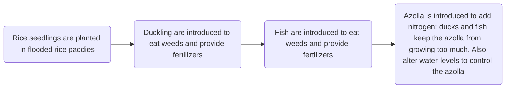

Date: 1st December 2025
Date Modified: 1st December 2025
File Folder: Week 13
#environmental

```ad-abstract
title: Today's Topics
collapse: open

- Topic1
- Topic2
- Topic3

```

# Module 8.2: Sustainable Farming

## Sustainable Rice Farming in Northern California

*The Massa Family*
- In Chico, CA
- Near the Sacramento River
- The third generation of Massa decided to add more sustainable agriculture to thier farm

How do you deal with *azolla*?
- It can take over rice fields and choke them out
- Typically, herbicide would be thrown at the problem, but it is not very sustainable

### The Duck-Rice Farm



![[Pasted image 20251201103203.png]]

From there, it creates **four products** instead of one
- Rice
- Duck eggs
- Ducks
- Fish
## Definition

**Goal**: raise food without damaging the environment or future productivity while operating ethically with regard to animals, workers and local communities.
- Must be economically viable for farmers to adopt
- Mimicing what a natural ecosystem does to keep it sustainable (using local organisms when possible)

```ad-note
title: Remember
**Industrial Agriculture**
- Monoculture farming of plants or animals
- Requires the use of pesticides and fertilizers because they cannot protect themselves
- *About 90% of our crops come from 15 different species*
```

### Organic Agriculture

There is **NO** use of synthetic fertilizers, pesticides, GMOs, or other chemical additives (ex. hormones for animals)

### Trade-Offs of Fertilizer Use

| Advantages                      | Disadvantages                                            |
| ------------------------------- | -------------------------------------------------------- |
| Increased Productivity          | Eutrophication                                           |
| Can grow crops in marginal soil | We gain a dependence on fertilizers on the marginal land |
### Pesticide Trade-Offs


| Advantages                                     | Disadvantages             |
| ---------------------------------------------- | ------------------------- |
| It kills off pests, leading to a greater yield | Toxic to most species     |
| Allows for monoculture agriculture             | Pests can gain resistance |
### Concentrated Animal Feeding Operations (CAFOs)

Can lead to health and ethical considerations:
- Disease can travel very fast through the populations.
- Throw a lot of antibiotics at the animals to help that
	- 65% of the world’s antibiotics are used on animals
	- Can lead to antibiotic resistance
	- These resistance bacteria can go up the food chain to us

## Agroecology

```ad-summary
title: Definition
Farming like an ecosystem. Thinking like the farm that sustains long-term without the use of herbicides, pesticides, and fertilizers. 
- Need to know the ecology of the area
- Indigienous knowledge
- Diversity on the farm (multiple plants and/or animals)
```

### How to Manage Pests?

**Integrated Pest Management**:
1. ID the true pest
2. Set an action threshold and monitor pests
3. Develop an action plan

*Different Methods*:
1. Cultural (cultivation)
	- Can plant in ways to break up crops to reduce monocultures
2. Mechanical
	- Covering the plants
	- Typically labor-intensive and only good for certain crops
3. Biological
	- Introduce predators to feed on the pests
	- Typically sterile males to prevent the species from getting out of control
4. Chemical (Pesticides)

## Traditional Farming Methods

```ad-note
Focuses on protecting and restoring the soil without the use of fertilizers 
```

1. Contour Farming
2. Crop Rotation
3. Strip Cropping
4. Cover Crops
5. Perennial Crops
6. Amending the Soil (ex. using Biochar to change pH and add nutrients)

## Consumer Choice Matters

```ad-example
Campbell's soup changed their chicken soup recipe to have fewer ingredients due to consumer suggestion. (this aged poorly huh?)
```

Consider:
1. How was your food raised?
2. How far was it shipped?

## Sustainable Agriculture Pros and Cons

#comebacklater 

|                       | Pro                                                                                                                     | Con                                                         |
| --------------------- | ----------------------------------------------------------------------------------------------------------------------- | ----------------------------------------------------------- |
| Consumer              | 1. Food is fresher and healthier<br>2. Gains satisfaction in making a more ethical and environmentally sound choice<br> | 1. More Expensive<br>2. Greenwashing<br>3. Worse shelf-life |
| Farmers & Environment | 1. Fewer water and fossil fuel usage<br>2. Less soil degregation<br>3. Less chemical use<br>4.                          |                                                             |
| Society               |                                                                                                                         |                                                             |
## What Can You Do?

1. **Community Supported Agriculture (CSAs):** www.localharvest.org
	- Buying only from local farms
	- Can be done with a subscription service

# Module 8.3: Raising Livestock

## Pros & Cons

![[Pasted image 20251203103435.png]]

## Diets and Carrying Capacity

The land area used for a given diet *cannot* exceed the amount available for any category
 - The largest jump is jumping away from meat to no-meat
 - However, not much change between vegan and vegitarian

# Module 8.4: Fisheries and Aquaculture: Fish in a Warehouse?

## Industrial Fishing Methods

**Hook and Line Methods**
1. Pole and Line: One line per rod
2. Long-line: One large line with a bunch of smaller 
3. Trolling: Baited lines are pulled behind a ship at speeds tailored to the target fish

**Net Method
1. Seine: A net is thrown to try and catch a school of fish
2. Trawling: A net is pulled behind a boat in open water along the seabed
3. Gill Nets: Nets are deployed either on the seabed or closer to the surface. Fish get trapped when they swim into the net.

## Aquaculture: Traditional Outdoor Methods

```ad-summary
Raising fish instead of going out and catching them.
- Has large amount of "pens" near land and the fish are raised
- like a CAFO but for fish
```

### Aquapod

An aquaculture that can be moved around and does not need to stay in one spot near the coast.
- The heavy currents of the open ocean wash the wastes away from the fish
- Less sea-lice and other diseases

```ad-warning
Carnivore fish that are raised need to be aware of where their feed is coming from as well.
```

### Recirculating Aquaculture System (RAS) System

Uses water treatment methods to circulate fresh water and create fake currents.


