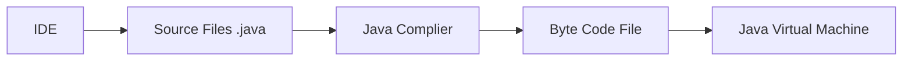

Date: 23rd January 2023
Date Modified: 2nd February 2023
File Folder: Week 1

```ad-abstract
title: Today's Topics
collapse: open

- Introduction to Java
- Fundamentals of Java
- Variables
- Strings

```


# Introduction to Java

```ad-abstract
title: Review of Terms
- Key words/Reserved words
	- Words that have special meaning in programming languages and they can only be used for their inteded purposes
- Operators
	- Symbols or words that perform operations on one or more operands
	- ex. + and -
- Puncuation
	- Most programming languages require the use of punctuation characters that serve specific purposes
	- the semicolon in most languages
- Programmer--Defiend Names/ Identifiers
	- Usd to identify storage locations in memory and parts of the program taht are created by the programmer
- Syntax
	- Rules that must be followed when writing a program, dictates how key words and operators may be used and where punctuation symbols must appear
```


## Example Program in Java

```java
public class CalcArea
{
	public static void main(String[] args)
	{
		double length = 10.0;
		int width = 5;
		double area = legth * width;
		system.out.println("The area=" + area);
	}
}
```

## Identifiers

- Class names begin with an ==UPPERCASE LETTER==
- Variable names begin with a lowercase letter
- Should be ***descriptive

```ad-info
title: Rules for Identifiers
- 1st character must be a letter, an underscore, or a dollar sign ($)
- After the 1st character, you can use any letters or digits or underscores or dollars signs
- Uppercase and lowercase characters are distinct
- **Cannot** include spaces
```

## Program Development Process



### Java Virtual Machine

- Good for portability
	- Works on almost any OS
- Makes it so pointers are not necessary and don't work anymore
- Makes it so you have to put more effort into a program to make it work

## Object-Oriented Programming (OOP)

```ad-example
title: General Overview

1. Java is an OOP language
2. OOP is a method of sotware developmetn that has its own practices, concepts, and vocabulary
3. OOP is centerd on creating objects
4. OOP addresses the problem of code / data seperation through enapsulation and data hiding
```

### Objects
- A software entity that contains data and procedures
	- aka. Attributes and behaviors

```ad-info
- Encapsulation
	- refers tot eh combining of data and code into a single object
- Data hiding
	- refers to an object's ability to hide its data from code taht is outside the object
```

# Fundamentals of Java

## ``System.out.print`` vs ``System.out.println``

```ad-check
title: Answer
- Print adds onto the previous line
- Println adds onto a previous line AND goes to the next line
	- much like endl and \n
```

# Data Types

| Type | Default Value | Descr
| ---- | ------------- |


