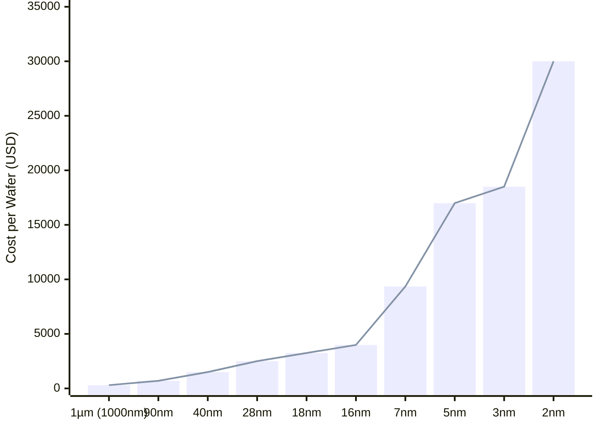

Date: 8th May 2025
Date Modified: 8th May 2025
File Folder: Kanban
#hwsw

```ad-summary
**Title:** Designing a Cost-Effective Programmable Single-Board Computer (SBC): AI and DSP Hardware Acceleration Suite for Automobile Applications
**Name**: Ethan Berei
**Date**: 5/11/25
```

# Section 1: Target Application 

As the client has requested and being a consultant for their new single-board computer (SBC), three target applications for the final SBC are needed to market the chip to a specific audience. However, before getting deep into the details of the hardware, the hardware that must be included in the final product needs to be discussed. The FPGA is the focal-point of the board due to it’s re-programmable hardware and is required as it is a part of the ZedBoard [1-2]. Specifically, Xilinx’s Zynq-7000 SoC is used, which contains configurable logic blocks (CLBs) with LUTs, flip-flops, adders, Block RAM, DSP Slices, Programmable I/O, PCIe Gen2, Serial Transceivers, and 12-bit XADC (Analog-to-Digital Converter) [3-4]. Additionally, a general purpose CPU, the ARM Cortex A9, is provided for the main contributions and control for the board [5]. Figure 1 below shows the architectural overview of the Zynq-7000 SoC

![[Pasted image 20250510140330.png | center]]
<center> <b> Figure 1 </b>: Architectural Overview of the Zynq-7000 SoC [3]</center>

Since the rest of the board is up to interpretation, a set of applications must be chosen. In the current technology landscape, digital signal processing for high data loads has become a mainstay for automotive, Internet of Things, and artificial intelligence [6-7]. Therefore, the three main applications for this chip will be as follows: a digital signal processing suite for high-speed analog applications, an artificial intelligence hardware accelerator for IoT devices, and an embedded processor for automobile smart systems. To accomplish these goals, the CPU and the FPGA will be gaining two more main components: a tensor processing unit (TPU) and a digital signal processor (DSP). In particular, the Coral Accelerator Module by Google is chosen to be the AI acceleration module of choice due to it’s open-source nature, availability, and cost [8]. It is able to perform 4 TOPS at it’s peak performance and run TensorFlow models directly on the chip. Additionally, the DSP of choice will be a Texas Instrument chip called the AM62D Sitara, which contains a set of DSP matrix-multiplication accelerators and DSP blocks that can calculate around 40GFLOPS of information [9]. The main CPU will act as a controller for the TPU and the DSP so that it can be used to interact with the user with the input/output handling and can help schedule the tasks on both of the chips. However, both of these chips are on the lower end for both DSP and AI processing, which means using them in conjunction may not be good enough on their own. Therefore, I propose that the FPGA, having re-programmable DSP slices, logic, I/O, and ADCs can be utilized as a hardware accelerator for the DSP and the TPU at the same time. In particular, the CLBs and built DSP blocks can be used to increase the number of Multiply-Accumulate (MAC) operations for the TPU [7]. Additionally, an FPGA can provide custom DSP slices that can be programmed on the fly depending on the task running [10-11]. Combining all these features together creates a robust board that can efficiently take in large sums of data and perform fast AI computations on them while having the flexibility of the FPGA to accelerate either the TPU or the CPU. To keep the I/O and performance simple for the explanation of the system, we will assume that only the bare minimum is needed. A set of GPIO will be used by the CPU for user input alongside any necessary ports for a small graphical output. A set of analog inputs will be provided thanks to the DSP as well.

# Section 2: Minimal Feature Set


To ensure that the final board will be cost-effective, a lot of the less important features on the original development board can be cut. In particular, it is crucial that only the most necessary I/O, memory, and processing capabilities are kept in order to ensure a cost-effective system that does not waste anything on non-important features. Figure 2 below shows the block diagram for the ZedBoard with all of the external outputs. Additionally, Figure 3 shows how the Zynq’s pins are assigned on the ZenBoard.

![[Pasted image 20250510161305.png | center]]
<center> <b> Figure 2 </b>: ZedBoard Block Diagram Including all I/O Devices [2]</center>

![[Pasted image 20250510162218.png | center]]
<center> <b> Figure 3 </b>: ZedBoard’s Pin Assignments for the Zynq-7000 SoC [2]</center>

Looking at the different ports for the I/O, it is clear that a good amount of the features can be cut without sacrificing the function of the new chip. The SD card, the gigabit Ethernet port, the Pmod ports, the FMC-LPC Mezzanine expansion slot, the debug switches and LEDs, the audio codec and jacks, the VGA port, and the OLED display can all be cut from the board without causing any problems. What we are left with from the original board is the flash memory for the bios, the USB ports for user input and storage, the 512MB of DDR3 RAM for the CPU, the HDMI Out for a display, the JTAG for post-fabrication testing, and the XADC external port for the DSP inputs/outputs. When looking at the potential manufacturing costs saved, we need to consider a few things. Firstly, the removed connectors will save a great amount of money. Each part was gathered using the Digikey online store. Note that all the prices are subject to change overtime and bulk orders and the parts are not exact copies of what is found on the ZedBoard. After taking these parts off, each board would cost $61.96 cheaper than before. This saved money can go directly into purchasing the TPU and the DSP with spare change. Table 1 below shows the price saving breakdown:

| Part                                | $ Per Part  | Number of Parts Per Board | Total Saved ($) |
| ----------------------------------- | ----------- | ------------------------- | --------------- |
| SD Slot (0475710001)                | $1.03 [12]  | 1                         | $1.03           |
| Ethernet (TDS8PC6)                  | $3.59 [13]  | 1                         | $3.59           |
| PMOD (240-078)                      | $5.00 [14]  | 4                         | $20.00          |
| Mezzanine Expansion (ASP-134606-02) | $19.75 [15] | 1                         | $19.75          |
| LED (LTST-C190KFKT)                 | $0.13 [16]  | 9                         | $1.17           |
| Switch (JS202011JCQN)               | $0.84 [17]  | 8                         | $6.72           |
| Audio Jack (ASJ-99H-R-HT-T/R)       | $0.77 [18]  | 4                         | $3.08           |
| VGA Port (L77HDE15SD1CH4FVGA)       | $1.62 [19]  | 1                         | $1.62           |
| OLED (26377)                        | $5.00 [20]  | 1                         | $5.00           |
| ***TOTAL***                         | —           | —                         | *$61.96*        |

As for the board size, it should be minimized such that the final product is able to fit into a pre-existing automobile. This means that much of the space found on the ZedBoard will be cut down significantly to only include what is necessary.

# Section 3: Simplifying the Design


The main reduction in cost and complexity comes from the use of the FPGA to off-load tasks from both the TPU and DSP to reduce their load and cost of the system. An FPGA is able to utilize it’s multiple DSP slices and it’s CLBs to create a pipelined algorithm that uses loop unrolling to quickly and efficiently parallelizes tasks for the DSP [10]. Additionally, the TPU is able to ask he CPU for the FPGA to improve pre-existing MAC operations for the TPU. By adding either extra carry chains, more adders adders and shadow multipliers, the MAC density of the chip can be increased by 6.1 times over with minimal added overhead [7]. Additionally, instead of adding extra memory past the provided memory on each of the chips, the FPGA can either provide it’s extra memory or even make more memory for the chips if the bandwidth of the memory is a bottleneck for the TPU or DSP [7]. 

Another reduction in cost can be solved by virtualizing processes found on both the TPU or the DSP and put them on the backend of the CPU as well. Since most of the heavy lifting is done by the TPU, DSP, and FPGA, the CPU should have some extra room left to have virtualized components run in the background. For example, algorithms can be used to transforms fast mathematical algorithms that a DSP will solve into an algorithm that can be ran on software [22]. Even though this is much slower than it physical running on hardware, it can be used to maximize the CPU’s usage and allows the system to be squeezed for extra performance.

As for being manufactured in-house or outsourced, the board should have the correct use of components to be made within the country. It does not have any custom chip and will utilize the components onboard with minimal extra SoCs or ICs outside of buffers between each chip. To minimize he production costs and time, a pick-and-place method will be used if possible such that the PCBs can be self-populated and quickly shipped off in bulk. Since most of the scheduling happens from the CPU’s side, the only thing that needs to be programmed is the flash BIOS chip to setup each of the chips before the operating system on the CPU takes over and does the rest of the work. Since the board size is not the largest constraint, larger and cheaper components can be used on the board as well to reduce costs of the extra parts.

# Section 4: VLSI Considerations with Power, Area, and Time Tradeoffs

One way to reduce power consumption is to improve the clock distribution on the entire chip. Clock distribution networks consume lot of power due to the large capacitive loads necessary to run with DVFS having limited effect on it. Uneven clock arrival times are common as process variations make it difficult to properly synch the clocks. The resonant clocking architecture proposes to provide a series of load inductors to reduce power consumption. The inductors are placed on he discharge path on the clock networks to store extra energy within a magnetic field, which can be then recycled and used during he next stage. This improves power loss caused by switching down by 50%, which allows the capacitor in the next stage to be charged on the next clock edge [24].

Another way to improve power saving is the use of DVFS and power gating as they are able to adjust resource use dynamically based on the workload. However, for AI and ML workloads, it can be often hard to predict the irregularity of distributed neural networks (DNN), especially when they introduce sparsity when an accelerator chooses to prune the network or introduce activation functions. It has gotten so bad that it has been impossible to fully exploit sparsity, which causes efficiency loss on the TPU. Therefore, a group of authors proposed a method allows for sparsity to be predicted in real-time to try to maximize the accelerator’s usage. They use a compact machine learning-based model to train on the sparsity training and actively predict if DVFS should be executed to reduce power loss on the chip [25].

The choice of the processor and the FPGA does not have a big impact on the silicon area of the chip. As seen on the datasheet, the ZYNQ-7000 comes with both the ARM Cortex-A9 cores built into the silicon alongside the FPGA’s blocks. This means that the SoC is already made and will not have a change int he final silicon area.

The specific fabrication process for the chip can ultimately determine the effectiveness of the chip overall. Looking at the potential options from $1 \micro m$ all the way down to $2nm$ processes, the best choice will be the $28nm$ process. Three primary metrics were considered: scaling challenges caused by smaller CMOS processes, the performance impacts of different CMOS processes, and the pre-established process sizes for the chosen chips. As you reduce the size of the processes for CMOS chips, you begin to hit the limits of the silicon and introduce power dissipation and signal integrity issues across the chip [26]. Additionally, as technologies scale down, passive devices such as capacitors and inductors start to degrade as the metal layers get smaller and smaller [27]. Additionally, the chips that uses the smallest process is the Coral Hardware Accelerator and the ZYNQ-7000, which uses the $28nm$ process [8]. Therefore, the process of the final chip will be determined by the smallest part to avoid any negative effects as the transistor scaling gets smaller. It will also make the migration easier as the ZYNQ-7000 and the Coral Accelerator will be at the same process size.

Overall, this fabrication decision will not greatly affect what parts the board needs as the $28nm$ process is pretty common both domestically (with a minimum size of $18nm$) and internationally. However, the cost per wafer does cause a great difference in price per chip. As the size shrinks, the wafer cost increases dramatically [27]. For example, the chosen 28nm process costs $2,500 for a 300mm wafer, with it increasing all the way to $30,000 for TSMC’s new 2nm wafers. Figure 4 below shows a chart of how the changes in process size directly affect the cost of 300mm wafers:


<center> <b> Figure 4 </b>: Wafer Costs by Process Node  [27]</center>

# Section 5: Health, Safety, and the Environment


When it comes to any AI processing device, there are always inherent health and safety risks around it. For more critical operations, devices that use AI become a liability as it has become more pervasive in our everyday life. The autonomy and opaqueness of AI make it so traditional faut-based frameworks struggle to work. Additionally, due to inconsistency in laws around AI globally, it can lead to unjust outcomes if a person is hurt by an AI device [28]. There are also many concerns around AI being used for medical use. The market around using AI for medical use has exploded over the past few years. However, there are many ethical concerns around how AI often operates as a “black box” systems as users can only see the inputs and outputs but not how the AI came to those conclusions. The unexplainably in such a system can introduce serious harm as it undermines the “do no harm” principle of practicing doctors. AI can misdiagnose or add errors to treatments, which cause direct harm. AI can also make decisions without the patient’s knowledge or consent, which harms their autonomy over themselves and can trick someone into a treatment they would otherwise not want [29]. There are also specific harmful cases involving AI such as Uber’s self-driving car causing the untimely death of a pedestrian on the sidewalk during an accident. To prevent such risks to be minimized, one solution is for AI designers to include UI for users to easily adjust safety constraints around AI to prevent the AI from doing something that may be harmful [30].

In terms of economical impacts, it is clear that the semiconductor industry as been the cause for a major environmental risk for many years. Pollution from manufacturing, high energy and material use, and e-waste accumulation over time makes the semiconductor industry one of the most wasteful and harmful around. Additionally, since there are no international standards for evaluating the impact of chips on the environment, the impact that chips have are often overlooked by many unfortunately [31]. Additionally, regardless of the size and technology used by the big chip manufactures, like TMSC and Samsung, does not have a better eco-efficiency on their chips. The need for a better energy system, especially for clean rooms, and better production lines are critical for prevent environmental impact [32]. To improve the environmental friendliness of our board, the boards will be made at a local fabrication facility due to it having a $28nm$ process to reduce harm caused by shipping. Additionally, already fabricated parts will be used where needed to reduce the carbon foot print of the chip. However, there are concerns with where the chips are manufactured. The ZYNQ-7000 is manufactured at TSMC in Taiwan, while the coral chip is made at Murata Manufacturing Co. in Japan [3, 8]. These shipping costs to the environment are concerning, but it is necessary as the ZYNQ-7000 chip is required for the final project.  

# Section 6: Global Considerations

The current geo-political landscape of the world makes this question particularly difficult to answer. Designing a chip for global distribution will be difficult with domestic tariffs being as high as 145% for some countries [33].  The eastern part of the world makes a large number of the chips that go into the device, but the Texas Instruments chip is made in the United States. Because of this, the chip packaging needs to scale around the perfect middle-ground between the manufacturing super-powers and the more local PCB and Texas Instruments plant to maximize profits for the board. Due to the United States’ control over the flow of almost all major chip products, the packing facility will be placed in the US, with California or Washington State being a hot contender for a location [34]. The part availability is currently healthy, but could be harmed in the future much like how COVID-19 harmed the production lines then. It is also crucial that collaboration with the fabrication facilities across the seas are strong to avoid problems with our advanced chip production [35]. Shipping must be a requirement as the chip’s components will be coming from three/four major areas: ZYNQ’s fab, the Coral fab, Texas Instruments fab, and the local PCB maker if the PCB machine is not in-house. Collaboration between each of these areas is critical for a strong global network. When it comes to the global electronic supply supply chain, any harm caused to it will cause great problems for our board’s design. Any component shortages, delays, or further tariff increases will lead to direct delays for the board since it relies on the two components made overseas. To mitigate these risks, it is imperative that more alternatives are looked into for the CPU, FPGA, and the TPU that are manufactured domestically to avoid any problems with eastern fab component shortages. Another method is to heavily bulk buy the components when they are in stock and at a good price to avoid the negative downsides caused by the state of the global market.

# Section 7: User-Friendliness


One of the most overlooked aspects of hardware design is the ease of use for developers, especially those who are not familiar with FPGA workflows. While tools like Vivado and Vitis are widely used in the Xilinx ecosystem, they often present a steep learning curve, particularly for newcomers or software-focused developers. To ease this burden and make the board more developer-friendly, alternative design suites such as _Libero IDE_ [36] and _Quartus Prime_ [37] can be evaluated for inspiration or compatibility, depending on licensing and device support. Libero IDE, developed by Microchip, is known for its streamlined project setup, integration with soft-core processors, and intuitive debug tools that simplify the onboarding process for entry-level users [36]. Similarly, Intel’s Quartus Prime software supports rapid prototyping with platform designer tools and schematic-based design entry, which may feel more familiar to those coming from microcontroller or embedded design backgrounds [37]. While the board will still center around the Zynq-7000 and require Vivado for synthesis, a compatibility layer or high-level wrapper interface could abstract Vivado’s complexity and export RTL modules directly to pre-built templates [3]. Moreover, a well-documented tutorial suite modeled after these friendlier IDEs should accompany the board, offering both text and video walkthroughs for everything from GPIO control to integrating the TPU and DSP accelerators.

Beyond tooling, the physical form factor and connectors of the board greatly influence its usability for both developers and systems integrators. A smaller board footprint improves portability and deployment in edge environments, but it must be balanced with the need for accessible I/O. Rather than using niche or fragile connectors, standard headers like GPIO, USB-C, and HDMI are prioritized to ensure compatibility with off-the-shelf cables and breakout boards. The elimination of bulky legacy connectors such as VGA and FMC reduces the board area without compromising functionality, aligning with the earlier cost-cutting decisions. Furthermore, developers should not be forced to fabricate custom interposers or learn exotic pin layouts—key interfaces must be clearly labeled and documented in reference guides, ideally with downloadable CAD files and pre-written HDL examples. The included JTAG pad also allows for the easy of debugging and development by allowing anyone to have access to all the registers within the device. By lowering both the software and hardware barrier to entry, the board becomes a powerful embedded tool that can be used by anyone.

# Section 8: Security and Reliability

While the flexibility and performance of a programmable SBC make it ideal for modern applications, its programmable nature also introduces several security and reliability challenges that must be addressed before deployment. One of the first and most dangerous vulnerabilities lies in the use of the JTAG port. While intended for debugging and post-fabrication testing, the JTAG interface can be exploited by malicious actors to gain full read/write access to memory, bypass software authentication layers, or inject malicious firmware [38]. Given that this SBC includes a JTAG port for validation, it must be locked down after testing is complete. A simple fix is the use of JTAG disabling mechanisms such as fuses or locking bitstreams that remove access to the debug interface once the board is ready for field use. Additionally, placing the JTAG interface behind a physical access control barrier or requiring cryptographic authentication before activation can further reduce risk [38].

Another critical vulnerability lies in the bitstream of the FPGA itself. As an inherently reprogrammable device, the FPGA is vulnerable to bitstream sniffing, tampering, or replay attacks if unprotected. Since the FPGA will serve as the accelerator backbone for both the TPU and DSP, protecting its functionality is essential. One common method of securing this is through the use of bitstream encryption and authentication schemes built into the FPGA toolchain [39]. Enabling authenticated bitstreams ensures that only signed, validated configurations are loaded onto the device and can prevent the board from operating if tampering is detected. While these methods add minimal cost or complexity to the manufacturing pipeline, they drastically reduce the potential for cyberattacks that exploit programmable logic.

In terms of long-term reliability, the primary consideration lies in maintaining fault-tolerance of the FPGA under continuous operation and ensuring that system degradation does not introduce silent errors. Advanced SoCs like the Zynq-7000 have shown susceptibility to Single Event Upsets (SEUs), thermal cycling degradation, and internal configuration bit failures when exposed to long-term or high-stress environments [40]. One solution to mitigate this issue is partial reconfiguration combined with configuration memory scrubbing. This technique allows the FPGA to continuously monitor and reload corrupted logic blocks during idle cycles without impacting live operation. Furthermore, wear-leveling memory allocation and power-aware task scheduling from the CPU can extend the life of both volatile and non-volatile memory blocks, which is crucial in embedded systems running 24/7 in harsh conditions such as automotive environments.

Another major aspect in achieving long-term reliability comes from the upstream supply chain. As counterfeit components continue to proliferate within the global ICT infrastructure, ensuring that all chips—especially critical ones like the TPU, DSP, and FPGA—come from verified distributors is vital [41]. If counterfeit components are integrated into the board, they may pass basic electrical tests but fail prematurely due to poor thermal characteristics, lower quality silicon, or improperly fabricated internal connections. Especially since the board focuses on automobile applications, a fault here could be devastating. To prevent this, the final manufacturing pipeline must source components only from traceable, high-reliability vendors who provide lot tracking and authentication. Additionally, implementing board-level authenticity checks such as IC serial validation or electrical fingerprinting during quality control can further reduce risk. These minor additions can protect the long-term function of the SBC while keeping the cost per unit low in mass production.

By integrating these security and reliability strategies—JTAG protection, secure bitstream handling, FPGA error correction, and counterfeit prevention—the programmable SBC can maintain long-term operation in a wide variety of applications without compromising integrity or durability.

# Section 9: Questions to Clarify the Design


Before finalizing the simplified and cost-effective version of the programmable single-board computer (SBC), it is critical to engage the investor with a few key design clarification questions. These questions will ultimately shape the feature set, performance expectations, and market viability of the final board. Each question is specifically formulated to extract constraints and goals that directly impact component selection, board layout, and manufacturing strategy.

**1. What is the primary deployment environment for this SBC (industrial, educational, automotive, or consumer)?**

The environmental context determines the necessary tolerances, durability, and regulatory certifications for the board. For example, if the board is targeted for educational use or desktop prototyping, high reliability under extreme temperature swings or vibration is not essential. However, if the SBC is destined for embedded automotive use or edge AI processing in outdoor industrial settings, the components must support extended temperature ranges, moisture shielding, and long-term availability. This single answer dictates not only what physical connectors can be used (e.g., locking vs. standard headers) but also whether the board can include cheaper consumer-grade DDR3, or if industrial-grade memory modules and conformal coatings are required.

**2. Is Linux or a custom RTOS expected to run out of the box, and what level of software support must be provided?**

While the ARM Cortex-A9 on the Zynq-7000 platform is capable of booting a full Linux distribution, like Ubuntu, doing so requires a proper bootloader, kernel image, and device tree setup. If the investor’s expectation is a "plug-and-play" Linux development environment, then NAND or eMMC storage for the OS image becomes mandatory, and peripheral drivers must be pre-integrated. Alternatively, if a real-time operating system (RTOS) or even bare-metal programming is expected for maximum timing control, this reduces software complexity but increases the documentation and tooling burden on developers. The level of OS abstraction defines the memory requirements, startup firmware, and whether the simplified board must retain peripherals like USB storage support or can offload everything to serial interfaces.

**3. Will external I/O or sensor integration be required in-field, or is the board intended to be used as a closed system?**

This question determines the scope of the I/O expansion needs. If the investor envisions end-users integrating sensors, cameras, or actuators post-purchase, then a standardized and accessible GPIO header becomes a high-priority feature. On the other hand, if the board is expected to ship with all required peripherals in a locked configuration, external interfaces can be minimized to reduce cost and complexity. This impacts whether Pmod connectors, I2C/SPI breakout pins, or even a subset of XADC analog inputs need to be preserved on the final design. These changes will ultimately affect the final bill of materials (BOM) and the cost of production. If full expandability is unnecessary, then these components can be removed, further reducing manufacturing costs and board size.

# Section 10: Final Recommendation

The final SBC design centers around the Zynq-7000 SoC, combining an ARM Cortex-A9 processor with FPGA fabric to create a flexible, reprogrammable platform suitable for signal processing, AI inference, and embedded control. To enhance its capabilities, the Coral TPU and TI Sitara DSP were added for low-power AI acceleration and analog processing, respectively. However, to offset their performance limits, the FPGA is used as a dynamic co-accelerator—extending MAC operations, creating custom DSP logic, and sharing memory bandwidth when needed. This hybrid approach ensures maximum compute efficiency across all workloads.

To reduce cost and complexity, non-essential components such as VGA, audio jacks, debug switches, and mezzanine expansions were removed, resulting in a board that's $61.96 cheaper per unit without sacrificing core functionality. The retained interfaces, including USB, HDMI, JTAG, XADC, and DDR3 RAM, were selected for essential I/O, user interaction, and analog input. The board targets a minimized footprint for embedded deployment and leverages a 28nm process node shared across all major chips to avoid process mismatch and reduce fabrication overhead.

Security and reliability are addressed through locked-down JTAG, encrypted bitstreams, fault-tolerant FPGA reconfiguration, and supply chain safeguards against counterfeit components. Combined with user-friendly documentation, standard connectors, and an accessible FPGA development flow, the board is designed to be cost-effective, secure, globally manufacturable, and developer-ready for automotive, IoT, and AI edge applications. Figure 5 illustrates a sketch of the potential board layout with their interactions:

![[Section 1 Target Application 2025-05-10 12.43.16.excalidraw | center]]
<center> <b> Figure 5 </b>: Proposed Programmable Single-Board Computer (SBC) For FPGA Hardware-Accelerated Machine Learning and Mixed Signal Processing</center>
# Resources
[1] S. Radecky, “What is an FPGA?: Uses, applications & advantages,” Digilent Blog, https://digilent.com/blog/what-is-an-fpga/
[2] Digilent, “Zedboard,” Reference Manuals, https://digilent.com/reference/_media/reference/programmable-logic/zedboard/zedboard_ug.pdf
[3] Xilinx Inc., “Zynq-7000 SoC Data Sheet: Overview,” AMD Technical Information Portal, https://docs.amd.com/v/u/en-US/ds190-Zynq-7000-Overview
[4] DigiKey, “XC7Z020-1CLG484CES,” DigiKey Electronics, https://www.digikey.com/en/products/detail/amd/XC7Z020-1CLG484CES/3672244
[5] ARM, “Cortex-A9 MBIST Controller Technical Reference Manual,” Documentation – Arm Developer, https://developer.arm.com/documentation/ddi0414/i?lang=en
[6] W. Kester, _Mixed-Signal and DSP Design Techniques_. Burlington, MA: Elsevier Science & Technology Books, 2003.
[7] Z. Li, Y. Zhang, J. Wang, and J. Lai, “A survey of FPGA design for AI era,” _Journal of Semiconductors_, vol. 41, no. 2, p. 021402, Feb. 2020. doi:10.1088/1674-4926/41/2/021402
[8] Google LLC, “Coral Accelerator Module Datasheet,” coral.ai, https://coral.ai/static/files/Coral-Accelerator-Module-datasheet.pdf
[9] Texas Instruments, “AM62D Sitara Processors Technical Reference Manual,” Technical Reference Manuals, https://www.ti.com/lit/ds/symlink/am62d-q1.pdf?ts=1746887423247&ref_url=https%253A%252F%252Fwww.ti.com%252Fproduct%252FAM62D-Q1
[10] G. Goslin, “A Guide to Using Field Programmable Gate Arrays (FPGAs) for Application-Specific Digital Signal Processing Performance,” _Microelectronics Journal_, vol. 28, no. 4, pp. xxiv–xxxv, May 1997. doi:10.1016/s0026-2692(97)84516-8
[11] O. Diouri _et al._, “Comparison Study of Hardware Architectures Performance Between FPGA and DSP Processors for Implementing Digital Signal Processing Algorithms: Application of FIR Digital Filter,” _Results in Engineering_, vol. 16, Dec. 2022. doi:10.1016/j.rineng.2022.100639
[12] DigiKey, “0475710001,” DigiKey Electronics, https://www.digikey.com/en/products/detail/molex/0475710001/3262277
[13] DigiKey, “TDS8PC6,” DigiKey Electronics, https://www.digikey.com/en/products/detail/l-com/TDS8PC6/21287845
[14] DigiKey, “240-078,” DigiKey Electronics, https://www.digikey.com/en/products/detail/digilent-inc/240-078/5848555 
[15] Digikey, “ASP-134606-02,” DigiKey Electronics, https://www.digikey.com/en/products/detail/samtec-inc/ASP-134606-02/16341478
[16] DigiKey, “LTST-C190KFKT,” DigiKey Electronics, https://www.digikey.com/en/products/detail/liteon/LTST-C190KFKT/386813
[17] DigiKey, “JS202011JCQN,” DigiKey Electronics, https://www.digikey.com/en/products/detail/c-k/JS202011JCQN/6137630
[18] DigiKey, “ASJ-99H-R-HT-T/R,” DigiKey Electronics, https://www.digikey.com/en/products/detail/adam-tech/ASJ-99H-R-HT-T-R/9833241
[19] DigiKey, “L77HDE15SD1CH4FVGA,” DigiKey Electronics, https://www.digikey.com/en/products/detail/amphenol-cs-commercial-products/L77HDE15SD1CH4FVGA/4888525
[20] DigiKey, “26377,” DigiKey Electronics, https://www.digikey.com/en/products/detail/universal-solder-electronics-ltd/26377/16822115
[21] A. Gacic, M. Puschel, and J. M. F. Moura, “Fast Automatic Software Implementations of FIR Filters,” _2003 IEEE International Conference on Acoustics, Speech, and Signal Processing, 2003. Proceedings. (ICASSP ’03)._, vol. 2, 2003. doi:10.1109/icassp.2003.**1202423**
[22] D. Challagundla, M. Galib, I. Bezzam, and R. Islam, “Power and Skew Reduction Using Resonant Energy Recycling in 14-nm FINfet Clocks,” _2022 IEEE International Symposium on Circuits and Systems (ISCAS)_, pp. 268–272, May 2022. doi:10.1109/iscas48785.2022.9937771
[23] D. Challagundla, M. Galib, I. Bezzam, and R. Islam, “Power and Skew Reduction Using Resonant Energy Recycling in 14-nm FINfet Clocks,” _2022 IEEE International Symposium on Circuits and Systems (ISCAS)_, pp. 268–272, May 2022. doi:10.1109/iscas48785.2022.9937771
[24] S. Liu and A. Karanth, “Dynamic Voltage and Frequency Scaling to Improve Energy-Efficiency of Hardware Accelerators,” _2021 IEEE 28th International Conference on High Performance Computing, Data, and Analytics (HiPC)_, Dec. 2021. doi:10.1109/hipc53243.2021.00037
[25] A. Jacob, R. Xie, M. G. Sung, and L. Liebmann, “Scaling Challenges for Advanced CMOS Devices,” _International Journal of High Speed Electronics and Systems_, vol. 26, no. 1, 2017. doi:https://doi.org/10.1142/S0129156417400018
[26] K. Lee _et al._, “The Impact of Semiconductor Technology Scaling on CMOS RF and Digital Circuits for Wireless Application,” _IEEE Transactions on Electron Devices_, vol. 52, no. 7, pp. 1415–1422, Jul. 2005. doi:10.1109/ted.2005.85063
[27] A. Shilov, “TSMC’s 2NM process will reportedly get another price hike - $30,000 per wafer for latest cutting-edge Tech,” Tom’s Hardware, https://www.tomshardware.com/tech-industry/tsmcs-2nm-will-reportedly-receive-a-price-hike-once-again-usd30-000-per-wafer
[28] B. Schütte, L. Majewski, and K. Havu, “Damages liability for harm caused by Artificial Intelligence – EU law in Flux,” _SSRN Electronic Journal_, 2021. doi:10.2139/ssrn.3897839
[29] H. Xu and K. M. Shuttleworth, “Medical Artificial Intelligence and the Black Box Problem: A view based on the ethical principle of ‘Do no harm,’” _Intelligent Medicine_, vol. 4, no. 1, pp. 52–57, Feb. 2024. doi:10.1016/j.imed.2023.08.001
[30] T. Mandel _et al._, “Using the crowd to prevent harmful AI behavior,” _Proceedings of the ACM on Human-Computer Interaction_, vol. 4, no. CSCW2, pp. 1–25, Oct. 2020. doi:10.1145/3415168
[31] A. Villard, A. Lelah, and D. Brissaud, “Drawing a chip environmental profile: Environmental indicators for the semiconductor industry,” _Journal of Cleaner Production_, vol. 86, pp. 98–109, Jan. 2015. doi:10.1016/j.jclepro.2014.08.061
[32] M. Ruberti, “The chip manufacturing industry: Environmental impacts and eco-efficiency analysis,” _Science of The Total Environment_, vol. 858, p. 159873, Feb. 2023. doi:10.1016/j.scitotenv.2022.159873
[33] A. Shalal and J. Mason, “Trump says China tariffs will come down from 145% | Reuters,” Reuters, https://www.reuters.com/world/trump-says-we-know-china-tariffs-will-come-down-145-percent-2025-05-08/
[34] Y. Zhang and X. Zhu, “Analysis of the global trade network of the chip industry chain: Does the U.S.-China Tech War Matter?,” _Heliyon_, vol. 9, no. 6, Jun. 2023. doi:10.1016/j.heliyon.2023.e17092
[35] H. W. Yeung, “Explaining geographic shifts of chip making toward East Asia and market dynamics in Semiconductor Global Production Networks,” _Economic Geography_, vol. 98, no. 3, pp. 272–298, Mar. 2022. doi:10.1080/00130095.2021.2019010
[36] Microchip, “Libero® IDE | Microchip Technology,” Libero, https://www.microchip.com/en-us/products/fpgas-and-plds/fpga-and-soc-design-tools/fpga/libero-ide
[37] Intel, “FPGA Design Software - Quartus® Prime,” Intel, https://www.intel.com/content/www/us/en/products/details/fpga/development-tools/quartus-prime.html 
[38] G. Vishwakarma and W. Lee, “Exploiting JTAG and its mitigation in IOT: A survey,” _Future Internet_, vol. 10, no. 12, p. 121, Dec. 2018. doi:10.3390/fi10120121
[39] A. Proulx, J.-Y. Chouinard, P. Fortier, and A. Miled, “A Survey on FPGA Cybersecurity Design Strategies,” _ACM Transactions on Reconfigurable Technology and Systems_, vol. 16, no. 2, pp. 1–33, Mar. 2023. doi:10.1145/3561515
[40] N. Cherezova, K. Shibin, M. Jenihhin, and A. Jutman, “Understanding fault-tolerance vulnerabilities in advanced SOC fpgas for critical applications,” _Microelectronics Reliability_, vol. 146, p. 115010, Jul. 2023. doi:10.1016/j.microrel.2023.115010
[41] S. Saleh, R. Lei, W. Guo, and E. A. Elsayed, “A survey on counterfeits in the Information and Communications Technology (ICT) supply chain,” _Lecture Notes in Networks and Systems_, pp. 849–870, Aug. 2022. doi:10.1007/978-981-19-1607-6_75
