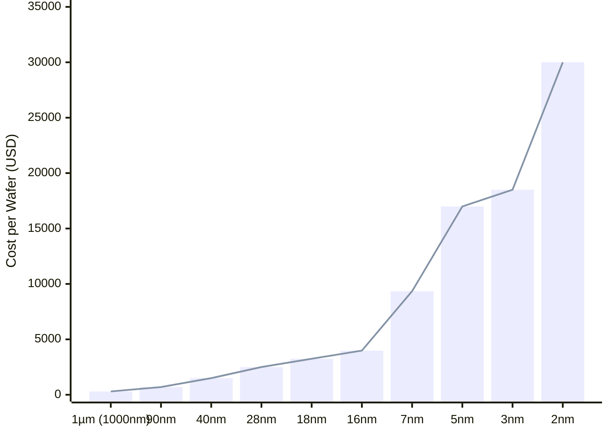

Date: 8th May 2025
Date Modified: 8th May 2025
File Folder: Kanban
#hwsw 

```ad-summary

- Suggest two power-saving techniques that can be implemented on the SBC. Consider aspects like clock gating, dynamic voltage scaling, or sleep modes. How can these techniques help reduce overall power consumption without compromising essential performance?
- How does the choice of processor (ARM Cortex-A9) and FPGA impact the silicon area of the chip?
- Suggest a specific fabrication process/technology (e.g., 28nm, 14nm, etc.) for the chip. Provide reasons for your choice in terms of cost, performance, availability, and how it impacts silicon area (and ultimately chip price).
- How would these fabrication choices affect production cost and availability of the components?
- How do the speed requirements (e.g., for I/O processing) impact your choice of processor and FPGA? Are there any areas where you can optimize time (e.g., through clock gating, frequency scaling, pipeline stages)?

```

One way to reduce power consumption is to improve the clock distribution on the entire chip. Clock distribution networks consume lot of power due to the large capacitive loads necessary to run with DVFS having limited effect on it. Uneven clock arrival times are common as process variations make it difficult to properly synch the clocks. The resonant clocking architecture proposes to provide a series of load inductors to reduce power consumption. The inductors are placed on he discharge path on the clock networks to store extra energy within a magnetic field, which can be then recycled and used during he next stage. This improves power loss caused by switching down by 50%, which allows the capacitor in the next stage to be charged on the next clock edge [24].

Another way to improve power saving is the use of DVFS and power gating as they are able to adjust resource use dynamically based on the workload. However, for AI and ML workloads, it can be often hard to predict the irregularity of distributed neural networks (DNN), especially when they introduce sparsity when an accelerator chooses to prune the network or introduce activation functions. It has gotten so bad that it has been impossible to fully exploit sparsity, which causes efficiency loss on the TPU. Therefore, a group of authors proposed a method allows for sparsity to be predicted in real-time to try to maximize the accelerator’s usage. They use a compact machine learning-based model to train on the sparsity training and actively predict if DVFS should be executed to reduce power loss on the chip [25].

The choice of the processor and the FPGA does not have a big impact on the silicon area of the chip. As seen on the datasheet, the ZYNQ-7000 comes with both the ARM Cortex-A9 cores built into the silicon alongside the FPGA’s blocks. This means that the SoC is already made and will not have a change int he final silicon area.

The specific fabrication process for the chip can ultimately determine the effectiveness of the chip overall. Looking at the potential options from $1 \micro m$ all the way down to $2nm$ processes, the best choice will be the $28nm$ process. Three primary metrics were considered: scaling challenges caused by smaller CMOS processes, the performance impacts of different CMOS processes, and the pre-established process sizes for the chosen chips. As you reduce the size of the processes for CMOS chips, you begin to hit the limits of the silicon and introduce power dissipation and signal integrity issues across the chip [26]. Additionally, as technologies scale down, passive devices such as capacitors and inductors start to degrade as the metal layers get smaller and smaller [27]. Additionally, the chips that uses the smallest process is the Coral Hardware Accelerator and the ZYNQ-7000, which uses the $28nm$ process [8]. Therefore, the process of the final chip will be determined by the smallest part to avoid any negative effects as the transistor scaling gets smaller. It will also make the migration easier as the ZYNQ-7000 and the Coral Accelerator will be at the same process size.

Overall, this fabrication decision will not greatly affect what parts the board needs as the $28nm$ process is pretty common both domestically (with a minimum size of $18nm$) and internationally. However, the cost per wafer does cause a great difference in price per chip. As the size shrinks, the wafer cost increases dramatically [27]. For example, the chosen 28nm process costs $2,500 for a 300mm wafer, with it increasing all the way to $30,000 for TSMC’s new 2nm wafers. Figure 5 below shows a chart of how the changes in process size directly affect the cost of 300mm wafers:


<center> <b> Figure 5 </b>: Wafer Costs by Process Node  [27]</center>

