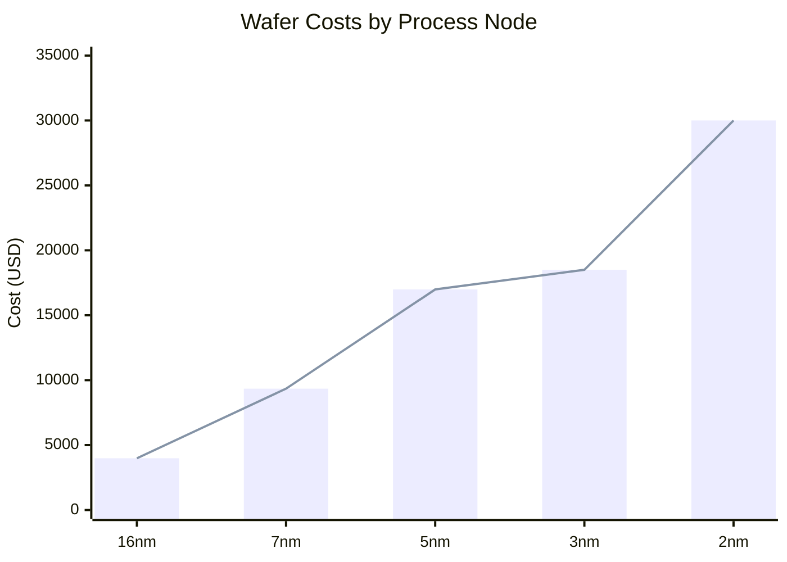

Date: 8th May 2025
Date Modified: 8th May 2025
File Folder: Kanban
## Publication Information

| Process Node | Cost Per 300mm Wafer |
| ------------ | -------------------- |
| 2nm          | $30,000              |
| 3nm          | $18,500              |
| 4nm          | $15,000              |
| 7nm          | $9,400               |
| 16nm         | $4,000               |
| 18nm         | $3,250               |

- Intel 18A (18nm) is the smallest one in the US

