Date: 8th May 2025
Date Modified: 8th May 2025
File Folder: Kanban
# Summary

```ad-important
Shows cost vs improvement in power saving/chip efficiency
```


| Process Node | Cost Per 300mm Wafer |
| ------------ | -------------------- |
| 2nm          | $30,000              |
| 3nm          | $18,500              |
| 4nm          | $15,000              |
| 7nm          | $9,400               |
| 16nm         | $4,000               |
| 18nm         | $3,250               |
| 28nm         | $2,500               |
| 40nm         | $1,500               |
| 90nm         | $700                 |
| 100nm        | $200                 |

```mermaid
xychart-beta
    title "Wafer Costs by Process Node (USD)"
    x-axis ["1µm (1000nm)", "90nm", "40nm", "28nm", "18nm", "16nm", "7nm", "5nm", "3nm", "2nm"]
    y-axis "Cost per Wafer (USD)" 0 --> 35000
    bar [300, 700, 1500, 2500, 3250, 3984, 9346, 16988, 18500, 30000]
    line [300, 700, 1500, 2500, 3250, 3984, 9346, 16988, 18500, 30000]
```



- Intel 18A (18nm) is the smallest one in the US
- Each level provides an approximate 15% speed improvement at *equal power*
- 15% improvement in power efficiency bc of this


