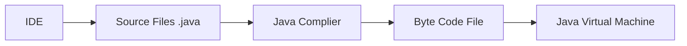

Date: 23rd January 2023
Date Modified: 2nd February 2023
File Folder: Week 1

```ad-abstract
title: Today's Topics
collapse: open

- Introduction to Java
- Fundamentals of Java
- Variables
- Strings

```


# Introduction to Java

```ad-abstract
title: Review of Terms
- Key words/Reserved words
	- Words that have special meaning in programming languages and they can only be used for their inteded purposes
- Operators
	- Symbols or words that perform operations on one or more operands
	- ex. + and -
- Puncuation
	- Most programming languages require the use of punctuation characters that serve specific purposes
	- the semicolon in most languages
- Programmer--Defiend Names/ Identifiers
	- Usd to identify storage locations in memory and parts of the program taht are created by the programmer
- Syntax
	- Rules that must be followed when writing a program, dictates how key words and operators may be used and where punctuation symbols must appear
```


## Example Program in Java

```java
public class CalcArea
{
	public static void main(String[] args)
	{
		double length = 10.0;
		int width = 5;
		double area = legth * width;
		system.out.println("The area=" + area);
	}
}
```

## Identifiers

- Class names begin with an ==UPPERCASE LETTER==
- Variable names begin with a lowercase letter
- Should be ***descriptive

```ad-info
title: Rules for Identifiers
- 1st character must be a letter, an underscore, or a dollar sign ($)
- After the 1st character, you can use any letters or digits or underscores or dollars signs
- Uppercase and lowercase characters are distinct
- **Cannot** include spaces
```

## Program Development Process



### Java Virtual Machine

- Good for portability
	- Works on almost any OS
- Makes it so pointers are not necessary and don't work anymore
- Makes it so you have to put more effort into a program to make it work

## Object-Oriented Programming (OOP)

```ad-example
title: General Overview

1. Java is an OOP language
2. OOP is a method of sotware developmetn that has its own practices, concepts, and vocabulary
3. OOP is centerd on creating objects
4. OOP addresses the problem of code / data seperation through enapsulation and data hiding
```

### Objects
- A software entity that contains data and procedures
	- aka. Attributes and behaviors

```ad-info
- Encapsulation
	- refers tot eh combining of data and code into a single object
- Data hiding
	- refers to an object's ability to hide its data from code taht is outside the object
```

# Fundamentals of Java

## ``System.out.print`` vs ``System.out.println``

```ad-check
title: Answer
- Print adds onto the previous line
- Println adds onto a previous line AND goes to the next line
	- much like endl and \n
```

# Data Types

| Type    | Default Value | Description                                     | Range                            |
| ------- | ------------- | ----------------------------------------------- | -------------------------------- |
| Byte    | 0             | 8-bit signed integer                            | -128 to 127                      |
| Short   | 0             | 16-bit signed integer                           | -32768 to 32767                  |
| Int     | 0             | 32-bit signed *or* unsigned integer             | -2^31 to 2^31-1 or 0 to 2^32 - 1 |
| Long    | 0             | 64-bit signed integer                           | -2^63 to 2^63-1                  |
| Float   | 0.0f          | Single-Precision 32-bit IEEE 754 floating point |                                  |
| Double  | 0.0f          | Double-Precision 32-bit IEEE 754 floating point |                                  |
| Boolean | false         | true or false, 1 bit of info                    | true or false                    |
| Char    | \u0000        | 16-bit Unicode character                        | \u0000 to \uffff                 |
| String  | null          | used to represent multiple character            |                                  |

## Variables

- Named storage lcoation in computer's memory
- Same as C++ except some of the rules are different
- Due to IDE and Java, we often see longer and more descriptive names
- Recommended:
	- **Give variables a defualt value whenever possible**

## Constants

- Uses the final keyword
- Used witha  variable declaration to amke the variable a named cosntant

```ad-info
title: Constant Examples
color: 250, 253, 15

- Final
	- A variable where the value does not change once it has been defined
- Static
	- Making sure there is only oen copy

```

## Conversion Between Data Types

```ad-attention
title: Java is a strongly typed language
Before a value is assgiend to a variable, Java checks he data type of the variable and value being assigned to determine wheter they are compatible
```

### Cast

A way to convert between integer variables and double variables without Java throwing up any errors

```ad-example
A cast turning a double into an integer so it can be stored in an integer
``` java
int x;
double y = 7.16;
x = (int)y;
```


# The String Class

Allows you to create objects holding strings

```ad-note
Since it is a calss, the data type is an uppercase letter: String
```

The class contains various methods tow ork with those characters

```ad-example
title: Length fo String Example
```java
String name = "Skywalker";
int stirngSize = name.length();
System.out.println(stringSize);
```

## Other String Functions

- ``charAt(index)``
	- Gets and stores the character at the index included
- ``length()`` 
	- Gets the total number of characters in a string and returns an int
- ``toLowerCase()``
	- chages all uppercase letters withina  string to lowercase
- ``toUpperCase()
	- changes all teh lowercase letters within a stirng to uppercase
