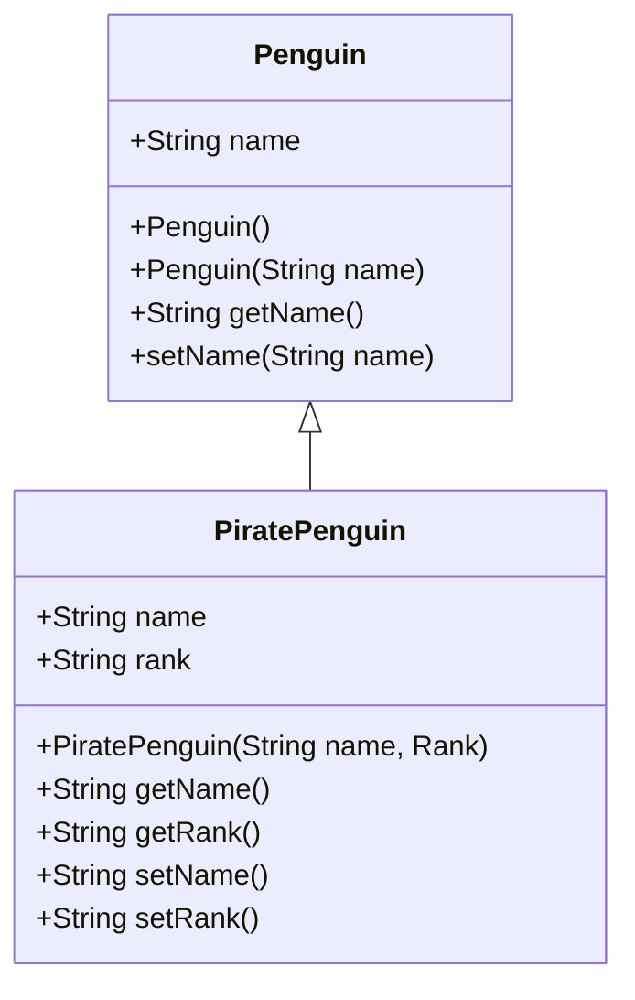

Date: 10th February 2023
Date Modified: 10th February 2023
File Folder: Week 3
#Programming2 

```ad-abstract
title: Today's Topics
collapse: open

- Topics Regarding Classes
	- Equals method
	- Copy Constructor
	- Aggregation
	- Enumeration
- Inheritance

```


# Java's class Object

- Know as a Superclass
- It sits at the top of the class hierarchy tree of the Java API
- Every class is a descendant of the Object superclass

## Methods Inherited from Object

1. `protected Object clone() throws CloneNotSUpportedExcpetion`
	1. Creates adn returns a copy of this object
2. `public boolean equals(Object obj)`
	1. Indicates whether some other object is "equal to" this one
3. `protected void finalize() throws Throwable`
	1. Called by the garbage collector on an objec twhen garbage colleciton detmerines that there are no more references to the object
4. `public final Class getClass()`
	1. Returns the runtime class of an object
5. `public int hashCode()`
	1. returns a rash code value for the object
6. `public Stirng toString()`
	1. Returns a string representation of the object.

# Equals Method

Compares one Object to another

```ad-summary
title: Basic Structure
color: 255, 255, 0

```java
public Boolean equals(Object o) {
	//Check if they are the same object
	//Check if they are the same class
	//compare all the fields
}

```

# Copy Constructor

Used to create an object tusing another object of the same Java classs

Looks liek a regular constructor, but takes as a parameter object of the same classs

```java
class Train {
public Train(Train t) {};
}
```

# Aggregation

When an instance of a class is a field in another class

There is a uniderictional association

- There is a "has  a" relationship
- Both entities can survive individually

# Ennumeration

A list of named constants

- Can have cosntructors, methods, and instance variables
- **Public, static, and final (by default)**

```ad-summary
title:Basic Structure

```java
enum WeekDays {
	sun,mon,tues,wed,thurs,fri,sat
}
```


# Inheritance

Mechanism in Java by which one class is allowed ot inherit features (emthods and fields) of antoher class


```ad-important
title: Importance
- Primarily code reuse /reusability
- When wee create a enw class and there is already a class that includes some of the code that we want, we can derive our new class from that existing class
- Thus, reusing methods and variables fo the existing class
```

# `extends` keyword

Allows you to add one child class to a parent class

```java
class derived_class extends base_class
{
	//all that improtant class code
	//variables, construcotrs, methods, etc.
}
```

## Examples

- Shapes
	- 2D - area
	- 3D - volume
- Class (greek) 4 Elements
	- Earth
	- Wind
	- Fire
	- Water
- Comic Heroes
	- DC
		- Batman
		- Superman
	- Marvel
		- Black Panther
		- Captain America
		- Ironman
		- Thor

# Is-A Relationship

We call inheritance an is-a relationship

Why? When one object "s-a" speicalized version of another object

### Examples

- Poodile is a dog
- FLower is  aplant
- Football player is an athlete
- 2D is a shape
- Batman is a DC (comic hero)
- Mustang is a car

```ad-note
## Rules of Thumb

- Deisnging a class w/inheritance
	- If it is something in common among classes, move it higher in the class until it is not something they have in common
- You should araw out the UML diagram BEFORE coding
	- Unified Modling Language
- Inheritance does **NOT** work in reverse
	- A sublclass inherits members from the superclass
	- It is not possible for a superclass to call a subclass's method
```


## UML Diagram Example




# `Super` Keyword

Refers to an object's superclass

You can use the super keyword to call a superclass constructor

```java
super(name, age, department)
//will call the previous class' constructor
```

## Overriding Superclass Methods

A subclass may

#comebacklater

# Review Points

- Inheritance is used to create an is-a relationship
- `extends` is a Java keyword sued to create a derived class
- `super` is athe keyword to access base calss fucnitonality
- You can override "super" class methods
	- Example: String Equals() is different from Object Equals()
- Reminder: overlaoding and overriding are 2 different things