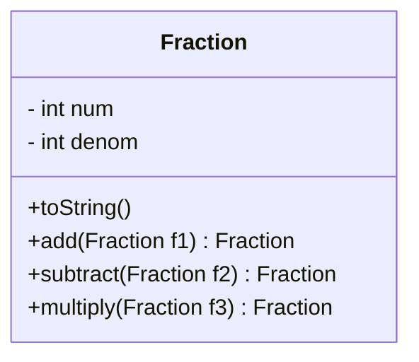

Date: 13th February 2023
Date Modified: 13th February 2023
File Folder: Week 4
#Programming2 

```ad-abstract
title: Today's Topics
collapse: open

- MP1 Debriefing
- Class Practice
```


```ad-todo
- [ ] MP1 📅 2023-02-21 
```
#tasks 

# MP1 Debrief

Create a small guessing game utilizing a single class

Tuesday the 14th will be lab to set up the basic layout

The rest will be due on the 21st.

# Class Practice

```ad-question
- Create a class called Fraction
- (Create a class called Main to test your fraction class)
```

# UML Diagram - Fraction


