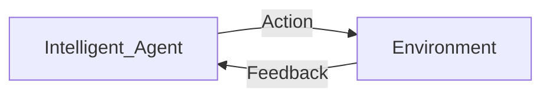

Date: 3rd June 2023
Date Modified: 3rd June 2023
File Folder: Machine Learning
#MachineLearning

# What is Machine Learning?

Teaches computers to learn from experience:
- Machine learning algorithms use computational methods to "learn" information directly from data *without relying on a predetermined equation as a model*.
- The algorithm adaptively improves their performance as the number of samples available for learning increases.

```ad-note
title: Engineering Definition
color: 255, 255, 0

Machine Learning is the study of algorithms that:
- Improve their **Performance** P
- at some **task** T
- with **experience** E
```

```ad-example
A Machine Learning program that can learn to flag spam emails given spam and non-spam emails
- Performance **P** can be given by thre ratio of correctly classified emails
- Task **T** is flagging spam for new emails
- Experience **E** can be given as the provided training data
```

**Training Set**
- A set of example the system uses to learn 
**Training Instance**
- Each training example

## Benefits of Machine Learning

- Automation
	- Machine learning can automate tasks that would otherwise require human intervention
- Improved accuracy
	- Machine learning algorithms can identify patterns in data that humans might miss, leading to more accurate predictions and decisions
- Handling Complex Data
	- ML can handle large and complex data sets that are difficult or impossible for humans to process.
- Predictive Analysis
	- ML can be used to make predictions about future events, allowing organizations to make proactive decisions
- Cost-effective
	- ML can reduce labor costs and increase efficiency, leading to cost saving for organizations

## When Do We Use Machine Learning?

- Hand-written rules and equations that are too complex
- Problems for which existing solutions require a lot of *hand tuning* or long lists of rules as in spam detection
- The nature of the data *keeps changing*, and the program needs to **adapt**.
- Human expertise does not exist (navigating on Mars)
- Models are based on huge amounts of data (genomics)

```ad-tldr
## Algorithms

Tells the computer how to learn, understand, perceive, and react. Can lead to intelligence demonstrated by machines.
```

## Machine Learning Applications

- Detecting letters on handwriting
- Autonomous Vehicle: vehicle Detection, (Lane Detection, Motion Tracking)
- Scene Labeling via Deep Learning
- Industrial Robot (Quality Control & Waste Sorting)

## Machine Learning Overview

- Machine learning is a branch of AI that enables machines to learn from data without explicit programming
- It involves developing algorithms and models that can automatically analyze, learn from and make predictions or decisions based on input data
- There are various types of machine learning such as **supervised, unsupervised, and reinforcement learning**
	- The choice of which depends on the task and the data available.
- Machine learning has a wide range of applications including:
	- natural language processing
	- computer vision
	- speech recognition
	- predictive modeling

### Different Categories of Learning

```ad-note
title: ##### Reinforcement Learning
Train the machine learnign models to make a sequence of decisions
- Rewards from sequence of actions
```

```ad-note
title: ##### Supervised Learning
color: 134, 234, 10
Teach or triant he machine using data that is well labelled
- Given: training data + desired outputs (labels)
```

```ad-note
title: ##### Unsupervised Learning
color: 100, 255, 255
classify data into structures; find similar data points without concern for the outcome
- Given: training data (without desired output)
```

### Choosing the Right Algorithm

The choice of algorithm and type of machine learning will depend on the specific problem you are trying to solve and the resources available.

# Reinforcement Learning

Where a model learns to make decisions by interacting with an environment and receiving feedback in the form of rewards or penalties.

- Input: Sequence of interactions with an environment.
- Output: Policy that performs a desired task

```ad-example
title: Examples of RL algorithms
- Q-learning
- REINFORCE
- PPO
- A3C
- DQN
```

```ad-note
RL has been succesfully applied in a wide range of fields:
- robotics
- control systems
- game playing
- recommendation systems
```


# Supervised Learning

The algorithm is trained on a labeled dataset to predict the output for a new, unseen input.

The goal is to train a model that can accurately predict the output given a new input using what it learned from the labeled data.

- Input: Examples of inputs and outputs with its Direct feedback
- Output: model that predicts unknown output given a new input

![[Pasted image 20230603155539.png]]

```ad-important
It is the most common type of machine learning
```

```ad-example
color: 234, 150, 100
title: Examples of Supervised Learning
- Image Classification
	- Training a model to identify objects in images
- Email spam filter
	- Training a modelt o identify spam emails
- Stock Price Prediction:
	- Traing a model to predict the future price of a stock
```

## Regression

Taking data and finding the proper regression and whether it is linear, quadratic, logarithmic, etc.

![[Pasted image 20230603160602.png]]

## Classification Algorithms

**Binary Classifier**: If the classification problem has only two possible outcomes.
- Ex. YES or NO, SPAM or NOT SPAM, CAT or DOG

**Multi-class Classifier**: If the classification problem has more than two outcomes
- EX. Genre of music, type of crop

# Unsupervised Learning

The algorithm is trained on an unlabeled dataset to discover patterns or relationships within the data. 

```ad-note
Unlike supervised learning, there is not specific output or label that the algorithm is trying to predict.
```

```ad-important
color:
Unsupervised leanring is useful whent he goal is to:
- find hidden structure in data
- identify patterns
- features that can be used to group, calssify or describe it.
```

```ad-example
color: 234, 123, 243
title: Examples of Unsupervised Learning
- Clustering: grouping similar data points together
- Anomaly detection: identifying unusual observations in the data
- Dimensionality reduction: reducing the number of features in a dataset
```
