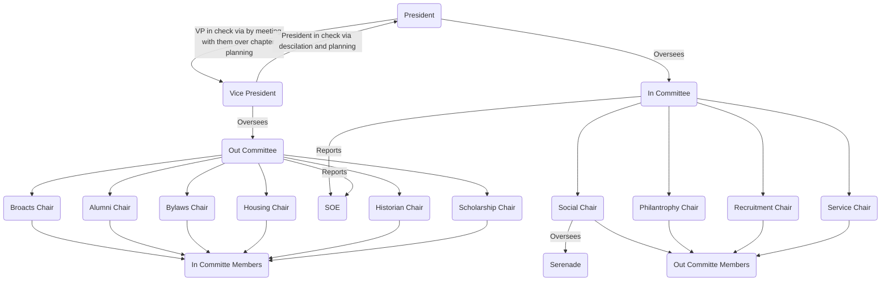

```mermaid
flowchart TD
A(President) --VP in check via by meeting with them over chapter planning-->B
B(Vice President) --President in check via descilation and planning-->A
C(In Committee)
D(Out Committee)
A--Oversees-->C
B--Oversees-->D
C-->E(Social Chair)--Oversees-->I(Serenade)
E-->R
C-->F(Philantrophy Chair)-->R
C-->G(Recruitment Chair)-->R
C--->M(Service Chair)-->R
H(SOE)
D-->J(Broacts Chair)-->Q
D-->K(Alumni Chair)-->Q
D-->L(Bylaws Chair)-->Q
D-->N(Housing Chair)-->Q
D-->O(Historian Chair)-->Q
D-->P(Scholarship Chair)-->Q
Q(In Committe Members)
R(Out Committe Members)
C--Reports-->H
D--Reports-->H
```

